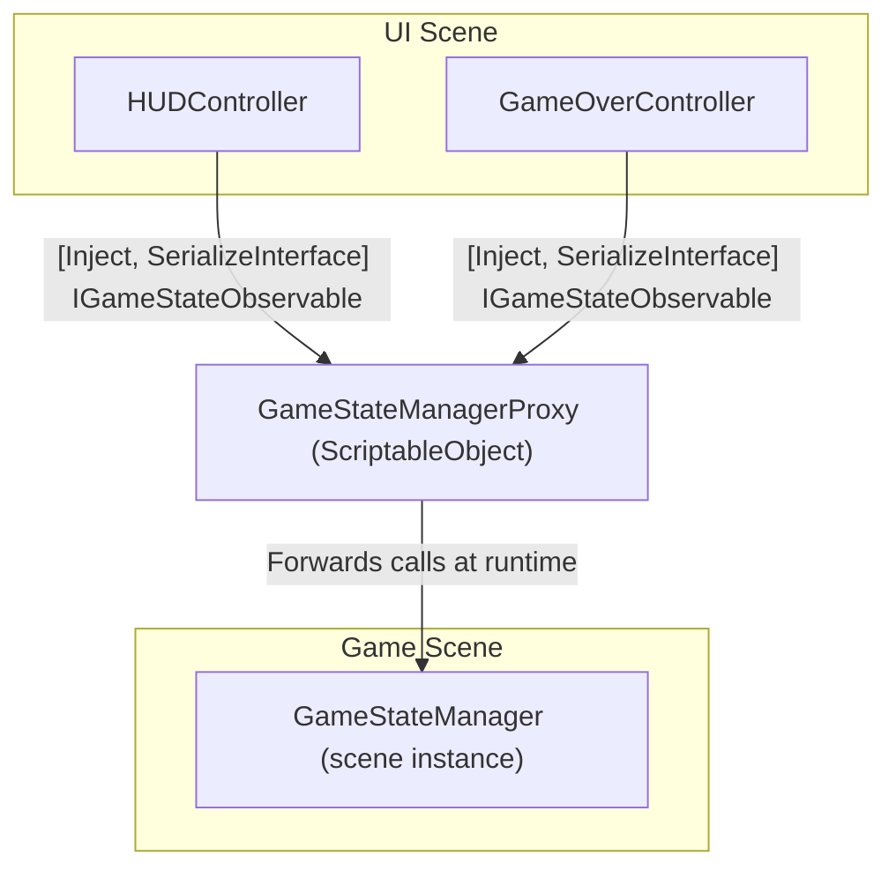

# Proxies

Unity cannot serialize a direct reference from one scene to another, or from a scene into a prefab asset. If you store a scene object reference in a prefab, Unity will lose it the moment the scene is unloaded or the prefab is opened in isolation.

`RuntimeProxy<T>` solves this by providing a `ScriptableObject` intermediary — a serializable project asset that knows how to find the real instance at runtime.

## How it works

A `RuntimeProxy<T>` is a `ScriptableObject` that implements the same interfaces as `T` and forwards all calls to the real instance. Because it's a project asset, it can be referenced from anywhere — scenes, prefabs, other ScriptableObjects — just like any other asset.

At runtime, the proxy resolves its target the first time it's accessed, then caches it. If the cached instance goes null (e.g. after a scene reload), it re-resolves automatically.



## The `[GenerateRuntimeProxy]` attribute

To generate a proxy for a class, create a partial stub and mark it with `[GenerateRuntimeProxy]`:

```csharp
[GenerateRuntimeProxy]
public partial class GameStateManagerProxy : RuntimeProxy<GameStateManager> { }
```

The Roslyn generator emits a second partial that implements all interfaces of `GameStateManager` and forwards every method, property, and event to the resolved instance.

You don't write or maintain the forwarding code — it's generated from the interface definitions at compile time.

## Binding with `FromRuntimeProxy()`

To have Saneject automatically create and wire a proxy during injection, add `.FromRuntimeProxy()` to a component binding:

```csharp
BindComponent<IGameStateObservable, GameStateManager>()
    .FromRuntimeProxy()
    .FromGlobalScope();
```

At injection time, Saneject:

1. Generates a proxy script (if one doesn't already exist for `GameStateManager`).
2. Triggers a script recompilation if a new script was generated — click **Inject** again after recompilation completes.
3. Creates a proxy `ScriptableObject` asset in the configured folder (default: `Assets/Generated`), or reuses an existing one.
4. Injects the proxy asset into any field typed as `IGameStateObservable`.

## Resolve methods

After `.FromRuntimeProxy()`, chain a resolve method to tell the proxy how to find its target instance at runtime:

```csharp
// Resolve from GlobalScope — zero-cost dictionary lookup
// Requires the target to be registered via BindGlobal<T>()
.FromRuntimeProxy().FromGlobalScope()

// Find the first instance in any loaded scene
.FromRuntimeProxy().FromAnywhereInLoadedScenes()

// Instantiate a prefab and get the component
.FromRuntimeProxy().FromComponentOnPrefab(myPrefab, dontDestroyOnLoad: true)

// Create a new GameObject and add the component
.FromRuntimeProxy().FromNewComponentOnNewGameObject(dontDestroyOnLoad: true)
```

For `FromComponentOnPrefab` and `FromNewComponentOnNewGameObject`, also chain an instance mode:

```csharp
.FromRuntimeProxy()
    .FromComponentOnPrefab(myPrefab, dontDestroyOnLoad: true)
    .AsSingleton();   // Registers in GlobalScope after creation — only created once

.FromRuntimeProxy()
    .FromNewComponentOnNewGameObject(dontDestroyOnLoad: false)
    .AsTransient();   // Creates a new instance every time the proxy resolves
```

`FromGlobalScope` and `FromAnywhereInLoadedScenes` don't require an instance mode.

## Manual proxy creation

`FromRuntimeProxy()` always reuses a single proxy asset per type across the project. For cases where you need multiple distinct proxy assets (e.g. different resolve strategies for the same type), create them manually:

1. Right-click any `MonoScript` → **Generate Proxy Object** — creates both the generated script and a `ScriptableObject` asset.
2. Or write the partial stub manually and create the asset via **Create → Saneject → Proxy**.

## `IRuntimeProxySwapTarget`

For advanced scenarios where a proxy should be replaced with the real instance after injection (e.g. to avoid proxy forwarding overhead in hot paths), your component can implement `IRuntimeProxySwapTarget`:

```csharp
public interface IRuntimeProxySwapTarget
{
    void SwapProxiesWithRealInstances();
}
```

Saneject calls `SwapProxiesWithRealInstances()` on `Awake` on all components registered via `Scope.AddProxySwapTarget`. This allows the component to replace its proxy references with direct instance references at startup.

## Performance

The proxy resolves its target the first time it's accessed and caches it. Subsequent calls pay only the cost of a null check plus the interface method dispatch.

If you have a very tight loop that calls through a proxy millions of times per frame, cache the underlying instance directly. For reference: in a stress test, one million proxy calls to a trivial method took approximately 5 ms on an Intel i7-9700K. In normal gameplay code, proxy overhead is negligible.
