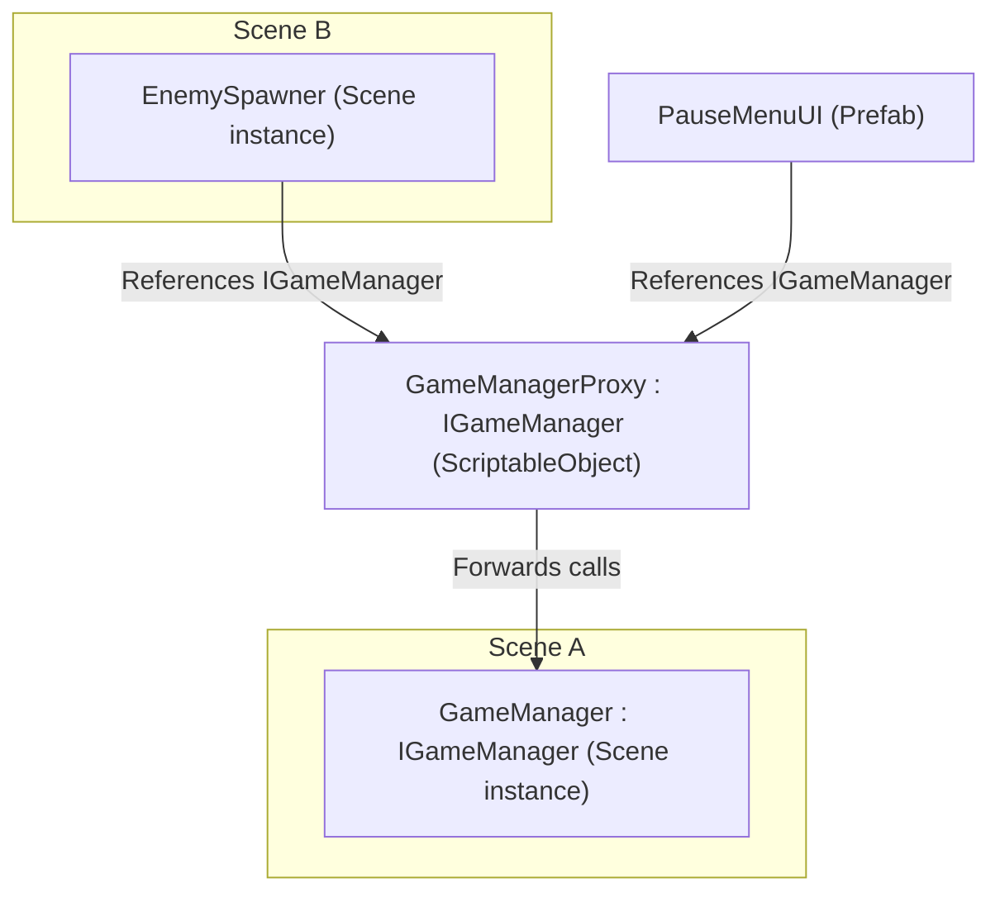

# ProxyObject

`ProxyObject<T>` is a special Roslyn-generated `ScriptableObject` that:

- Implements every interface on `T` at compile-time.
- Generates forwarding code for all method calls, property gets/sets, and event subscriptions at compile-time.
- The actual `T` instance is resolved at runtime – cheaply if using `BindGlobal<TComponent>` to register it to the `GlobalScope`.

Why? Unity can't serialize direct references to scene objects across scenes or into prefabs. The proxy asset is serializable, so you assign it in the Inspector or inject it. At runtime, it finds and links to the actual instance the first time it's used. This makes it ideal for cross-context injections.

## Auto-generation

Think of it as a serializable weak reference that resolves quickly at runtime. Whenever you need to inject a `Component` from outside the current serialization context, just bind like this:

`BindComponent<IInterface, Concrete>().FromProxy()`

At injection time, this will:

- Generate a proxy script implementing all interfaces of `Concrete` (if one doesn't already exist).
- Trigger a standard Unity script recompilation if a new proxy script has to be generated, stopping the current injection pass. In this case, click Inject again to continue.
- Create a `ScriptableObject` proxy asset at `Assets/Generated` (if one doesn't already exist).
- Reuse the first found proxy asset if it already exists somewhere in the project.

## Manual generation

`FromProxy()` always reuses a single proxy asset per type project-wide. For advanced cases (like different resolution strategies per object), you can add more manually:

Right-click any `MonoScript` that implements one or more interfaces and select **Generate Proxy Object**.

This creates:

- A proxy script for the class.
- A proxy `ScriptableObject` asset in `Assets/Generated` (path is configurable in settings).

Or write the stub manually and create the proxy `ScriptableObject` with right-click project folders → `Create/Saneject/Proxy`.

## Example



> ⚠️ Last time I checked, Mermaid diagrams don't render in the GitHub mobile app. Use a browser to view them properly.

Example interface:

```csharp
public interface IGameManager
{
    bool IsGameOver { get; }
    void RestartGame();
}
```

Concrete class:

```csharp
public class GameManager : MonoBehaviour, IGameManager
{
    public bool IsGameOver { get; private set; }
    public void RestartGame() { }
}
```

Generated stub (once per class):

```csharp
[GenerateProxyObject]
public partial class GameManagerProxy : ProxyObject<GameManager> { }
```

Roslyn-generated proxy forwarding:

```csharp
public partial class GameManagerProxy : IGameManager
{
    public bool IsGameOver
    {
        get
        {
            if (!instance) instance = ResolveInstance();
            return instance.IsGameOver;
        }
    }

    public void RestartGame()
    {
        if (!instance) instance = ResolveInstance();
        instance.RestartGame();
    }
}
```

Now you can drag the `GameManagerProxy` asset into any `[SerializeInterface] IGameManager` field, whether it's in a scene, a prefab, or resolved through injection.

## Resolve strategies

| Resolve method                    | What it does                                                                                                               |
|-----------------------------------|----------------------------------------------------------------------------------------------------------------------------|
| `FromGlobalScope`                 | Pulls the instance from `GlobalScope`. Register it via `BindGlobal` in a `Scope`. No reflection, just a dictionary lookup. |
| `FindInLoadedScenes`              | Uses `FindFirstObjectByType<T>(FindObjectsInactive.Include)` across all loaded scenes.                                     |
| `FromComponentOnPrefab`           | Instantiates the given prefab and returns the component.                                                                   |
| `FromNewComponentOnNewGameObject` | Creates a new `GameObject` and adds the component.                                                                         |
| `ManualRegistration`              | You call `proxy.RegisterInstance(instance)` at runtime before the proxy is used.                                           |

## Performance note

The proxy resolves its target the first time it's accessed and then caches it. If the cached instance goes null (for example, after a scene reload), the proxy will resolve it again automatically.

Forwarded calls include a null-check, which makes them about 8x slower than a direct call. In practice that means nanoseconds of overhead, which is negligible outside of extremely tight loops.

In a stress test, one million proxy calls in a single frame to a trivial method took ~5 ms on an Intel i7-9700K CPU. If you ever need to squeeze out that last bit of performance in a hot path, grab the concrete instance once with `proxy.GetInstanceAs<TConcrete>()` and call it directly.


# GlobalScope

The `GlobalScope` is a static service locator that `ProxyObject` can fetch from at near-zero cost (dictionary lookup).
Use it to register scene objects or assets as cross-scene singletons. The `GlobalScope` can only hold one instance per unique type.

Bindings are added via `BindGlobal<TComponent>()` inside a `Scope`. This stores the binding into a `SceneGlobalContainer` component.

At runtime, on `Awake()` (with `[DefaultExecutionOrder(-10000)]`), the `SceneGlobalContainer` adds all its references to the `GlobalScope`.

Only one `SceneGlobalContainer` is allowed per scene - it's created automatically during scene injection and manual creation is not allowed. If another instance of the same type is registered, the registration fails and an error is logged. The original instance remains.

## Global binding API

Register global singletons in the `Scope` using the following methods.

| Method                     | Description                                                              |
|----------------------------|--------------------------------------------------------------------------|
| `BindGlobal<TComponent>()` | Adds a scene `Component` to the global scope via `SceneGlobalContainer`. |

## GlobalScope API

| Method                          | Description                                                       |
|---------------------------------|-------------------------------------------------------------------|
| `GlobalScope.Register<T>(T)`    | Registers an instance globally. Only one per type.                |
| `GlobalScope.Get<T>()`          | Returns the registered instance (or `null`).                      |
| `GlobalScope.Unregister<T>()`   | Removes a registered instance of type `T`.                        |
| `GlobalScope.IsRegistered<T>()` | Returns `true` if an instance of type `T` is in the global scope. |
| `GlobalScope.Clear()`           | Clears all global registrations (Play Mode only).                 |

If you're using `ProxyObject`, global registration is one of the ways to resolve its target instance.

💡 You can toggle logging for global registration under `Saneject/User Settings/Editor Logging`.