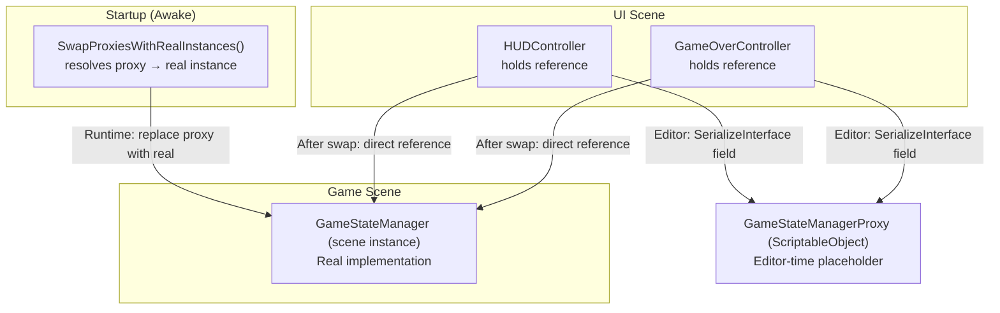

# Proxies

Unity cannot serialize a direct reference from one scene to another, or from a scene into a prefab asset. If you store a scene object reference in a prefab, Unity will lose it the moment the scene is unloaded or the prefab is opened in isolation.

`RuntimeProxy<T>` solves this by providing a `ScriptableObject` intermediary — a serializable project asset that acts as an editor-time placeholder for a real instance that will be resolved at runtime.

## How it works

A `RuntimeProxy<T>` is a `ScriptableObject` that:
- **At editor-time**: Implements the same interfaces as `T` with stub implementations (which throw exceptions if accessed directly).
- **At runtime**: Is replaced with the real instance through a swap mechanism, ensuring the real object is used going forward.

Because the proxy is a project asset, it can be referenced from anywhere — scenes, prefabs, other ScriptableObjects — just like any other asset.

The proxy is assigned a **resolution strategy** that determines how to find or create the real instance at startup. When a Scope initializes, it:
1. Registers components and assets according to its binding declarations
2. Collects all components that implement `IRuntimeProxySwapTarget` (including any component holding a proxy reference)
3. Calls `SwapProxiesWithRealInstances()` on each, which uses the proxy's resolution strategy to find the real instance
4. Replaces the proxy reference with the real instance in the parent component
5. From that point forward, the real instance is used directly — no proxy overhead



## The `[GenerateRuntimeProxy]` attribute

To generate a proxy for a class, create a partial stub and mark it with `[GenerateRuntimeProxy]`:

```csharp
[GenerateRuntimeProxy]
public partial class GameStateManagerProxy : RuntimeProxy<GameStateManager> { }
```

The Roslyn generator emits a second partial that implements all interfaces of `GameStateManager` with stub methods that throw exceptions. These stubs ensure type safety at editor-time while preventing accidental direct access at runtime (which would indicate the proxy was not swapped with the real instance).

You don't write or maintain the stub code — it's generated from the interface definitions at compile time. The stubs should never be called in normal operation; if they are, it indicates a configuration error (e.g. the Scope didn't call `SwapProxiesWithRealInstances`).

## Binding with `FromRuntimeProxy()`

To have Saneject automatically create and wire a proxy during injection, add `.FromRuntimeProxy()` to a component binding:

```csharp
BindComponent<IGameStateObservable, GameStateManager>()
    .FromRuntimeProxy()
    .FromGlobalScope();
```

At injection time, Saneject:

1. Generates a proxy script (if one doesn't already exist for `GameStateManager`).
2. Triggers a script recompilation if a new script was generated — click **Inject** again after recompilation completes.
3. Creates a proxy `ScriptableObject` asset in the configured folder (default: `Assets/Generated`), or reuses an existing one.
4. Injects the proxy asset into any field typed as `IGameStateObservable`.

## Resolve methods

After `.FromRuntimeProxy()`, chain a resolve method to tell the proxy how to find its target instance at runtime:

```csharp
// Resolve from GlobalScope — zero-cost dictionary lookup
// Requires the target to be registered via BindGlobal<T>()
.FromRuntimeProxy().FromGlobalScope()

// Find the first instance in any loaded scene (including inactive objects)
.FromRuntimeProxy().FromAnywhereInLoadedScenes()

// Instantiate a prefab and get the component
.FromRuntimeProxy().FromComponentOnPrefab(myPrefab, dontDestroyOnLoad: true)

// Create a new GameObject and add the component
.FromRuntimeProxy().FromNewComponentOnNewGameObject(dontDestroyOnLoad: true)
```

For `FromComponentOnPrefab` and `FromNewComponentOnNewGameObject`, also chain an instance mode:

```csharp
.FromRuntimeProxy()
    .FromComponentOnPrefab(myPrefab, dontDestroyOnLoad: true)
    .AsSingleton();   // Resolves once, then reuses the same instance (registers in GlobalScope)

.FromRuntimeProxy()
    .FromNewComponentOnNewGameObject(dontDestroyOnLoad: false)
    .AsTransient();   // Creates a new instance each time the proxy is swapped
```

`FromGlobalScope` and `FromAnywhereInLoadedScenes` don't support instance modes — they always fetch an already-existing instance.

## Manual proxy creation

`FromRuntimeProxy()` always reuses a single proxy asset per type across the project. For cases where you need multiple distinct proxy assets (e.g. different resolve strategies for the same type), create them manually:

1. Right-click any `MonoScript` → **Generate Proxy Object** — creates both the generated script and a `ScriptableObject` asset.
2. Or write the partial stub manually and create the asset via **Create → Saneject → Proxy**.

Manually created proxies work identically to those created by `FromRuntimeProxy()` — they still require a `SwapProxiesWithRealInstances()` call to replace the proxy with the real instance.

## `IRuntimeProxySwapTarget`

Any component that holds proxy references should implement `IRuntimeProxySwapTarget`:

```csharp
public interface IRuntimeProxySwapTarget
{
    void SwapProxiesWithRealInstances();
}
```

In your implementation, use each proxy's resolution method to get the real instance, then replace the proxy reference:

```csharp
public void SwapProxiesWithRealInstances()
{
    if (audioServiceProxy is RuntimeProxyBase proxy)
        audioService = proxy.ResolveInstance() as IAudioService;
}
```

Saneject automatically calls `SwapProxiesWithRealInstances()` on Awake for all components registered via `Scope.AddProxySwapTarget`, and for any component that implements the interface. After the swap, your component holds a direct reference to the real instance, with zero proxy overhead.

## Performance

Because proxies are replaced with real instances on Awake, there is **zero proxy overhead** during gameplay. The proxy only exists as an editor-time placeholder.

If you need to debug proxy resolution or verify that swaps are happening correctly, enable **Saneject → Settings → Log Proxy Resolve** to see detailed logs when proxies are resolved.
