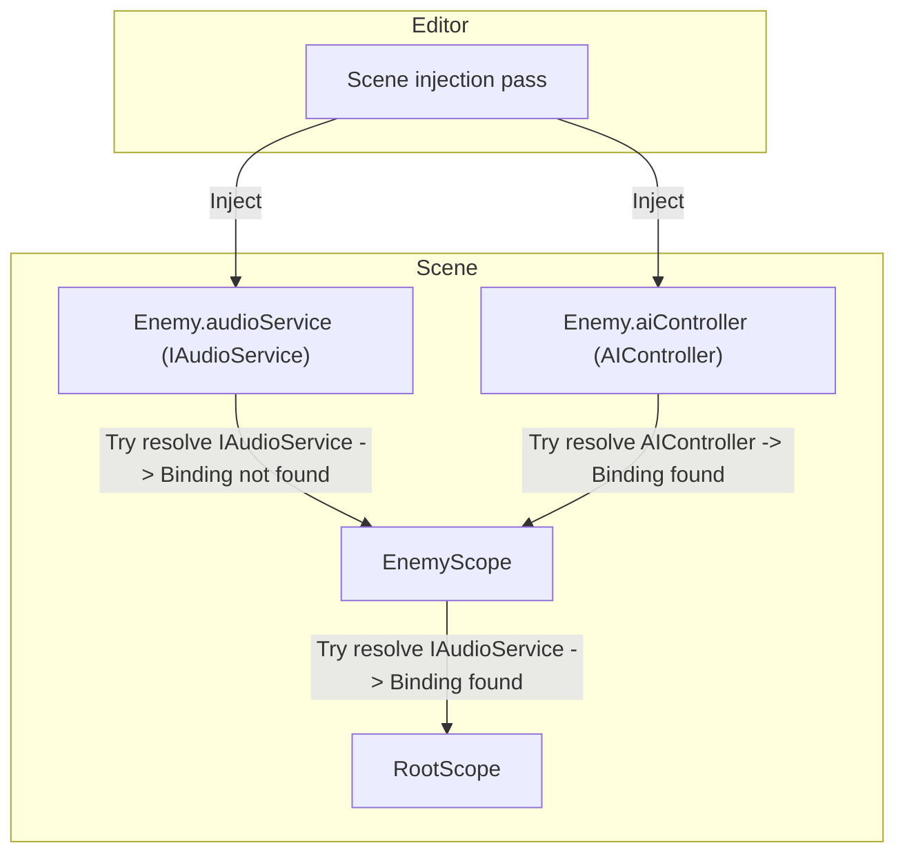

# Scope

A scope is a `MonoBehaviour` that declares dependency bindings for a part of your hierarchy.

In Saneject, you create a scope by inheriting from `Scope` and implementing `DeclareBindings()`. Every binding you
declare in that method tells Saneject how to resolve a dependency type.

At injection time, Saneject uses scope bindings to resolve `[Inject]` fields, properties and methods for components
below that scope's `Transform`. At runtime, the same scope also performs early setup for global registrations and
runtime proxy swapping.

Scopes work on scene objects, prefab instances, and prefab assets. How they participate in injection and how their
bindings resolve across scenes and prefabs depends on context filtering and context isolation settings.
See [Context](context.md) for details.

## Declaring bindings in a scope

Bindings are declared directly inside `DeclareBindings()`:

```csharp
using Plugins.Saneject.Experimental.Runtime.Scopes;

public class EnemyScope : Scope
{
    protected override void DeclareBindings()
    {
        BindComponent<AIController>()
            .FromScopeSelf();
    }
}
```

This declares a binding for `AIController` and tells Saneject where to look for the instance (`FromScopeSelf()` means
the scope's own `Transform`).

For more details and binding examples, see [Bindings](binding.md).

## Hierarchy, overrides, and fallback

Saneject tries to resolve each injection target (`Component` with injected fields, properties, methods) from the nearest
scope at the same transform or above it first, then walks up parent scopes until a matching binding is found. That means
child scopes naturally override parent scopes for the same requested type.

**Example:**



```csharp
using Plugins.Saneject.Experimental.Runtime.Scopes;

public class RootScope : Scope
{
    protected override void DeclareBindings()
    {
        // AudioServiceAsset is a Unity asset type that implements IAudioService.
        BindAsset<IAudioService, AudioServiceAsset>()
            .FromResources("Audio/Service");
    }
}
```

```csharp
using Plugins.Saneject.Experimental.Runtime.Scopes;

public class EnemyScope : Scope
{
    protected override void DeclareBindings()
    {
        // Enemy-local AIController only. No IAudioService binding here.
        BindComponent<AIController>()
            .FromScopeSelf();
    }
}
```

```csharp
using Plugins.Saneject.Experimental.Runtime.Attributes;
using UnityEngine;

public partial class Enemy : MonoBehaviour
{
    [Inject, SerializeInterface]
    private IAudioService audioService; // Resolved from RootScope (fallback)

    [Inject]
    private AIController aiController; // Resolved from EnemyScope
}
```

`IAudioService` is not bound in `EnemyScope`, so Saneject walks up to `RootScope` and resolves it there. `AIController`
is bound in `EnemyScope`, so it resolves locally without fallback.

## Runtime behavior

Almost everything in Saneject happens at edit-time. However, a few things need to happen at runtime to facilitate
dependencies between contexts that Unity cannot serialize (scene ↔ other scene, scene ↔ prefab asset).

### Global components in scopes

Scopes can declare globally/statically available components with `BindGlobal<T>()`:

```csharp
using Plugins.Saneject.Experimental.Runtime.Scopes;

public class BootstrapScope : Scope
{
    protected override void DeclareBindings()
    {
        BindGlobal<AudioManager>()
            .FromScopeSelf();
    }
}
```

How it works:

- During editor injection, Saneject resolves the global component and serializes it in the same `Scope` that declares
  the global binding.
- At runtime, `Scope.Awake()` registers those serialized components into `GlobalScope` (a static service locator).
- This is usually used as a cheap lookup mechanism for runtime proxies that resolve with `FromGlobalScope()`.
- In `Scope.OnDestroy()`, the scope unregisters what it registered from `GlobalScope`, meaning that global components
  per local `Scope` have the same lifetime as the scope.
- `Scope` has default execution order `-10000`, so scope runtime operations run before normal component `Awake` to avoid
  startup race conditions/null access issues.

Only one global registration per concrete component type is allowed. Duplicate global bindings for the same type are
reported as invalid.

See [Global scope](global-scope.md) for details.

### Runtime proxy swap targets

A `RuntimeProxy` is an auto-generated `ScriptableObject` used as an editor-time stand-in for a real interface dependency
when that real reference cannot be serialized directly in the current `Scope` context (for example, prefab to scene
references).

During editor injection, when Saneject injects a runtime proxy into an interface field, it registers the owning
component as a proxy swap target in the nearest `Scope`.

At runtime, `Scope.Awake()` (execution order `-10000`) runs right after global registration and calls Roslyn-generated
`SwapProxiesWithRealInstances()` on each registered swap target. That generated method replaces proxy references with
the real instances using normal field assignment, with no reflection.

The full proxy mechanism is documented in [Runtime proxies](runtime-proxy.md).

Proxy swap flow:

1. A binding uses `FromRuntimeProxy()` for an interface dependency.
2. Injection writes a runtime proxy into the interface field and registers the owner as a swap target in the nearest
   `Scope`.
3. In `Scope.Awake()`, the scope calls `SwapProxiesWithRealInstances()`, and the field is reassigned to the real
   instance.

Typical proxy binding setup:

```csharp
public class CombatScope : Scope
{
    protected override void DeclareBindings()
    {
        BindComponent<ICombatService, CombatService>()
            .FromRuntimeProxy()
            .FromGlobalScope();

        BindGlobal<CombatService>()
            .FromScopeSelf();
    }
}
```

Typical consumer:

```csharp
using Plugins.Saneject.Experimental.Runtime.Attributes;
using UnityEngine;

public partial class CombatHud : MonoBehaviour
{
    [Inject, SerializeInterface]
    private ICombatService combatService;
}
```

See [Runtime proxies](runtime-proxy.md) and [Serialized interfaces](serialized-interface.md) for details.

## Related pages

- [Bindings](binding.md)
- [Global scope](global-scope.md)
- [Runtime proxies](runtime-proxy.md)
- [Serialized interfaces](serialized-interface.md)
- [Contexts](context.md)


