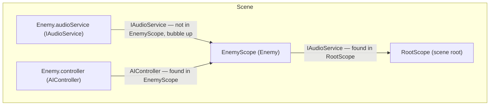

# Scopes

A `Scope` is a `MonoBehaviour` that declares where dependencies come from. You create a subclass, override `DeclareBindings()`, and place it on a `GameObject` in the scene or prefab. When injection runs, Saneject reads the bindings from every `Scope` in the hierarchy and resolves them against the components below.

## Declaring bindings

```csharp
public class GameScope : Scope
{
    protected override void DeclareBindings()
    {
        BindComponent<IGameStateObservable, GameStateManager>()
            .FromAnywhere();

        BindComponent<CharacterController>()
            .FromTargetSelf();
    }
}
```

`Scope` has `[DisallowMultipleComponent]`, so only one `Scope` is allowed per `GameObject`.

## Root-scope scan

No matter which `Scope` you trigger injection on, Saneject walks up to the topmost `Scope` in the hierarchy first, then injects downward in a single pass. This means parent scopes always run before child scopes, and the injection order is deterministic.

## Resolution fallback

When a field needs a dependency, Saneject looks for a matching binding in the nearest `Scope` above the injection target. If no match is found there, it walks up through parent `Scopes` until it finds one, or reports a missing binding error.



In this example, `AIController` is bound in `EnemyScope` and resolves immediately. `IAudioService` is not bound there, so the request bubbles up to `RootScope`.

```csharp
public class RootScope : Scope
{
    protected override void DeclareBindings()
    {
        BindComponent<IAudioService, AudioService>()
            .FromAnywhere();
    }
}

public class EnemyScope : Scope
{
    protected override void DeclareBindings()
    {
        BindComponent<AIController>()
            .FromSelf();
    }
}
```

## Scene Scopes and Prefab Scopes

The `Scope` component type is the same regardless of where it lives, but Saneject treats its context differently:

| | Scene Scope | Prefab Scope |
|---|---|---|
| Lives on | A non-prefab scene `GameObject` | A prefab (asset or instance) |
| Can bind to | Components and assets anywhere in the scene or project | Components and assets within the prefab itself or the project |
| During scene injection pass | Processed normally | **Skipped** — prefab instances in a scene are not processed during a scene pass |
| During prefab injection pass | Skipped | Processed in isolation |

Prefab instances in a scene get their own isolated injection pass and are never processed as part of the scene pass. This keeps prefabs self-contained and their bindings from leaking into the scene hierarchy.

To inject a scene object into a prefab, use a [RuntimeProxy](proxies.md).

## Creating a Scope

Scope boilerplate can be generated via **Saneject → Create New Scope** or **Assets → Create → Saneject → Create New Scope**. If **Generate Scope Namespace From Folder** is enabled in User Settings, the generated class will have a namespace matching its folder path relative to `Assets/`.
