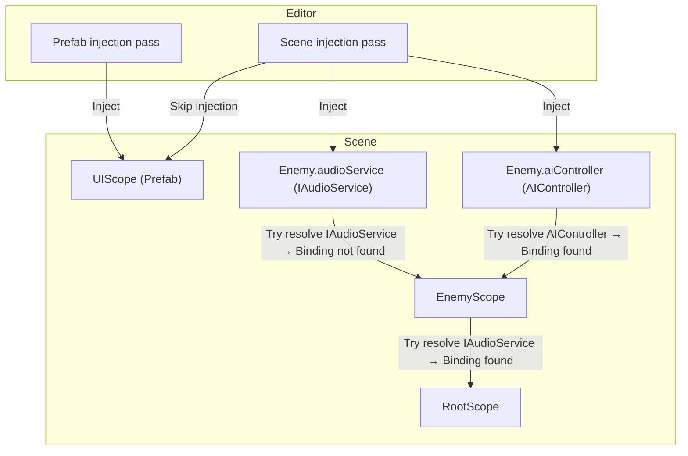

# Scopes & resolution order

| **Concept**               | **What it means in Saneject**                                                                                                                                                                                                                                                                                                |
|---------------------------|------------------------------------------------------------------------------------------------------------------------------------------------------------------------------------------------------------------------------------------------------------------------------------------------------------------------------|
| **Scope component**       | A `MonoBehaviour` that declares bindings for how to resolve dependencies in `Components` **below** its `Transform`.                                                                                                                                                                                                          |
| **Root-scope scan**       | No matter which `Scope` you start the injection on, Saneject walks up to the top-most Scope first, then injects downward once.                                                                                                                                                                                               |
| **Resolution fallback**   | When a binding isn't found in the current `Scope`, the injector climbs upward through parent `Scopes` until it finds one (or fails).                                                                                                                                                                                         |
| **Scene Scope**           | Lives on a (non-prefab) scene `GameObject`. Can bind to any `Component` or `Object` in the scene or project folder, including prefabs.                                                                                                                                                                                       |
| **Prefab Scope**          | Lives on a prefab. Can bind to any `Component` or `Object` in the prefab itself or project folder. Prefab Scopes present in the scene are skipped during scene injection, to keep the prefab self-contained.<br><br>Need a scene reference inside a prefab? Use an `ProxyObject` `ScriptableObject` and inject that instead. |
| **Scene vs prefab Scope** | Same `Component` but the DI system treats them as different contexts.                                                                                                                                                                                                                                                        |

An example of how scoped resolution works (code below):



> ⚠️ Last time I checked, Mermaid diagrams don't render in the GitHub mobile app. Use a browser to view them properly.

`DependencyInjector` (injection passes) first queries `EnemyScope` for `IAudioService` but a binding isn't defined there, so the request bubbles up to `RootScope` which has the binding and provides the `Object`.

`AIController` is resolved directly from `EnemyScope`, so no fallback is needed.

Any scopes that live on prefabs (like `UIScope` above) are skipped during a scene-wide injection pass - they get their own dependencies when the prefab is injected in isolation, or you can inject scene objects into a prefab via an `ProxyObject`.

```csharp
public class RootScope : Scope
{
    public override void Configure()
    {
        BindAsset<IAudioService>().FromResources("Audio/Service");
    }
}
```

```csharp
public class EnemyScope : Scope
{
    public override void Configure()
    {
        // Enemy-local AIController only; no IAudioService here.
        BindComponent<AIController>().FromScopeSelf();
    }
}
```

After injection:

```csharp
public class Enemy : MonoBehaviour
{
    [Inject, SerializeInterface] 
    IAudioService audioService; // Resolved from RootScope
    
    [Inject]
    AIController aiController; // Resolved from EnemyScope        
}
```