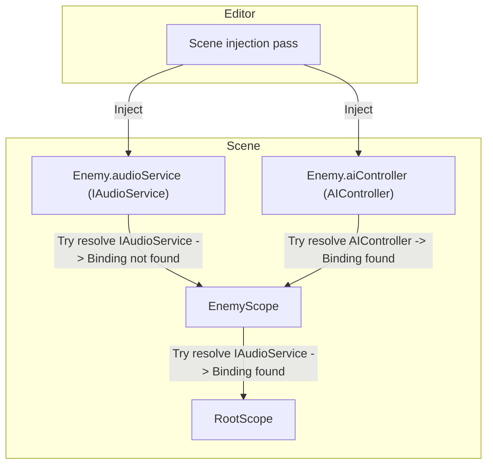

# Scopes

A scope is a `MonoBehaviour` that declares dependency bindings for a part of your hierarchy.

In Saneject, you create a scope by inheriting from `Scope` and implementing `DeclareBindings()`. Every binding you declare in that method tells Saneject how to resolve a dependency type.

At injection time, Saneject uses scope bindings to resolve `[Inject]` fields and methods for components under that scope's `Transform`. At runtime, the same scope also performs early setup for global registrations and runtime proxy swapping.

Scopes work on scene objects, prefab instances, and prefab assets. How they participate in injection and how their bindings resolve across hierarchy boundaries depends on context filtering and context isolation settings. See [Context](contexts.md) for details.

## Declaring bindings in a scope

Bindings are declared directly inside `DeclareBindings()`:

```csharp
using Plugins.Saneject.Experimental.Runtime.Scopes;

public class EnemyScope : Scope
{
    protected override void DeclareBindings()
    {
        BindComponent<AIController>()
            .FromScopeSelf();
    }
}
```

This declares a binding for `AIController` and tells Saneject where to look for the instance (`FromScopeSelf()` means the scope's own `Transform`).

For more details and binding examples, see [Bindings](bindings.md).

## Hierarchy, overrides, and fallback

Saneject resolves each injection target from the nearest scope above it first, then walks up parent scopes until a matching binding is found. That means child scopes naturally override parent scopes for the same requested type.

**Example:**



```csharp
using Plugins.Saneject.Experimental.Runtime.Scopes;

public class RootScope : Scope
{
    protected override void DeclareBindings()
    {
        // AudioServiceAsset is a Unity asset type that implements IAudioService.
        BindAsset<IAudioService, AudioServiceAsset>()
            .FromResources("Audio/Service");
    }
}
```

```csharp
using Plugins.Saneject.Experimental.Runtime.Scopes;

public class EnemyScope : Scope
{
    protected override void DeclareBindings()
    {
        // Enemy-local AIController only. No IAudioService binding here.
        BindComponent<AIController>()
            .FromScopeSelf();
    }
}
```

```csharp
using Plugins.Saneject.Experimental.Runtime.Attributes;
using UnityEngine;

public partial class Enemy : MonoBehaviour
{
    [Inject, SerializeInterface]
    private IAudioService audioService; // Resolved from RootScope (fallback)

    [Inject]
    private AIController aiController; // Resolved from EnemyScope
}
```

`IAudioService` is not bound in `EnemyScope`, so Saneject walks up to `RootScope` and resolves it there. `AIController` is bound in `EnemyScope`, so it resolves locally without fallback.

## Global components in scopes

Scopes can declare global component bindings with `BindGlobal<T>()`:

```csharp
using Plugins.Saneject.Experimental.Runtime.Scopes;

public class BootstrapScope : Scope
{
    protected override void DeclareBindings()
    {
        BindGlobal<AudioBus>()
            .FromScopeSelf();
    }
}
```

How it works:

- During editor injection, Saneject resolves the target component and stores it on the Scope.
- This depends on editor injection having been run, since that is what serializes the global component list onto each Scope.
- At runtime, `Scope.Awake()` registers those serialized components into `GlobalScope` (a static service locator).
- This is usually used as a cheap lookup mechanism for runtime proxies that resolve with `FromGlobalScope()`.
- In `Scope.OnDestroy()`, the scope unregisters what it registered.
- Global bindings are separate from normal field and method binding lookup.
- `Scope` has default execution order `-10000`, so scope runtime operations run before normal component `Awake` and avoid startup race/null access issues.

Only one global registration per concrete component type is allowed. Duplicate global bindings for the same type are reported as invalid.

See [Global scope](global-scope.md) for details.

## Runtime proxy swap targets

During injection, Saneject registers proxy swap targets in the nearest `Scope`. A proxy swap target is a component where an interface field was injected with a runtime proxy.

At runtime, `Scope.Awake()` (default execution order `-10000`), right after global components are registered into `GlobalScope`, the `Scope` calls a Roslyn-generated `SwapProxiesWithRealInstances()` method on each registered swap target component.

That generated method replaces proxy references with real instances using regular field assignment, without reflection, allowing the runtime to interact with the real instance from here on. 

The proxy swap mechanism is covered in detail in [Runtime proxies](runtime-proxies.md).

Proxy swap flow:

1. A binding uses `FromRuntimeProxy()` for an interface dependency.
2. Injection assigns a runtime proxy asset to the interface field and registers the owning component as a swap target in the nearest `Scope`.
3. In `Scope.Awake()`, right after global registration, the `Scope` calls `SwapProxiesWithRealInstances()` on those targets so the field points to the real instance.

Typical proxy binding setup:

```csharp
public class CombatScope : Scope
{
    protected override void DeclareBindings()
    {
        BindComponent<ICombatService, CombatService>()
            .FromRuntimeProxy()
            .FromGlobalScope();

        BindGlobal<CombatService>()
            .FromScopeSelf();
    }
}
```

Typical consumer:

```csharp
using Plugins.Saneject.Experimental.Runtime.Attributes;
using UnityEngine;

public partial class CombatHud : MonoBehaviour
{
    [Inject, SerializeInterface]
    private ICombatService combatService;
}
```

The `SerializeInterface` generator provides the backing field and swap implementation used by the scope at runtime.

See [Runtime proxies](runtime-proxies.md) and [Serialized interfaces](serialized-interfaces.md) for details.

## Related pages

- [Bindings](bindings.md)
- [Global scope](global-scope.md)
- [Runtime proxies](runtime-proxies.md)
- [Serialized interfaces](serialized-interfaces.md)
- [Contexts](contexts.md)


