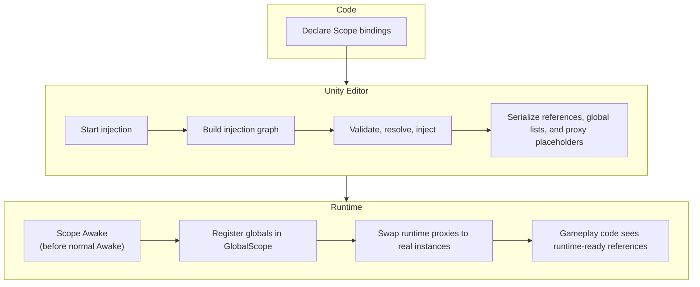

# Architecture overview

Saneject is architected as an editor-time dependency injection and wiring system for Unity. The normal workflow is to declare [bindings](../reference/glossary.md#binding) in `Scope` components, run injection in the Unity Editor, and let Saneject write resolved dependencies into serialized scene and prefab data before Play Mode starts.

A small runtime layer remains for the cases Unity cannot finish at edit time. In practice, that runtime layer exists for two jobs:

- Registering editor-resolved global components into `GlobalScope`
- Swapping serialized [runtime proxy](../reference/glossary.md#runtime-proxy) placeholders with real component instances

That design goal is the key to understanding the whole framework. Saneject is not a runtime container that rebuilds an object graph every time the game starts. It is primarily an authoring-time system that prepares Unity content ahead of runtime.

## Architecture at a glance

## Major systems

### Scope & bindings

[Scope](../core-concepts/scope.md) is the unit that declares resolution rules for part of a hierarchy. Inside `DeclareBindings()`, a [scope](../reference/glossary.md#scope) creates [Binding](../core-concepts/binding.md) objects that describe:

- What type is being requested
- Whether the [binding](../reference/glossary.md#binding) is single-value or collection-based
- Which qualifiers restrict the [binding](../reference/glossary.md#binding)
- How candidates are located
- Which filters are applied after candidate location

At injection time, Saneject starts at the nearest reachable [scope](../reference/glossary.md#scope) and walks upward until it finds the first matching [binding](../reference/glossary.md#binding).

### Injection targets

An [injection target](../reference/glossary.md#injection-target) is a `Component` that owns injected members. Those members can be:

- fields marked with `[Inject]`
- [Auto-property backing fields](../reference/glossary.md#auto-property-backing-field) marked with `[field: Inject]`
- Methods marked with `[Inject]`

Saneject also walks nested `[Serializable]` class instances inside a component, so injected fields and methods are not limited to the top-level `MonoBehaviour` itself. For the member-level rules, see [Field, property & method injection](../core-concepts/field-property-and-method-injection.md).

### Context system

[Context](../core-concepts/context.md) is the boundary system that keeps [scene objects](../reference/glossary.md#scene-object), [prefab instances](../reference/glossary.md#prefab-instance), and [prefab assets](../reference/glossary.md#prefab-asset) from being treated as one undifferentiated search space. It influences architecture in two places:

- Graph filtering decides which parts of a hierarchy participate in a run
- [Context isolation](../reference/glossary.md#context-isolation) decides which [scopes](../reference/glossary.md#scope) and [dependency candidates](../reference/glossary.md#dependency-candidate) are allowed to cross boundaries during resolution

Without [context](../reference/glossary.md#context), edit-time injection in Unity would be far less predictable across scenes and prefabs.

### Edit-time pipeline

The edit-time architecture is the main engine of the framework. It builds an [injection graph](../reference/glossary.md#injection-graph), narrows it to the active set for the current run, validates [bindings](../reference/glossary.md#binding), resolves dependencies, writes values into objects, collects [proxy swap targets](../reference/glossary.md#proxy-swap-target), and emits a complete result summary.

That pipeline is described in detail in [Edit-time architecture](edit-time-architecture.md).

### Generated code

Saneject uses Roslyn to fill in the parts Unity does not provide by default:

- [SerializeInterface](../core-concepts/serialized-interface.md) generates hidden serialized backing members and synchronization methods for interface-typed members.
- [Runtime proxy](../reference/glossary.md#runtime-proxy) generation creates proxy script stubs and proxy interface implementations so interface members can temporarily hold placeholder assets.
- [Roslyn analyzers](../reference/glossary.md#roslyn-analyzer) catch some invalid injection patterns before an [injection run](../reference/glossary.md#injection-run) even starts. See [Code analyzers](../editor-and-tooling/code-analyzers.md).

Generated code is not a side feature. It is part of how Saneject makes interface-based edit-time injection practical inside Unity's serialization model.

### Runtime handoff layer

The runtime layer is intentionally small. It centers on [Scope](../core-concepts/scope.md), [GlobalScope](../core-concepts/global-scope.md), and [Runtime proxy](../core-concepts/runtime-proxy.md).

At runtime, `Scope.Awake()` performs early startup work using data that was prepared during editor injection:

- Hidden global component lists are registered into `GlobalScope`
- Components that were marked as [proxy swap targets](../reference/glossary.md#proxy-swap-target) are asked to replace proxies with real instances

That runtime handoff is described in detail in [Runtime architecture](runtime-architecture.md).

## Edit-time and runtime relationship

| Case                                           | What the editor does                                                                                         | What runtime does                                                                |
|------------------------------------------------|--------------------------------------------------------------------------------------------------------------|----------------------------------------------------------------------------------|
| Direct component or asset dependency           | Writes the real object reference into the member.                                                            | Nothing extra.                                                                   |
| Interface dependency with `SerializeInterface` | Writes the real object into the generated hidden backing member and keeps the interface member synchronized. | Nothing extra unless the value is a [runtime proxy](../reference/glossary.md#runtime-proxy).                               |
| `BindGlobal<T>()`                              | Resolves the component and stores it in the declaring [scope](../reference/glossary.md#scope)'s hidden global list.                            | Registers that component into `GlobalScope` during `Scope.Awake()`.              |
| `FromRuntimeProxy()` [binding](../reference/glossary.md#binding)                   | Resolves or creates a proxy asset and serializes that placeholder into the interface member.                 | Resolves the real runtime instance and swaps the placeholder out during startup. |

## What is serialized and what is deferred

Saneject's split is easier to reason about if you separate serialized state from deferred state.

Serialized at edit time:

- Ordinary component references that Unity can store directly
- Ordinary asset references that Unity can store directly
- Interface references persisted through generated `SerializeInterface` backing members
- The list of global components owned by each [scope](../reference/glossary.md#scope)
- [Runtime proxy](../reference/glossary.md#runtime-proxy) placeholder assets and their [proxy swap targets](../reference/glossary.md#proxy-swap-target)

Deferred to runtime:

- Registration of hidden global component lists into the static `GlobalScope`
- Resolution of [runtime proxy](../reference/glossary.md#runtime-proxy) placeholders into real component instances
- Creation of runtime-only objects for proxy resolve methods such as `FromComponentOnPrefab(...)` and `FromNewComponentOnNewGameObject(...)`

Saneject does not defer normal field/property resolution and method invocation to runtime. The runtime layer exists to bridge boundaries that Unity fundamentally cannot serialize.

## Tradeoffs and constraints

- Saneject resolves `UnityEngine.Component` and `UnityEngine.Object` assets. It does not resolve arbitrary POCO object graphs.
- The main [injection pipeline](../reference/glossary.md#injection-pipeline) is editor-only. Entering Play Mode does not rebuild the [injection graph](../reference/glossary.md#injection-graph) or re-run [binding](../reference/glossary.md#binding) validation.
- Scope/context resolution results are fixed at injection time and persisted. Runtime does not re-evaluate [scope](../reference/glossary.md#scope) fallback or [context filtering](../reference/glossary.md#context-filtering).
- Cross-boundary dependencies Unity cannot serialize directly require a runtime bridge (`GlobalScope`, `RuntimeProxy`, or both).
- Fixed injected references improve determinism and inspector visibility, but reduce runtime composition flexibility compared to runtime DI containers.
- Resolving and validating before Play Mode moves failures earlier, but runtime-state-dependent wiring still requires startup bridge logic.
- Keeping runtime narrow avoids a live runtime DI container with its own lifecycle, but bridge-based dependencies still care about startup-order and lifetime of their target dependencies.

## Related pages

- [Edit-time architecture](edit-time-architecture.md)
- [Runtime architecture](runtime-architecture.md)
- [Scope](../core-concepts/scope.md)
- [Binding](../core-concepts/binding.md)
- [Context](../core-concepts/context.md)
- [Serialized interface](../core-concepts/serialized-interface.md)
- [Runtime proxy](../core-concepts/runtime-proxy.md)
- [Global scope](../core-concepts/global-scope.md)
- [Glossary](../reference/glossary.md)

