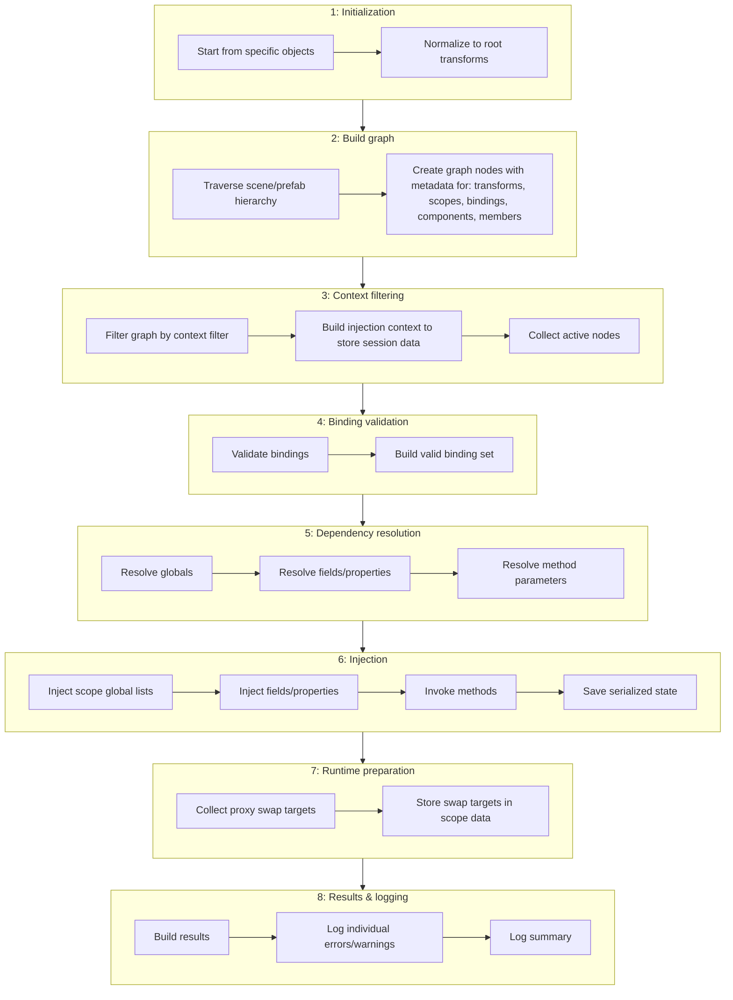

# Edit-time architecture

This page explains the editor-side system that prepares injected scenes and prefabs. It is about architecture and lifecycle, not the fluent [binding](../reference/glossary.md#binding) API. 

For the individual concepts, see [Scope](../core-concepts/scope.md), [Binding](../core-concepts/binding.md), [Context](../core-concepts/context.md), and [Field, property & method injection](../core-concepts/field-property-and-method-injection.md).

## Responsibilities of the edit-time system

The edit-time architecture has five main responsibilities:

- Build a structural model of the selected hierarchies
- Decide which parts of that model are active for the current run
- Validate [bindings](../reference/glossary.md#binding) before any dependency lookup starts
- Resolve and inject dependencies into [scopes](../reference/glossary.md#scope) and components
- Prepare any runtime handoff data that Play Mode will need later

This is the core of Saneject. Almost everything the framework does happens here.

## Injection pipeline

### 1. Initialization

Injection starts from editor commands such as scene injection, selected hierarchy injection, prefab injection, or [batch injection](../reference/glossary.md#batch-injection). All of those entry points ultimately converge on `InjectionRunner`.

`InjectionRunner` first applies two high-level rules:

- The pipeline only runs in Edit Mode
- The selected start objects are normalized to `Transform` roots before graph construction begins

For [batch injection](../reference/glossary.md#batch-injection), the same pipeline is reused for each scene or [prefab asset](../reference/glossary.md#prefab-asset). The surrounding batch system handles scene loading, saving, and per-item status reporting, but the actual injection stages stay the same.

### 2. Build graph

The first real architectural step is building an `InjectionGraph`. The graph building starts from the root transforms of the selected objects and recursively models the reachable hierarchy.

Each `TransformNode` records the information the later stages depend on:

- The real `Transform`
- The node's [context](../reference/glossary.md#context) identity
- The [scope](../reference/glossary.md#scope) declared directly on that transform, if any
- The nearest reachable [scope](../reference/glossary.md#scope) above it
- The child transforms below it
- The component nodes on that transform that actually contain injectable members

That "nearest reachable [scope](../reference/glossary.md#scope)" detail matters. It is computed while the graph is built, and it already respects `UseContextIsolation`. In other words, the graph is not only a tree of transforms. It is also the first place where architectural boundaries start to take shape.

#### Component and member discovery

For each component, Saneject discovers injectable members by walking:

- Top-level fields marked with `[Inject]`
- [Auto-property backing fields](../reference/glossary.md#auto-property-backing-field) marked with `[field: Inject]`
- Methods marked with `[Inject]`
- Nested `[Serializable]` class instances stored inside the component

That deep traversal is important for architecture because it means the pipeline is not limited to the immediate members on a `MonoBehaviour`. Nested serialized objects participate in the same run and are resolved with the same [scope](../reference/glossary.md#scope) and [context](../reference/glossary.md#context) rules.

### 3. Context filtering and the active set

After the full graph exists, Saneject applies `ContextWalkFilter` through `GraphFilter`. This produces the active transform set for the current run.

`ContextWalkFilter` options:

- `AllContexts`
- `SameContextsAsSelection`
- `SceneObjects`
- `PrefabInstances`
- `PrefabAssetObjects`

The result is used to build an `InjectionContext`, which is the per-run working set for the rest of the pipeline. `InjectionContext` projects the active transforms into:

- Active component nodes
- Active [scope](../reference/glossary.md#scope) nodes
- Active [binding](../reference/glossary.md#binding) nodes
- Resolution maps for fields, methods, and global components
- Accumulated results such as errors, created proxy assets, and used [bindings](../reference/glossary.md#binding)

Filtering only decides what participates in the run. It does not decide whether a candidate is allowed to cross a [context](../reference/glossary.md#context) boundary. That second decision still belongs to [context isolation](../reference/glossary.md#context-isolation) during resolution.

### 4. Binding validation

Saneject validates every active [binding](../reference/glossary.md#binding) before it tries to satisfy a single field, property, or method parameter.

Validation covers the architecture-level invariants of the [binding](../reference/glossary.md#binding) system:

- Duplicate [bindings](../reference/glossary.md#binding) inside the same [scope](../reference/glossary.md#scope)
- Duplicate global ownership of the same concrete component type
- [Component bindings](../reference/glossary.md#component-binding) whose concrete type is not a `Component`
- [Asset bindings](../reference/glossary.md#asset-binding) whose concrete type incorrectly derives from `Component`
- Interface declarations that are not actually interfaces
- Interface and concrete type pairs that do not match
- [Runtime proxy bindings](../reference/glossary.md#runtime-proxy-binding) that do not satisfy proxy constraints
- [Bindings](../reference/glossary.md#binding) that never selected a [locator strategy](../reference/glossary.md#locator-strategy)

An invalid [binding](../reference/glossary.md#binding) is logged and excluded from `ValidBindingNodes`, but the rest of the run continues. This is a deliberate architectural choice. The pipeline is designed to report the full state of a run, not to stop at the first bad [binding](../reference/glossary.md#binding).

### 5. Dependency resolution

Resolution is split into three ordered phases:

1. Global [bindings](../reference/glossary.md#binding)
2. Fields and auto-properties
3. Methods

That order matters because the later stages depend on the earlier stages having already established the data they need.

#### Binding matching

For ordinary field and method resolution, Saneject starts at the [injection target](../reference/glossary.md#injection-target)'s nearest reachable [scope](../reference/glossary.md#scope) and walks up parent [scopes](../reference/glossary.md#scope) until it finds the first matching [binding](../reference/glossary.md#binding).

A [binding](../reference/glossary.md#binding) matches only if all of the following line up:

- Requested type
- Single-value versus collection shape
- `ToTarget(...)` qualifiers, if present
- `ToMember(...)` qualifiers, if present
- `ToID(...)` qualifiers, if present

This is why architecture pages treat [scopes](../reference/glossary.md#scope), [bindings](../reference/glossary.md#binding), and [injection targets](../reference/glossary.md#injection-target) as a single cooperating system. None of them are very meaningful in isolation.

#### Locate dependency candidates

Once a [binding](../reference/glossary.md#binding) has matched, the locator stage produces candidate objects.

For [component bindings](../reference/glossary.md#component-binding), candidates can come from hierarchy traversal, explicit instances, scene-wide search, or [runtime proxy](../reference/glossary.md#runtime-proxy) resolution depending on the configured `From...` strategy.

For [asset bindings](../reference/glossary.md#asset-binding), candidates can come from `Resources`, direct `AssetDatabase` paths, folders, or explicit asset instances.

For [runtime proxy bindings](../reference/glossary.md#runtime-proxy-binding) specifically, the editor does not look up the final runtime component. Instead, it resolves a proxy asset through `ProxyAssetResolver`. That resolver either reuses an existing proxy asset with the same concrete type and `RuntimeProxyConfig`, or creates a new one in the configured proxy output folder.

#### Filters and context isolation

After candidate location, [binding filters](../reference/glossary.md#binding-filter) are applied. If a filter throws, Saneject logs the exception and continues the run.

Then [context isolation](../reference/glossary.md#context-isolation) decides which candidates are still valid. With `UseContextIsolation` enabled:

- Nearest-scope lookup only walks through [scopes](../reference/glossary.md#scope) in the same [context](../reference/glossary.md#context) as the [injection target](../reference/glossary.md#injection-target)
- Candidate objects from other [contexts](../reference/glossary.md#context) are rejected

One subtle but important detail is that non-`GameObject` objects such as assets and proxy assets have `ContextType.Global`, so they are not rejected by [context isolation](../reference/glossary.md#context-isolation). This is what makes asset injection and proxy placeholder injection compatible with strict [context](../reference/glossary.md#context) boundaries.

#### Result shaping

After candidate selection, Saneject shapes the result to the target member type:

- Single-value sites take the first candidate
- Array sites receive all candidates as an array
- `List<T>` sites receive all candidates as a new list

If no matching [binding](../reference/glossary.md#binding) is found, Saneject records a missing [binding](../reference/glossary.md#binding) error. If a [binding](../reference/glossary.md#binding) matches but produces no valid candidates, Saneject records a missing dependency error. In both cases, the stored resolution becomes `null`.

For methods, each parameter is resolved independently, but method-level qualifiers are shared by the whole method.

### 6. Injection

After resolution, `Injector` performs the actual write phase in this order:

1. Inject resolved global components into each active [scope](../reference/glossary.md#scope)'s hidden global list
2. Assign field and [auto-property backing field](../reference/glossary.md#auto-property-backing-field) values by reflection
3. Invoke `[Inject]` methods by reflection

The injector then marks the affected [scopes](../reference/glossary.md#scope) and components dirty so Unity persists the new serialized state.

Two architectural points matter here:

- Global component lists are editor data, not runtime lookups. They are serialized onto the declaring [scope](../reference/glossary.md#scope) for later startup registration.
- Method injection is intentionally the last ordinary injection step, so methods run after fields and properties already hold their resolved values.

If a method throws, the exception is caught and logged as part of the run result instead of aborting the pipeline.

### 7. Runtime preparation

Once values have been written, Saneject prepares the runtime handoff for interface members that currently hold [runtime proxy](../reference/glossary.md#runtime-proxy) assets.

`ProxySwapTargetCollector` does this by:

1. Clearing the current [proxy swap target](../reference/glossary.md#proxy-swap-target) list on every active [scope](../reference/glossary.md#scope)
2. Scanning injected interface field nodes after field injection has completed
3. Checking whether the current field value is a `RuntimeProxyBase`
4. Registering the owning component on the nearest [scope](../reference/glossary.md#scope) if that component implements `IRuntimeProxySwapTarget`

This step is the bridge between edit-time injection and [runtime startup](../reference/glossary.md#runtime-startup). The editor records which components need proxy swapping later, but the actual swap is deferred to `Scope.Awake()`.

### 8. Results & logging

After that, `InjectionContext` computes the final run result:

- All accumulated errors
- Created proxy assets
- Injected field, property, and method counts
- Registered global count
- [Proxy swap target](../reference/glossary.md#proxy-swap-target) count
- Valid-but-unused [bindings](../reference/glossary.md#binding)

`Logger` then emits ordered error logs, optional unused-binding warnings, created-proxy logs, and a summary line. The logging system is designed to finish the run and report everything it found in one pass.

For the Roslyn/code-generation layer that supports both edit-time and runtime behavior, see [Roslyn & generated code](roslyn-and-generated-code.md).

## Boundaries of the edit-time architecture

The editor pipeline is powerful, but its boundaries are deliberate.

- It only runs in the Unity Editor.
- It prepares serialized data. It does not stay alive as a runtime container.
- It resolves Unity objects, not arbitrary plain C# service graphs.
- It can prepare [runtime proxy](../reference/glossary.md#runtime-proxy) placeholders, but the real runtime instance may still depend on Play Mode state such as loaded scenes or object creation.
- It does not use generated code to hide architectural complexity. Generated code exists because Unity's serializer and interface model leave gaps that the framework must bridge explicitly.

## Related pages

- [Architecture overview](architecture-overview.md)
- [Runtime architecture](runtime-architecture.md)
- [Roslyn & generated code](roslyn-and-generated-code.md)
- [Scope](../core-concepts/scope.md)
- [Binding](../core-concepts/binding.md)
- [Context](../core-concepts/context.md)
- [Field, property & method injection](../core-concepts/field-property-and-method-injection.md)
- [Serialized interface](../core-concepts/serialized-interface.md)
- [Runtime proxy](../core-concepts/runtime-proxy.md)
- [Logging & validation](../editor-and-tooling/logging-and-validation.md)
- [Glossary](../reference/glossary.md)
