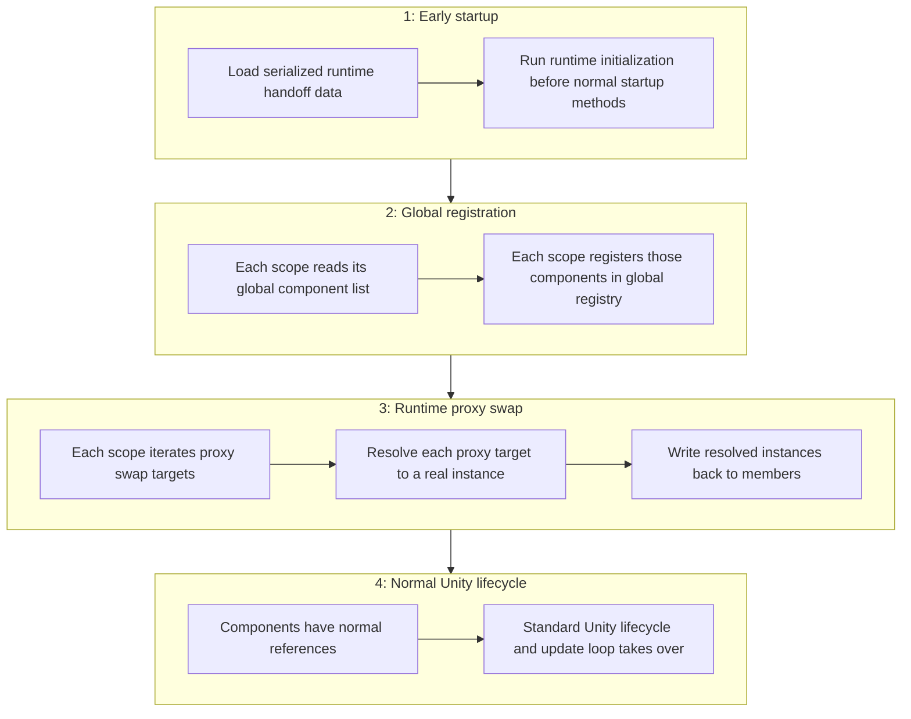

# Runtime architecture

Saneject's runtime layer is intentionally small. It does not run the injection pipeline again. It executes a short startup handoff on data prepared in the editor, then Unity's normal lifecycle continues.

## Runtime flow

### 1. Early startup

Runtime starts from serialized handoff data produced by edit-time injection. The runtime layer does not discover dependencies here. It consumes precomputed data and applies it in a deterministic startup order.

The central runtime entry point is `Scope.Awake()`. `Scope` has `[DefaultExecutionOrder(-10000)]`, so this startup hook runs before regular `Awake()` methods. That timing is intentional. It ensures global registration and proxy swap complete before normal gameplay startup code begins reading dependencies.

This applies not only at initial scene startup. Any `Scope` that becomes active later, such as from a spawned prefab instance, runs the same handoff sequence in its own `Awake()`.

The key architectural boundary in this phase is:

- Input: serialized lists prepared by edit-time architecture.
- Output: runtime-ready state for registration and proxy swap phases.

### 2. Global registration

Each scope reads its serialized global component list and registers those instances into `GlobalScope` through `GlobalScope.RegisterComponent(...)`.

From an architecture perspective, this is a state activation step. Edit-time determined which concrete objects should be globally available. Runtime makes those objects reachable through a shared lookup surface during startup.

Why ordering matters:

- Global registration must complete before proxy swap logic that may depend on global lookups.
- Global registration ownership and lifetime are tied to the declaring scope (registered in `Scope.Awake()`, unregistered in `Scope.OnDestroy()`).

For more details, see [Global scope](../core-concepts/global-scope.md).

### 3. Runtime proxy swap

Each scope iterates serialized proxy swap targets and executes generated swap logic on those targets. In practice, `Scope.Awake()` calls `SwapProxiesWithRealInstances()` on components that implement `IRuntimeProxySwapTarget` and were registered with the `Scope` during edit-time injection.

`IRuntimeProxySwapTarget.SwapProxiesWithRealInstances()` is Roslyn-generated for components using `SerializeInterface`. The generated method checks serialized interface backing members, detects `RuntimeProxyBase` placeholders, calls `RuntimeProxyBase.ResolveInstance()`, and writes the resolved real instance back to the member.

This phase is intentionally narrow:

- It operates only on known swap targets collected during edit-time injection.
- It applies generated member assignments instead of re-running graph traversal.
- It finishes and disappears once placeholders are replaced with real instances.

For more details, see [Runtime proxy](../core-concepts/runtime-proxy.md).

### 4. Normal Unity lifecycle

After global registration and proxy swap complete, Saneject runtime handoff is effectively finished. Control returns to normal Unity component lifecycle behavior with runtime references stabilized.

From this point, Saneject almost disappears from the runtime, with a few exceptions:

- `Scope.Awake()` and `Scope.OnDestroy()` still exist and will register/unregister global components (if any) with `GlobalScope`.
- Instantiated prefabs that contain a `Scope` run the same startup cycle for that instance: global registration, then proxy swap.

Other than that, there is no runtime element to Saneject. The runtime layer has one objective: activate precomputed state and finalize bridge-based references.

## Tradeoffs and constraints

- The runtime layer stays small and predictable, but runtime-dependent dependencies still require startup handoff.
- Most wiring is fixed at edit-time, which improves determinism but reduces runtime composition flexibility compared to runtime DI containers.
- Cross-boundary dependencies Unity cannot serialize directly require runtime bridges.

## Notes

- Runtime does not rebuild the injection graph, re-run validation, or repeat edit-time resolution.
- Runtime behavior depends on serialized data produced by editor injection.
- `Scope.OnDestroy()` unregisters owned global components when scopes are destroyed.
- For details on runtime registry and proxy mechanics, see [Global scope](../core-concepts/global-scope.md) and [Runtime proxy](../core-concepts/runtime-proxy.md).

## Related pages

- [Architecture overview](architecture-overview.md)
- [Edit-time architecture](edit-time-architecture.md)
- [Roslyn & generated code](roslyn-and-generated-code.md)
- [Scope](../core-concepts/scope.md)
- [Global scope](../core-concepts/global-scope.md)
- [Runtime proxy](../core-concepts/runtime-proxy.md)
- [Context](../core-concepts/context.md)
