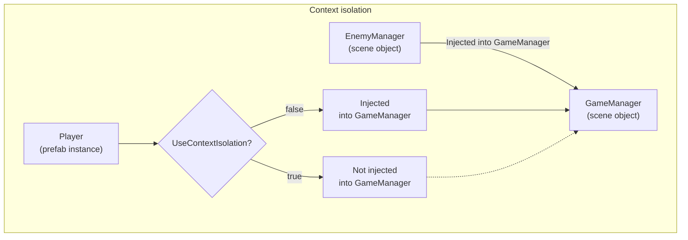
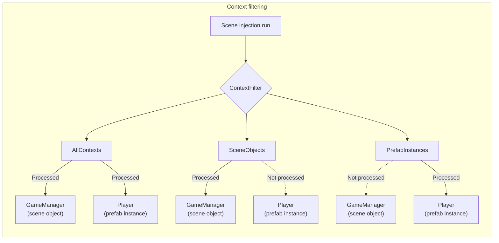

# Context

A context is Saneject's way of saying "this object belongs to this serialized boundary".

Saneject uses context during editor injection to answer two questions:

- Which transforms participate in the injection walk?
- Which potential dependency candidates can be injected in this component?

## Context types

For `GameObject` hierarchies, Saneject uses these context types:

- `Scene object`: a regular object in a scene.
- `Prefab instance`: a prefab instance in a scene or nested inside another prefab.
- `Prefab asset`: the prefab asset in the Project window.

Context equality is instance-specific, not type-based. Saneject assigns a context ID and uses that ID to compare context equality. The same rule applies to scenes, prefab instances, and prefab assets.

Example:

- Scene A and Scene B are different contexts.
- Prefab instances of the same prefab asset are different contexts.
- Each prefab asset is its own context.

## Why contexts exist

Unity already enforces some serialization boundaries. For example, scene objects cannot serialize direct references to prefab asset objects, and vice versa.

However, edit-time injection can still create dependencies across boundaries where Unity technically allows references, like between a scene object and prefab instance within the same scene. That can make a prefab depend on the scene where it was authored, making it less modular and portable to other contexts.

Saneject addresses this with two controls:

- `Context isolation`: controls whether dependency resolution can cross contexts.
- `Context filtering`: controls which contexts are included in a specific injection run.

## Context isolation

`Context isolation` is a project setting.

- UI path: `Saneject/Settings/Project Settings/Use Context Isolation`
- File path: `{ProjectRoot}/ProjectSettings/Saneject/ProjectSettings.json`

Because it is in `ProjectSettings`, teams can version control and share the same behavior. It is important that the entire project uses the same isolation setting so injection stays deterministic for everyone.

### What isolation changes

When Saneject resolves an `[Inject]` member, there are two relevant steps:

1. Find a matching binding by walking scopes upward.
2. Locate dependency candidates from the chosen binding.

With isolation enabled:

- Step 1 only considers scopes in the same context as the injection target component.
- Step 2 rejects dependency candidates from other contexts.

With isolation disabled:

- Step 1 can walk across scene object and prefab instance boundaries in the active hierarchy.
- Step 2 can also accept dependency candidates across those boundaries.

### Practical effect

- `UseContextIsolation = true`: Strict boundaries. A component can only get injected into other components from its own context, e.g., a component on a prefab instance cannot be injected into a component on a scene object.
- `UseContextIsolation = false`: Relaxed boundaries. Components can be injected across contexts, e.g., a component on a prefab instance can be injected into a component on a scene object.

## Context filtering

`Context filtering` decides which injection targets are included in an injection run, meaning which components are processed for injection.

Saneject builds the injection graph first, then applies the selected `ContextWalkFilter`.
Only the filtered transforms become active, and only components under those transforms are processed.

What filtering does not do: it does not change context isolation rules, and it does not directly filter dependency candidates returned by an active binding.

So if an active binding searches into another context, those candidates can still be found. Whether they are accepted is still decided by `UseContextIsolation`.

Example: run with `SceneObjects` filter, and a scene `Scope` binding uses `FromDescendants`.
If that hierarchy contains a prefab instance child, the binding can still find components on that prefab instance.

- `UseContextIsolation = false`: those cross-context candidates can be injected.
- `UseContextIsolation = true`: those cross-context candidates are rejected.

### Why use filters

Filters are most useful as a focused debugging and iteration tool in large hierarchies.
For example, in a large scene, `SceneObjects` lets you validate scene-object wiring without processing prefab instances in the same pass.

A common workflow is:

- Use filters selectively while developing or debugging.
- Run a full injection pass (`AllContexts` or normal full scene/prefab injection) before final validation.

### Filter options

- `AllContexts`: process all transform nodes in the graph.
- `SameContextsAsSelection`: process only nodes that match the selected object contexts.
- `SceneObjects`: process only scene object contexts.
- `PrefabAssetObjects`: process only prefab asset contexts.
- `PrefabInstances`: process only prefab instance contexts.

### Where filters are used

You can pick these filters from:

- Injection menu items.
- Injection controls in the `Scope` inspector.

## Isolation vs filtering

These features solve different problems:

- Filtering decides what enters the run.
- Isolation decides what gets injected where inside that run.

So you can run `AllContexts` and still keep strict boundaries by enabling isolation.
Or you can run a narrow filter and still allow cross-context resolution by disabling isolation.

## Pipeline summary

At a high level, Saneject applies context rules in this order:

1. Build the injection graph from the selected start roots.
2. Apply `ContextWalkFilter` to select active transforms.
3. Build active components, scopes, and bindings from those transforms.
4. Resolve bindings and dependency candidates.
5. Apply context isolation rules while resolving.

## Cross-context dependencies

If a dependency must cross a hard boundary (for example scene to prefab asset), use a runtime proxy.
That is the intended pattern for cross-context wiring.

See [Runtime proxy](runtime-proxy.md).

## Visual examples

## Related pages

- [Scope](scope.md)
- [Binding](binding.md)
- [Global scope](global-scope.md)
- [Runtime proxy](runtime-proxy.md)
- [Glossary](../reference/glossary.md)

