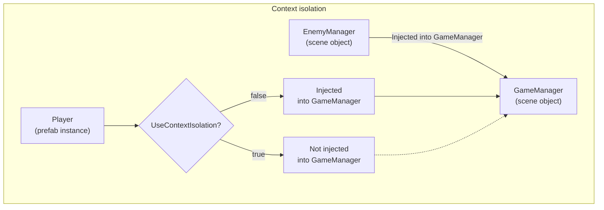
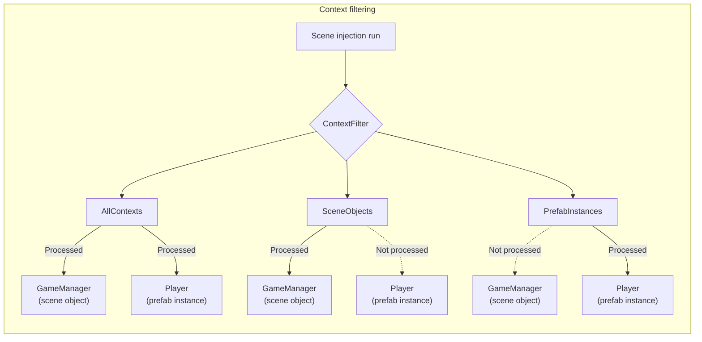

# Context

A [context](../reference/glossary.md#context) is Saneject's way of saying "this object belongs to this serialized boundary".

Saneject uses [context](../reference/glossary.md#context) during editor injection to answer two questions:

- Which transforms participate in the injection walk?
- Which potential [dependency candidates](../reference/glossary.md#dependency-candidate) can be injected in this component?

## Context types

For `GameObject` hierarchies, Saneject uses these [context](../reference/glossary.md#context) types:

- `Scene object`: a regular object in a scene.
- `Prefab instance`: a [prefab instance](../reference/glossary.md#prefab-instance) in a scene or nested inside another prefab.
- `Prefab asset`: the [prefab asset](../reference/glossary.md#prefab-asset) in the Project window.

[Context equality](../reference/glossary.md#context-equality) is instance-specific, not type-based. Saneject assigns a [context](../reference/glossary.md#context) ID and uses that ID to compare [context equality](../reference/glossary.md#context-equality). The same rule applies to scenes, [prefab instances](../reference/glossary.md#prefab-instance), and [prefab assets](../reference/glossary.md#prefab-asset).

Example:

- Scene A and Scene B are different [contexts](../reference/glossary.md#context).
- [Prefab instances](../reference/glossary.md#prefab-instance) of the same [prefab asset](../reference/glossary.md#prefab-asset) are different [contexts](../reference/glossary.md#context).
- Each [prefab asset](../reference/glossary.md#prefab-asset) is its own [context](../reference/glossary.md#context).

## Why contexts exist

Unity already enforces some [serialization boundaries](../reference/glossary.md#serialization-boundary). For example, [scene objects](../reference/glossary.md#scene-object) cannot serialize direct references to [prefab asset](../reference/glossary.md#prefab-asset) objects, and vice versa.

However, edit-time injection can still create dependencies across boundaries where Unity technically allows references, like between a [scene object](../reference/glossary.md#scene-object) and [prefab instance](../reference/glossary.md#prefab-instance) within the same scene. That can make a prefab depend on the scene where it was authored, making it less modular and portable to other [contexts](../reference/glossary.md#context).

Saneject addresses this with two controls:

- `Context isolation`: controls whether dependency resolution can cross [contexts](../reference/glossary.md#context).
- `Context filtering`: controls which [contexts](../reference/glossary.md#context) are included in a specific [injection run](../reference/glossary.md#injection-run).

## Context isolation

`Context isolation` is a [project setting](../reference/glossary.md#project-settings).

- UI path: `Saneject/Settings/Project Settings/Use Context Isolation`
- File path: `{ProjectRoot}/ProjectSettings/Saneject/ProjectSettings.json`

Because it is in `ProjectSettings`, teams can version control and share the same behavior. It is important that the entire project uses the same isolation setting so injection stays deterministic for everyone.

### What isolation changes

When Saneject resolves an `[Inject]` member, there are two relevant steps:

1. Find a matching [binding](../reference/glossary.md#binding) by walking [scopes](../reference/glossary.md#scope) upward.
2. Locate [dependency candidates](../reference/glossary.md#dependency-candidate) from the chosen [binding](../reference/glossary.md#binding).

With isolation enabled:

- Step 1 only considers [scopes](../reference/glossary.md#scope) in the same [context](../reference/glossary.md#context) as the [injection target](../reference/glossary.md#injection-target) component.
- Step 2 rejects [dependency candidates](../reference/glossary.md#dependency-candidate) from other [contexts](../reference/glossary.md#context).

With isolation disabled:

- Step 1 can walk across [scene object](../reference/glossary.md#scene-object) and [prefab instance](../reference/glossary.md#prefab-instance) boundaries in the active hierarchy.
- Step 2 can also accept [dependency candidates](../reference/glossary.md#dependency-candidate) across those boundaries.

### Practical effect

- `UseContextIsolation = true`: Strict boundaries. A component can only get injected into other components from its own [context](../reference/glossary.md#context), e.g., a component on a [prefab instance](../reference/glossary.md#prefab-instance) cannot be injected into a component on a [scene object](../reference/glossary.md#scene-object).
- `UseContextIsolation = false`: Relaxed boundaries. Components can be injected across [contexts](../reference/glossary.md#context), e.g., a component on a [prefab instance](../reference/glossary.md#prefab-instance) can be injected into a component on a [scene object](../reference/glossary.md#scene-object).

## Context filtering

`Context filtering` decides which [injection targets](../reference/glossary.md#injection-target) are included in an [injection run](../reference/glossary.md#injection-run), meaning which components are processed for injection.

Saneject builds the [injection graph](../reference/glossary.md#injection-graph) first, then applies the selected `ContextWalkFilter`.
Only the filtered transforms become active, and only components under those transforms are processed.

What filtering does not do: it does not change [context isolation](../reference/glossary.md#context-isolation) rules, and it does not directly filter [dependency candidates](../reference/glossary.md#dependency-candidate) returned by an active [binding](../reference/glossary.md#binding).

So if an active [binding](../reference/glossary.md#binding) searches into another [context](../reference/glossary.md#context), those candidates can still be found. Whether they are accepted is still decided by `UseContextIsolation`.

Example: run with `SceneObjects` filter, and a scene `Scope` [binding](../reference/glossary.md#binding) uses `FromDescendants`.
If that hierarchy contains a [prefab instance](../reference/glossary.md#prefab-instance) child, the [binding](../reference/glossary.md#binding) can still find components on that [prefab instance](../reference/glossary.md#prefab-instance).

- `UseContextIsolation = false`: those cross-context candidates can be injected.
- `UseContextIsolation = true`: those cross-context candidates are rejected.

### Why use filters

Filters are most useful as a focused debugging and iteration tool in large hierarchies.
For example, in a large scene, `SceneObjects` lets you validate scene-object wiring without processing [prefab instances](../reference/glossary.md#prefab-instance) in the same pass.

A common workflow is:

- Use filters selectively while developing or debugging.
- Run a full injection pass (`AllContexts` or normal full scene/prefab injection) before final validation.

### Filter options

- `AllContexts`: process all transform nodes in the graph.
- `SameContextsAsSelection`: process only nodes that match the selected object [contexts](../reference/glossary.md#context).
- `SceneObjects`: process only [scene object](../reference/glossary.md#scene-object) [contexts](../reference/glossary.md#context).
- `PrefabAssetObjects`: process only [prefab asset](../reference/glossary.md#prefab-asset) [contexts](../reference/glossary.md#context).
- `PrefabInstances`: process only [prefab instance](../reference/glossary.md#prefab-instance) [contexts](../reference/glossary.md#context).

### Where filters are used

You can pick run filters from:

- [Injection context menu](../reference/glossary.md#injection-context-menu) items.
- `Batch Inject Selected Assets` menu items under `Assets/Saneject/Batch Inject Selected Assets/...` and `Saneject/Batch Inject Selected Assets/...`.
- The `ContextWalkFilter` dropdown in the [Batch Injector](../reference/glossary.md#batch-injector) window for supported scene and [prefab asset](../reference/glossary.md#prefab-asset) runs.

## Isolation vs filtering

These features solve different problems:

- [Context filtering](../reference/glossary.md#context-filtering) decides what enters the run.
- [Context isolation](../reference/glossary.md#context-isolation) decides what gets injected where inside that run.

So you can run `AllContexts` and still keep strict boundaries by enabling [context isolation](../reference/glossary.md#context-isolation).
Or you can run a narrow filter and still allow cross-context resolution by disabling [context isolation](../reference/glossary.md#context-isolation).

## Pipeline summary

At a high level, Saneject applies [context](../reference/glossary.md#context) rules in this order:

1. Build the [injection graph](../reference/glossary.md#injection-graph) from the selected start roots.
2. Apply `ContextWalkFilter` to select active transforms.
3. Build active components, [scopes](../reference/glossary.md#scope), and [bindings](../reference/glossary.md#binding) from those transforms.
4. Resolve [bindings](../reference/glossary.md#binding) and [dependency candidates](../reference/glossary.md#dependency-candidate).
5. Apply [context isolation](../reference/glossary.md#context-isolation) rules while resolving.

## Cross-context dependencies

If a dependency must cross a hard boundary (for example scene to [prefab asset](../reference/glossary.md#prefab-asset)), use a [runtime proxy](../reference/glossary.md#runtime-proxy).
That is the intended pattern for cross-context wiring.

See [Runtime proxy](runtime-proxy.md) for details.

## Visual examples

## Related pages

- [Scope](scope.md)
- [Binding](binding.md)
- [Global scope](global-scope.md)
- [Runtime proxy](runtime-proxy.md)
- [Glossary](../reference/glossary.md)

