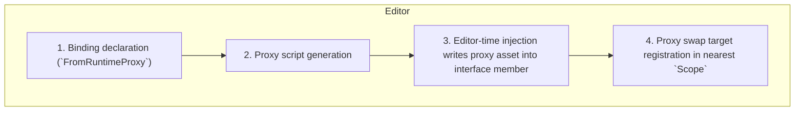
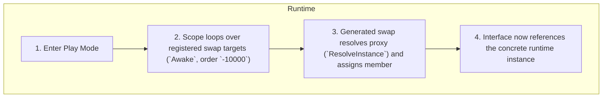

# Runtime proxy

Runtime proxy is one of the more advanced Saneject features. The API is small, but it helps to understand the runtime model before using it.

At a high level, a runtime proxy is a bridge for references Unity cannot serialize directly, such as scene-to-scene, scene-to-prefab, and prefab-to-prefab component references.

## Why runtime proxy exists

Saneject is primarily editor-time DI. It resolves dependencies in the Editor and writes them into serialized members so they persist in scenes and prefabs.

That works well when Unity can serialize the real dependency directly. It breaks down when the dependency is in another runtime context that is not directly serializable.

Runtime proxy solves this by injecting a serializable placeholder asset at editor time, then replacing that placeholder with the real instance during early runtime startup.

## Mental model

A runtime proxy is a serialized placeholder asset (`ScriptableObject`) that temporarily stands in for a real component dependency.

Think about it as a lifecycle, not just a type:

1. At editor time, injection writes a runtime proxy asset into an interface member.
2. That runtime proxy asset is serialized, so the reference can persist across scene/prefab boundaries that Unity cannot serialize directly.
3. At runtime startup, `Scope.Awake()` (execution order `-10000`) automatically swaps the runtime proxy with the real instance.
4. After swap, gameplay code uses the resolved instance through the same interface member.

Type-wise, the runtime proxy is based on `RuntimeProxy<TComponent>` and is generated in two parts:

1. A generated runtime proxy script stub that inherits `RuntimeProxy<TComponent>` and is marked with `[GenerateRuntimeProxy]`.
2. A Roslyn-generated partial implementation that makes the runtime proxy type implement all public non-generic interfaces on `TComponent`.

If a runtime proxy is accessed directly before swap, its generated interface members throw `InvalidOperationException`. That behavior is intentional, because proxies are placeholders and are expected to be swapped automatically during startup.

## Binding a runtime proxy

Runtime runtime proxy bindings start from a component binding, but the global registration and runtime proxy consumer are usually in different contexts.

Bootstrap context:

```csharp
using Plugins.Saneject.Runtime.Scopes;

public class BootstrapScope : Scope
{
    protected override void DeclareBindings()
    {
        BindGlobal<GameManager>()
            .FromScopeSelf();
    }
}
```

Consumer context (another scene or prefab context):

```csharp
using Plugins.Saneject.Runtime.Scopes;

public class HudScope : Scope
{
    protected override void DeclareBindings()
    {
        BindComponent<IGameManager, GameManager>()
            .FromRuntimeProxy()
            .FromGlobalScope();
    }
}
```

If you stop at `FromRuntimeProxy()` and do not call a resolve method, the default resolve method is `FromGlobalScope()`.

Consumer component:

```csharp
using Plugins.Saneject.Runtime.Attributes;
using UnityEngine;

public partial class HudController : MonoBehaviour
{
    [Inject, SerializeInterface]
    private IGameManager gameManager;
}
```

Runtime proxies only work through interfaces. The generated runtime proxy type stands in for interface members, not concrete component members, which is why runtime proxy bindings require `BindComponent<TInterface, TConcrete>()`.

`[SerializeInterface]` is the standard way to make interface members serializable and to generate the `SwapProxiesWithRealInstances()` hook used during runtime swapping. See [Serialized interface](serialized-interface.md) for more details.

API reference:

- [Scope binding entry points](xref:Plugins.Saneject.Runtime.Scopes.Scope)
- [Runtime proxy binding builder](xref:Plugins.Saneject.Runtime.Bindings.RuntimeProxy.RuntimeProxyBindingBuilder)
- [Runtime proxy instance mode builder](xref:Plugins.Saneject.Runtime.Bindings.RuntimeProxy.RuntimeProxyInstanceModeBuilder)

## Editor/runtime flow

Runtime proxy flow has two phases. Editor-time prepares serialized placeholders and runtime finalizes them into real instances.

### Editor phase

1. You declare a binding with `BindComponent<TInterface, TConcrete>().FromRuntimeProxy(...)`.
2. Roslyn and the Unity Editor generate the required runtime proxy scripts (stub plus generated partial implementation).
3. During injection, Saneject injects a runtime proxy asset into the interface member instead of a concrete component reference.
4. If that member contains a runtime proxy and the owner implements `IRuntimeProxySwapTarget`, Saneject registers that component as a proxy swap target on the nearest upwards `Scope`.



### Runtime phase

1. Enter Play Mode
2. Each `Scope` runs `Awake()` at execution order `-10000` and loops over its registered proxy swap targets.
3. For each target, the generated `SwapProxiesWithRealInstances()` method checks serialized single interface members and calls `ResolveInstance()` for any `RuntimeProxyBase` found.
4. The resolved concrete instance is assigned back to the interface member, so normal gameplay code reads the real object for the rest of execution.

If the binding resolves via `FromGlobalScope()`, the required global registration is already done in scope startup before runtime proxy swapping runs.

This startup path is lightweight because swapping uses generated member assignments, not reflection.



## Resolve methods

`FromRuntimeProxy()` returns `RuntimeProxyBindingBuilder`, which configures how the runtime proxy resolves the real instance:

| Method                                               | Runtime behavior                                                                | Notes                                                                                                                      |
|------------------------------------------------------|---------------------------------------------------------------------------------|----------------------------------------------------------------------------------------------------------------------------|
| `FromGlobalScope()`                                  | Dictionary lookup in `GlobalScope`.                                             | Fastest option. Requires the concrete component to be registered in `GlobalScope`, usually via `BindGlobal<TComponent>()`. |
| `FromAnywhereInLoadedScenes()`                       | Uses `FindFirstObjectByType<TComponent>(FindObjectsInactive.Include)`.          | Searches loaded scenes, including inactive objects. Returns the first match.                                               |
| `FromComponentOnPrefab(prefab, dontDestroyOnLoad)`   | Instantiates the prefab and resolves `TComponent` from the instantiated object. | Prefab must contain `TComponent`.                                                                                          |
| `FromNewComponentOnNewGameObject(dontDestroyOnLoad)` | Creates a new `GameObject` and adds `TComponent`.                               | Useful for runtime-only service components.                                                                                |

Example with prefab creation:

```csharp
using Plugins.Saneject.Runtime.Scopes;
using UnityEngine;

public class AudioScope : Scope
{
    [SerializeField] 
    private GameObject audioServicePrefab;

    protected override void DeclareBindings()
    {
        BindComponent<IAudioService, AudioService>()
            .FromRuntimeProxy()
            .FromComponentOnPrefab(audioServicePrefab, dontDestroyOnLoad: true)
            .AsSingleton();
    }
}
```

## Instance mode

`AsTransient()` and `AsSingleton()` are available for creation-based methods:

- `FromComponentOnPrefab(...)`
- `FromNewComponentOnNewGameObject(...)`

Behavior:

- `AsTransient()`: Creates a new instance for each resolve call.
- `AsSingleton()`: Reuses one instance and caches it in `GlobalScope`. Also enforces `dontDestroyOnLoad: true`.

`FromGlobalScope()` and `FromAnywhereInLoadedScenes()` are lookup-based methods, so they do not expose instance mode configuration.

## Proxy generation

The runtime proxy system is almost fully automated. Scripts and assets are generated automatically when declaring bindings and when injecting. Runtime proxy generation has three stages.

### Script generation

**1) Proxy type discovery (Roslyn)**

At compile time, Saneject scans `DeclareBindings()` methods in `Scope` subclasses. It finds chains that include `BindComponent<TInterface, TConcrete>()` with `.FromRuntimeProxy()`, then emits an assembly manifest of required concrete runtime proxy targets.

**2) Proxy script generation (Unity Editor)**

On domain reload, Saneject reads those manifests and generates missing runtime proxy script stubs.

- Controlled by project setting `GenerateProxyScriptsOnDomainReload`.
- If disabled, generate manually from `Saneject/Runtime Proxy/Generate Missing Proxy Scripts`.
- Scripts are created under `ProjectSettings.ProxyAssetGenerationFolder` (default: `Assets/SanejectGenerated/RuntimeProxies`).

**3) Proxy script partial generation (Roslyn)**

During compilation, Roslyn generates a partial implementation for each runtime proxy stub marked with `[GenerateRuntimeProxy]`. The generated partial makes the runtime proxy implement the target component's public non-generic interfaces and emits stub members (events, properties, methods) that throw `InvalidOperationException` until the runtime proxy is swapped.

Unused runtime proxy scripts and assets can be cleaned from:

- `Saneject/Runtime Proxy/Clean Up Unused Scripts And Assets`

### Proxy asset generation and reuse

During injection, runtime proxy assets are created automatically in the same configured output folder used for generated runtime proxy scripts.

For each runtime proxy binding, Saneject checks whether an existing runtime proxy asset already matches both:

- The runtime proxy target type (`TConcrete`)
- The runtime proxy configuration (`RuntimeProxyConfig`, including resolve method, prefab, instance mode, and `dontDestroyOnLoad`)

If a match exists, it is reused. If not, a new asset is created. This keeps runtime proxy asset count lower across scenes and prefabs while still producing the exact configuration each binding needs.

### Generated proxy anatomy

Auto-generated stub script:

```csharp
using Plugins.Saneject.Runtime.Proxy;
using Plugins.Saneject.Runtime.Attributes; 

[GenerateRuntimeProxy]
// GameManager implements IGameObservable, IGameStarter
public partial class GameManagerProxyC5D11084 : RuntimeProxy<GameManager>
{
}
```

Roslyn-generated partial:

```csharp
using System;

// Roslyn implements all interfaces of the target GameManager
public partial class GameManagerProxyC5D11084 : IGameObservable, IGameStarter 
{
    private const string ProxyAccessExceptionMessage =
        "Saneject: RuntimeProxy instances are serialized placeholders and should not be accessed directly.";

    // Inherited from IGameObservable and generated by Roslyn
    public event Action OnGameStarted
    {
        add => throw new InvalidOperationException(ProxyAccessExceptionMessage);
        remove => throw new InvalidOperationException(ProxyAccessExceptionMessage);
    }

    // Inherited from IGameObservable and generated by Roslyn
    public bool IsGameRunning
    {
        get => throw new InvalidOperationException(ProxyAccessExceptionMessage);
    }

    // Inherited from IGameStarter and generated by Roslyn
    public void StartGame()
    {
        throw new InvalidOperationException(ProxyAccessExceptionMessage);
    }
}
```

## Rules and constraints

Runtime proxy bindings must follow these constraints:

- Must be component bindings, not asset bindings.
- Must declare both interface and concrete type: `BindComponent<TInterface, TConcrete>()`.
- Must be single-value bindings, not collections.
- `TConcrete` must derive from `UnityEngine.Component`.
- Runtime proxy binding path does not expose filter methods (`Where...`).

`BindComponent<TConcrete>().FromRuntimeProxy()` can compile, but it is invalidated during injection because runtime proxy bindings require an interface type to stand in for.

In practice, you usually let Saneject generate and manage runtime proxy scripts and runtime proxy assets. Hand-authoring runtime proxy types is possible, but not the intended workflow.

## Runtime lifecycle considerations

Runtime proxy resolution can fail if runtime preconditions are not met. Typical examples:

- `FromGlobalScope()` with no registered instance in `GlobalScope`.
- `FromAnywhereInLoadedScenes()` before the target scene/object is loaded.
- `FromComponentOnPrefab()` when the prefab does not contain the target component.
- Target component destroyed before runtime proxy resolution, for example because its scene or owning prefab instance was unloaded.
- Proxy used directly before swap, which throws `InvalidOperationException`.

This is expected for runtime systems: load order and lifetime now matter. Most Saneject features run at editor time and avoid those concerns, but runtime proxy intentionally crosses into runtime lifecycle for dependencies that can't avoid it.

## Related pages

- [Binding](binding.md)
- [Scope](scope.md)
- [Serialized interface](serialized-interface.md)
- [Global scope](global-scope.md)
- [Glossary](../reference/glossary.md)


