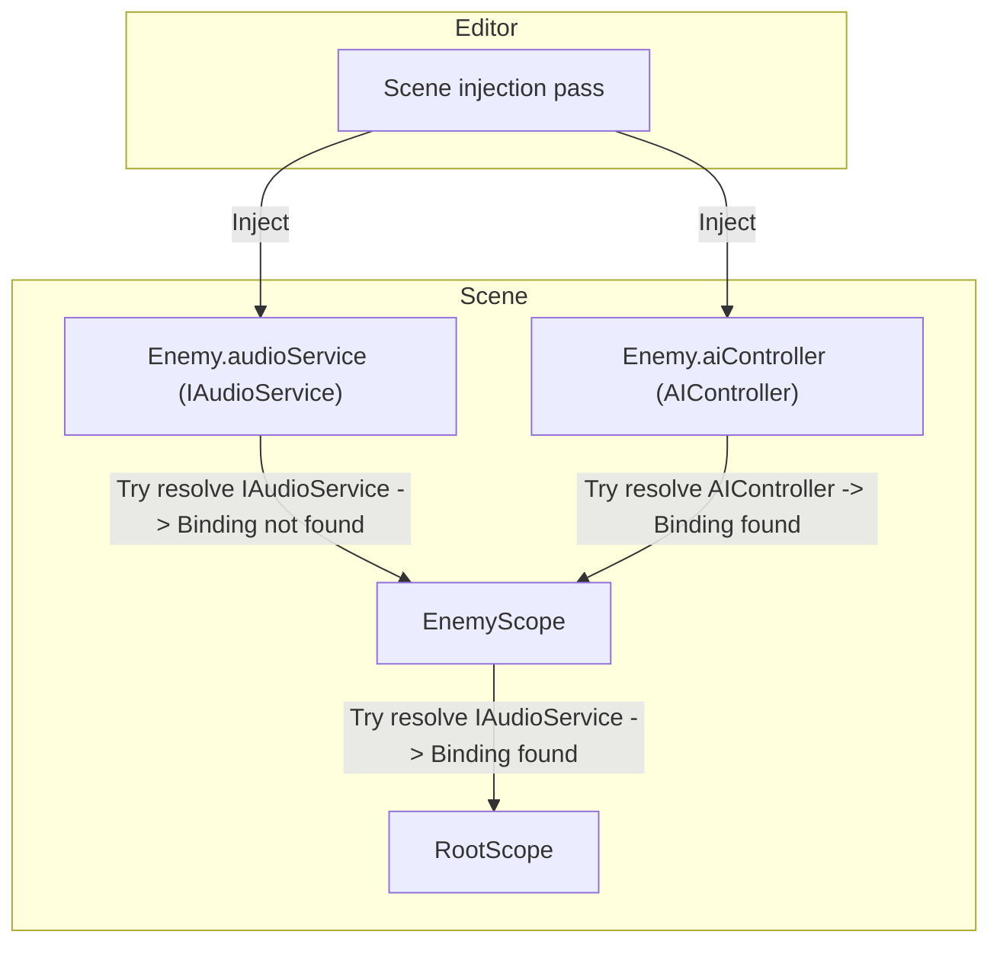

# Scope

A [scope](../reference/glossary.md#scope) is a `MonoBehaviour` that declares dependency [bindings](../reference/glossary.md#binding) for a part of your hierarchy.

In Saneject, you create a [scope](../reference/glossary.md#scope) by inheriting from `Scope` and implementing `DeclareBindings()`. Every [binding](../reference/glossary.md#binding) you
declare in that method tells Saneject how to resolve a dependency type.

At injection time, Saneject uses [scope](../reference/glossary.md#scope) [bindings](../reference/glossary.md#binding) to resolve `[Inject]` fields, properties and methods for components
below that [scope](../reference/glossary.md#scope)'s `Transform`. At runtime, the same [scope](../reference/glossary.md#scope) also performs early setup for [global registrations](../reference/glossary.md#global-registration) and
[runtime proxy](../reference/glossary.md#runtime-proxy) swapping.

[Scopes](../reference/glossary.md#scope) work on [scene objects](../reference/glossary.md#scene-object), [prefab instances](../reference/glossary.md#prefab-instance), and [prefab assets](../reference/glossary.md#prefab-asset). How they participate in injection and how their
[bindings](../reference/glossary.md#binding) resolve across scenes and prefabs depends on [context filtering](../reference/glossary.md#context-filtering) and [context isolation](../reference/glossary.md#context-isolation) settings.
See [Context](context.md) for details.

## Declaring bindings in a scope

[Bindings](../reference/glossary.md#binding) are declared directly inside `DeclareBindings()`:

```csharp
using Plugins.Saneject.Experimental.Runtime.Scopes;

public class EnemyScope : Scope
{
    protected override void DeclareBindings()
    {
        BindComponent<AIController>()
            .FromScopeSelf();
    }
}
```

This declares a [binding](../reference/glossary.md#binding) for `AIController` and tells Saneject where to look for the instance (`FromScopeSelf()` means
the [scope](../reference/glossary.md#scope)'s own `Transform`).

For more details and [binding](../reference/glossary.md#binding) examples, see [Bindings](binding.md).

## Hierarchy, overrides, and fallback

Saneject tries to resolve each [injection target](../reference/glossary.md#injection-target) (`Component` with injected fields, properties, methods) from the nearest
[scope](../reference/glossary.md#scope) at the same transform or above it first, then walks up parent [scopes](../reference/glossary.md#scope) until a matching [binding](../reference/glossary.md#binding) is found. That means
child [scopes](../reference/glossary.md#scope) naturally override parent [scopes](../reference/glossary.md#scope) for the same requested type.

**Example:**



```csharp
using Plugins.Saneject.Experimental.Runtime.Scopes;

public class RootScope : Scope
{
    protected override void DeclareBindings()
    {
        // AudioServiceAsset is a Unity asset type that implements IAudioService.
        BindAsset<IAudioService, AudioServiceAsset>()
            .FromResources("Audio/Service");
    }
}
```

```csharp
using Plugins.Saneject.Experimental.Runtime.Scopes;

public class EnemyScope : Scope
{
    protected override void DeclareBindings()
    {
        // Enemy-local AIController only. No IAudioService binding here.
        BindComponent<AIController>()
            .FromScopeSelf();
    }
}
```

```csharp
using Plugins.Saneject.Experimental.Runtime.Attributes;
using UnityEngine;

public partial class Enemy : MonoBehaviour
{
    [Inject, SerializeInterface]
    private IAudioService audioService; // Resolved from RootScope (fallback)

    [Inject]
    private AIController aiController; // Resolved from EnemyScope
}
```

`IAudioService` is not bound in `EnemyScope`, so Saneject walks up to `RootScope` and resolves it there. `AIController`
is bound in `EnemyScope`, so it resolves locally without fallback.

## Runtime behavior

Almost everything in Saneject happens at edit-time. However, a few things need to happen at runtime to facilitate
dependencies between [contexts](../reference/glossary.md#context) that Unity cannot serialize (scene ↔ other scene, scene ↔ [prefab asset](../reference/glossary.md#prefab-asset)).

### Global components in scopes

[Scopes](../reference/glossary.md#scope) can declare globally/statically available components with `BindGlobal<T>()`:

```csharp
using Plugins.Saneject.Experimental.Runtime.Scopes;

public class BootstrapScope : Scope
{
    protected override void DeclareBindings()
    {
        BindGlobal<AudioManager>()
            .FromScopeSelf();
    }
}
```

How it works:

- During editor injection, Saneject resolves the global component and serializes it in the same `Scope` that declares
  the global [binding](../reference/glossary.md#binding).
- At runtime, `Scope.Awake()` registers those serialized components into `GlobalScope` (a static [service locator](../reference/glossary.md#service-locator)).
- This is usually used as a cheap lookup mechanism for [runtime proxies](../reference/glossary.md#runtime-proxy) that resolve with `FromGlobalScope()`.
- In `Scope.OnDestroy()`, the [scope](../reference/glossary.md#scope) unregisters what it registered from `GlobalScope`, meaning that global components
  per local `Scope` have the same lifetime as the [scope](../reference/glossary.md#scope).
- `Scope` has default execution order `-10000`, so [scope](../reference/glossary.md#scope) runtime operations run before normal component `Awake` to avoid
  startup race conditions/null access issues.

Only one [global registration](../reference/glossary.md#global-registration) per concrete component type is allowed. Duplicate global [bindings](../reference/glossary.md#binding) for the same type are
reported as invalid.

See [Global scope](global-scope.md) for details.

### Runtime proxy swap targets

A `RuntimeProxy` is an auto-generated `ScriptableObject` used as an editor-time stand-in for a real interface dependency
when that real reference cannot be serialized directly in the current `Scope` [context](../reference/glossary.md#context) (for example, prefab to scene
references).

During editor injection, when Saneject injects a [runtime proxy](../reference/glossary.md#runtime-proxy) into an interface field, it registers the owning
component as a [proxy swap target](../reference/glossary.md#proxy-swap-target) in the nearest `Scope`.

At runtime, `Scope.Awake()` (execution order `-10000`) runs right after [global registration](../reference/glossary.md#global-registration) and calls Roslyn-generated
`SwapProxiesWithRealInstances()` on each registered swap target. That generated method replaces proxy references with
the real instances using normal field assignment, with no reflection.

The full proxy mechanism is documented in [Runtime proxies](runtime-proxy.md).

Proxy swap flow:

1. A [binding](../reference/glossary.md#binding) uses `FromRuntimeProxy()` for an interface dependency.
2. Injection writes a [runtime proxy](../reference/glossary.md#runtime-proxy) into the interface field and registers the owner as a swap target in the nearest
   `Scope`.
3. In `Scope.Awake()`, the [scope](../reference/glossary.md#scope) calls `SwapProxiesWithRealInstances()`, and the field is reassigned to the real
   instance.

Typical proxy [binding](../reference/glossary.md#binding) setup:

```csharp
public class CombatScope : Scope
{
    protected override void DeclareBindings()
    {
        BindComponent<ICombatService, CombatService>()
            .FromRuntimeProxy()
            .FromGlobalScope();

        BindGlobal<CombatService>()
            .FromScopeSelf();
    }
}
```

Typical consumer:

```csharp
using Plugins.Saneject.Experimental.Runtime.Attributes;
using UnityEngine;

public partial class CombatHud : MonoBehaviour
{
    [Inject, SerializeInterface]
    private ICombatService combatService;
}
```

See [Runtime proxies](runtime-proxy.md) and [Serialized interfaces](serialized-interface.md) for details.

## Related pages

- [Bindings](binding.md)
- [Global scope](global-scope.md)
- [Runtime proxies](runtime-proxy.md)
- [Serialized interfaces](serialized-interface.md)
- [Contexts](context.md)


