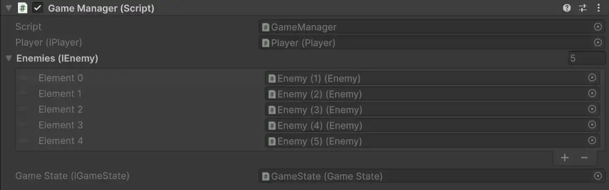

# Serialized interface

Unity does not serialize interface-typed members by default, but interfaces are a core part of clean dependency injection code.
Saneject solves this by generating serialized backing members for interface fields and auto-properties marked with `[SerializeInterface]`.

This gives you interface-based code with normal inspector workflows and [editor-time injection](../reference/glossary.md#editor-time-injection).

## Why Unity can't "serialize an interface"

Unity serialization supports concrete serializable data and `UnityEngine.Object` references.
An interface is only a contract, not a concrete serializable type.
So a member typed as `IMyService` is skipped by Unity's serializer unless you add an explicit serialization bridge.

In DI-heavy code, this matters because Saneject writes resolved dependencies into serialized members.
If interface members cannot serialize, interface-based injection cannot persist in scenes and prefabs.

## What the Saneject Roslyn generator adds

For each member marked with `[SerializeInterface]`, Saneject generates code in a matching partial class:

- Hidden serialized backing member(s), named `__<memberName>`, typed as `Object`, `Object[]`, or `List<Object>`.
- `OnBeforeSerialize()` to sync interface value → backing value (editor only).
- `OnAfterDeserialize()` to sync backing value → interface value.
- `SwapProxiesWithRealInstances()` for single interface members, used at when [runtime proxies](../reference/glossary.md#runtime-proxy) are injected into the interfaces.

Supported member shapes:

- Single interface: `IMyService`
- Interface array: `IMyService[]`
- Interface list: `List<IMyService>`

### User code example

```csharp
using Plugins.Saneject.Runtime.Attributes;
using UnityEngine;

public partial class GameManager : MonoBehaviour
{
    [Inject, SerializeInterface]
    private IPlayer player;

    [Inject, SerializeInterface]
    private IEnemy[] enemies;

    [field: Inject, SerializeInterface]
    public IGameState GameState { get; private set; }
}
```

### Generated partial

```csharp
using System.ComponentModel;
using System.Linq;
using Plugins.Saneject.Runtime.Proxy;
using UnityEngine;

public partial class GameManager : ISerializationCallbackReceiver, IRuntimeProxySwapTarget
{
    [SerializeField, HideInInspector, EditorBrowsable(EditorBrowsableState.Never)]
    private Object __player;

    [SerializeField, HideInInspector, EditorBrowsable(EditorBrowsableState.Never)]
    private Object[] __enemies;

    [SerializeField, HideInInspector, EditorBrowsable(EditorBrowsableState.Never)]
    private Object __GameState;

    [EditorBrowsable(EditorBrowsableState.Never)]
    public virtual void OnBeforeSerialize()
    {
#if UNITY_EDITOR
        __player = player as Object;
        __enemies = enemies?.Cast<Object>().ToArray();
        __GameState = GameState as Object;
#endif
    }

    [EditorBrowsable(EditorBrowsableState.Never)]
    public virtual void OnAfterDeserialize()
    {
        player = __player as IPlayer;
        
        enemies = (__enemies ?? System.Array.Empty<Object>())
            .Select(x => x as IEnemy)
            .ToArray();
        
        GameState = __GameState as IGameState;
    }

    [EditorBrowsable(EditorBrowsableState.Never)]
    public void SwapProxiesWithRealInstances()
    {
        if (__player is RuntimeProxyBase playerProxy)
            player = playerProxy.ResolveInstance() as IPlayer;

        if (__GameState is RuntimeProxyBase stateProxy)
            GameState = stateProxy.ResolveInstance() as IGameState;
    }
}
```

## What this enables

With `[SerializeInterface]`, you can:

- Use interface fields and auto-properties directly, no wrapper classes needed.
- Assign interface references in the inspector like other serialized references.
- Combine `[Inject]` + `[SerializeInterface]` for clean editor-time DI with persistent scene/prefab data.
- Use interface collections (`T[]`, `List<T>`) with normal [binding](../reference/glossary.md#binding) and injection workflows.



If a [serialized interface](../reference/glossary.md#serialized-interface) field is assigned an object that does not implement the expected interface, Saneject's inspector validation clears that reference to `null`.

## Runtime proxy swap hook

`SwapProxiesWithRealInstances()` is generated by the same source generator.
It is relevant when a [serialized interface](../reference/glossary.md#serialized-interface) member currently holds a [runtime proxy](../reference/glossary.md#runtime-proxy) asset.

At [runtime startup](../reference/glossary.md#runtime-startup), Saneject calls this method for registered [proxy swap targets](../reference/glossary.md#proxy-swap-target).
The generated method checks each single-value interface backing member and replaces any proxy with its resolved runtime instance.

For full proxy behavior and resolution strategies, see [Runtime proxy](runtime-proxy.md).

## Requirements and notes

- The declaring type must be `partial`.
- The declaring type must be Unity-serializable and non-sealed.
- For auto-properties, use `[field: SerializeInterface]` and keep a setter (for example `private set`), so generated deserialization can assign the value.
- Generated backing members are hidden (`HideInInspector`) and editor-browsing-hidden (`EditorBrowsable(Never)`).
- Default Unity inspector ordering would place generated backing members at the end, but Saneject's custom inspector renders them in logical member order. See [MonoBehaviour inspector](../editor-and-tooling/inspectors/monobehaviour-inspector.md).

## Related pages

- [Field, property & method injection](field-property-and-method-injection.md)
- [Binding](binding.md)
- [Runtime proxy](runtime-proxy.md)
- [MonoBehaviour inspector](../editor-and-tooling/inspectors/monobehaviour-inspector.md)
- [Glossary](../reference/glossary.md)
