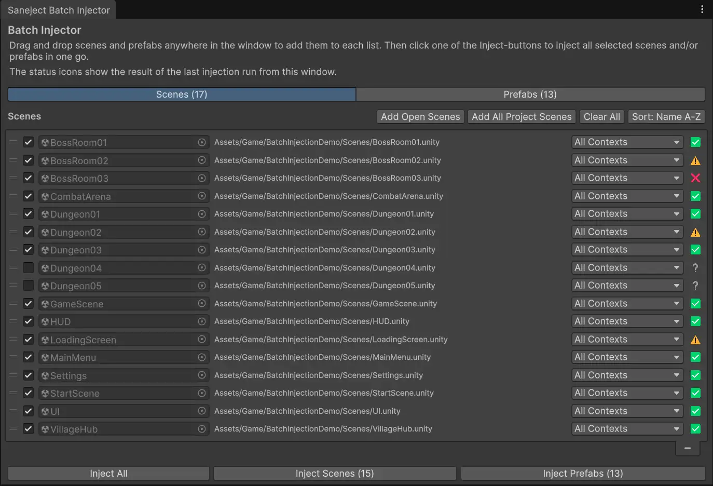
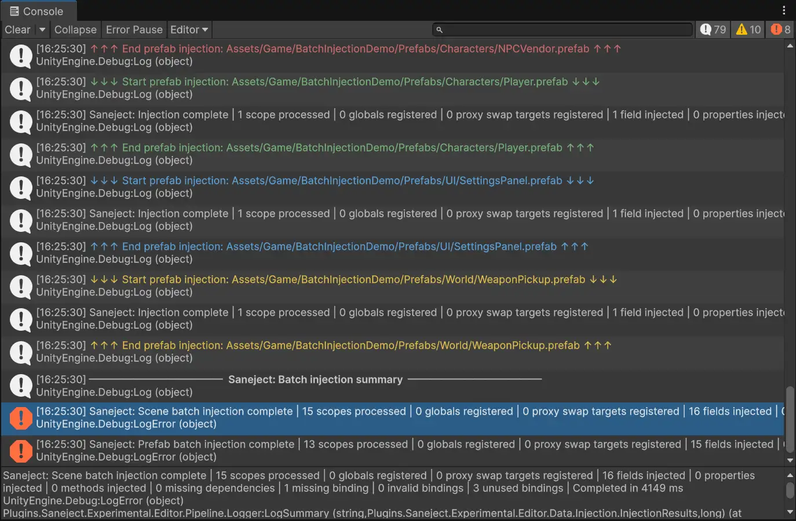

# Batch injection

Batch injection means running Saneject's normal editor injection pipeline across many assets in one operation.

Instead of opening one scene or prefab at a time and injecting manually, you can process a larger set of scene and prefab assets in one run and review one consolidated console output.

This is especially useful when your project grows and you need frequent dependency validation across multiple content areas. 

> It is recommended to batch inject the project periodically or before builds to verify that all dependencies are correctly resolved and that there are no missing references.

## Ways to run batch injection

### 1. Batch Injector window

The window is designed for repeatable, project-scale batch injection runs with persistent scene/prefab lists and settings.

Menu path:

- `Saneject/Batch Inject/Open Batch Injector Window`

### 2. Selected assets

Use this when you want a targeted pass for a folder or a specific Project window selection.

Menu paths:

- `Assets/Saneject/Batch Inject/Selected Assets (All Contexts)`
- `Saneject/Batch Inject/Selected Assets (All Contexts)`

Behavior:

1. Saneject scans the current Project selection using deep asset selection.
2. It keeps scene assets and prefab assets.
3. It assigns `ContextWalkFilter.AllContexts` to every collected asset.
4. It optionally shows a confirmation dialog (controlled by `Ask Before Batch Inject` in `Saneject/Settings`).
5. It asks whether modified open scenes should be saved.
6. It injects the selected scenes and prefabs.
7. It logs per-asset output plus a final batch summary.

## Batch Injector window features

The window has two tabs:

- `Scenes`
- `Prefabs`

Each tab shows a persistent reorderable list with these per-row controls:

- Enable toggle (`Enabled`)
- Asset object field
- Asset path (shows `Deleted` if the asset no longer exists)
- `ContextWalkFilter` dropdown (restricted by asset type)
- Injection status icon

### Add, remove, and organize assets

You can populate lists by:

- Drag and drop scenes or prefabs into the window.
- `Add Open Scenes` (Scenes tab).
- `Add All Project Scenes` (Scenes tab, scans `Assets`).
- `Add All Prefabs In Current Scene` (Prefabs tab).
- `Add All Project Prefabs` (Prefabs tab, scans `Assets`).

You can organize lists by:

- Manual reorder (switches sort mode to `Custom`).
- Sort menu options: `Name A-Z`, `Name Z-A`, `Path A-Z`, `Path Z-A`, `Enabled-Disabled`, `Disabled-Enabled`, `Success-Error`, `Error-Success`.

List and window state are persisted to:

- `ProjectSettings/Saneject/BatchInjectorData.json`

### Multi-select and context menu actions

Both lists support multi-selection and a context menu with:

- `Inject Selected`: Runs batch injection only for the currently selected rows.
- `Enable` / `Disable`: Toggles whether rows are included when using the bottom `Inject All` and `Inject Scenes/Prefabs` buttons.
- `Clear Injection Status`: Resets selected rows to `Unknown` without changing their enable state or filter.
- `Remove`: Deletes selected rows from the list (does not delete assets from the project).
- `Set Context Walk Filter/...`: Applies the chosen `ContextWalkFilter` to all selected rows.

Input shortcuts:

- `Ctrl/Cmd + A` selects all rows in the active tab.
- `Esc` clears selection in the active tab.

### Inject buttons

Bottom buttons run injection for enabled rows:

- `Inject All`
- `Inject Scenes ({count})`
- `Inject Prefabs ({count})`

`Inject Selected` from the row context menu injects the selected rows directly, even if some of those rows are disabled.

## Context filter rules in batch injection

`ContextWalkFilter` is configured per asset in the Batch Injector window.

Allowed values depend on asset type:

| Asset type   | Allowed `ContextWalkFilter` values                     |
|--------------|--------------------------------------------------------|
| Scene asset  | `AllContexts`, `SceneObjects`, `PrefabInstances`       |
| Prefab asset | `AllContexts`, `PrefabAssetObjects`, `PrefabInstances` |

For details on filter semantics, see [Context](../core-concepts/context.md).

## Batch injection pipeline overview

Batch injection uses the same core pipeline as regular injection.

For each asset, Saneject:

1. Builds an injection graph from start transforms.
2. Applies the selected `ContextWalkFilter`.
3. Builds an `InjectionContext` from active transforms, components, scopes, and bindings.
4. Validates bindings.
5. Resolves globals, fields/properties, and methods.
6. Injects values and marks modified objects dirty.
7. Collects runtime proxy swap targets.
8. Logs errors, warnings, and summary counts.

Batch-specific orchestration:

- Scene batch opens each scene in `OpenSceneMode.Single`, injects from scene root objects, and saves each processed scene.
- Prefab batch loads each prefab asset root, injects from that root, and saves assets when prefab processing completes.

If a saved active scene existed when the batch started, Saneject re-opens that scene at the end.

## Injection status meanings

In the Batch Injector window, each row has a status icon with one of these meanings:

| Icon | Status    | Meaning                                                           |
|------|-----------|-------------------------------------------------------------------|
| ❔    | `Unknown` | No run has set status yet, or status was cleared.                 |
| ✅    | `Success` | No unsuppressed errors and no unused bindings for that asset run. |
| ⚠️   | `Warning` | No unsuppressed errors, but one or more bindings were unused.     |
| ❌    | `Error`   | One or more unsuppressed errors were logged.                      |

## Logging model for batch runs

Batch logging is scoped in layers:

1. A batch header for scenes and/or prefabs.
2. Per-asset start/end markers so each asset run is visually separated in the console.
3. Normal injection logs inside each asset section, including errors and a per-asset summary line.
4. A final batch summary section with aggregated scene and prefab summaries and elapsed times.

If no `Scope` components are found in a run, Saneject logs that nothing was injected for that run.

Logging output is affected by user settings in `Saneject/Settings`, including:

- `Clear Logs On Injection`
- `Log Injection Summary`
- `Log Unused Bindings`

For more information on logging, see [Logging & validation](logging-and-validation.md).

## Related pages

- [Injection menus](injection-menus.md)
- [Context](../core-concepts/context.md)
- [Field, property & method injection](../core-concepts/field-property-and-method-injection.md)
- [Settings](settings.md)
- [Logging & validation](logging-and-validation.md)
- [Glossary](../reference/glossary.md)
