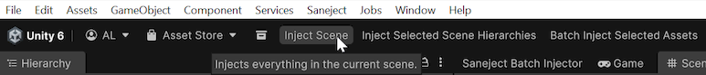
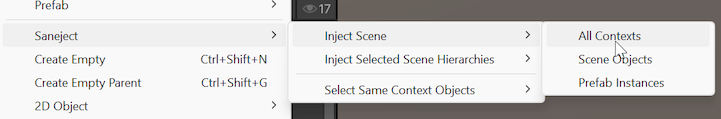
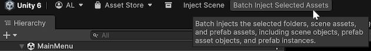
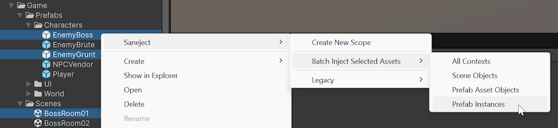
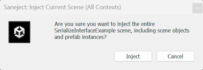

# Injection toolbar & context menus

Saneject injection context menus are editor commands that run dependency injection on scenes, prefab assets, or batches of assets.

For common full-run workflows, Saneject also exposes contextual main toolbar buttons:

- `Inject Scene`
- `Inject Selected Scene Hierarchies`
- `Inject Prefab Asset`
- `Batch Inject Selected Assets`

Those toolbar buttons appear only when they apply to the current selection or editor stage, and they always run with `ContextWalkFilter.AllContexts`.

If you are new to contexts and filters, read [Context](../core-concepts/context.md) first.

## Toolbar buttons

The contextual main toolbar buttons cover the most common `AllContexts` runs.

- `Inject Scene`: shown while editing a scene.
- `Inject Selected Scene Hierarchies`: shown while editing a scene and one or more scene objects are selected.
- `Inject Prefab Asset`: shown in Prefab Mode.
- `Batch Inject Selected Assets`: shown when the Project selection contains one or more scene assets, prefab assets, or folders that contain them.

For more focused runs, use the injection context menus described below.

## Context menus

Saneject exposes the same grouped injection commands in multiple Unity menus.

- Main menu:
    - `Saneject/Inject Scene/...`
    - `Saneject/Inject Selected Scene Hierarchies/...`
    - `Saneject/Inject Prefab Asset/...`
- Hierarchy context menu:
    - `GameObject/Saneject/Inject Scene/...`
    - `GameObject/Saneject/Inject Selected Scene Hierarchies/...`
    - `GameObject/Saneject/Inject Prefab Asset/...`
- Project window context menu:
    - `Assets/Saneject/Batch Inject Selected Assets/All Contexts`
    - `Assets/Saneject/Batch Inject Selected Assets/Scene Objects`
    - `Assets/Saneject/Batch Inject Selected Assets/Prefab Asset Objects`
    - `Assets/Saneject/Batch Inject Selected Assets/Prefab Instances`
- Main menu batch shortcuts:
    - `Saneject/Batch Inject Selected Assets/All Contexts`
    - `Saneject/Batch Inject Selected Assets/Scene Objects`
    - `Saneject/Batch Inject Selected Assets/Prefab Asset Objects`
    - `Saneject/Batch Inject Selected Assets/Prefab Instances`

There is also a dedicated batch injector window:

- `Saneject/Open Batch Injector Window`

That window is covered in [Batch injection](batch-injection.md).

## Scene and prefab injection commands

All commands in `Saneject/Inject Scene/...`, `Saneject/Inject Selected Scene Hierarchies/...`, `Saneject/Inject Prefab Asset/...`, and the matching `GameObject/Saneject/...` paths use the same injection pipeline. The only differences are:

- Start objects for the run.
- `ContextWalkFilter` selected by that menu item.

### Inject Scene group

Menu paths:

- `Saneject/Inject Scene/All Contexts`
- `Saneject/Inject Scene/Scene Objects`
- `Saneject/Inject Scene/Prefab Instances`
- `GameObject/Saneject/Inject Scene/...`

Availability:

- Enabled only while editing a scene.
- Disabled in Prefab Mode.

Behavior:

- Uses the active scene's root `GameObject` objects as start objects.
- Runs injection for that scene using the selected filter.

### Inject Selected Scene Hierarchies group

Menu paths:

- `Saneject/Inject Selected Scene Hierarchies/All Contexts`
- `Saneject/Inject Selected Scene Hierarchies/Scene Objects`
- `Saneject/Inject Selected Scene Hierarchies/Prefab Instances`
- `Saneject/Inject Selected Scene Hierarchies/Same Contexts As Selection`
- `GameObject/Saneject/Inject Selected Scene Hierarchies/...`

Availability:

- Enabled only while editing a scene.
- Requires at least one selected `GameObject`.

Behavior:

- Uses `Selection.gameObjects` as start objects.
- The graph is built from each selected object's root transform, then filtered by the selected `ContextWalkFilter`.
- This means a selected child can still cause its full root hierarchy to be part of the run.

### Inject Prefab Asset group

Menu paths:

- `Saneject/Inject Prefab Asset/All Contexts`
- `Saneject/Inject Prefab Asset/Prefab Asset Objects`
- `Saneject/Inject Prefab Asset/Prefab Instances`
- `Saneject/Inject Prefab Asset/Same Contexts As Selection`
- `GameObject/Saneject/Inject Prefab Asset/...`

Availability:

- Enabled only in Prefab Mode.
- `Same Contexts As Selection` also requires a selection.

Behavior:

- For `All Contexts`, `Prefab Asset Objects`, and `Prefab Instances`, Saneject starts from the current prefab asset root.
- For `Same Contexts As Selection`, Saneject starts from the current selection.

## Filter labels used in menu names

Menu labels in these command groups, including `Batch Inject Selected Assets/...`, map directly to `ContextWalkFilter` values:

| Menu label suffix            | Context walk filter       | Included contexts                                                                                                                                                                   |
|------------------------------|---------------------------|-------------------------------------------------------------------------------------------------------------------------------------------------------------------------------------|
| `All Contexts`               | `AllContexts`             | Scene objects, prefab instances, prefab asset objects |
| `Scene Objects`              | `SceneObjects`            | Scene object contexts only                                                                             |
| `Prefab Instances`           | `PrefabInstances`         | Prefab instance contexts only                                                                       |
| `Prefab Asset Objects`       | `PrefabAssetObjects`      | Prefab asset contexts only                                                                             |
| `Same Contexts As Selection` | `SameContextsAsSelection` | Contexts matching selected start object contexts only                                                                                           |

`ContextWalkFilter` controls what enters the run. It does not override context isolation.
Context isolation is configured in project settings and still applies during resolution.
See [Context](../core-concepts/context.md).

## Batch inject from selected assets

Entry points:

- Main toolbar: `Batch Inject Selected Assets` (`ContextWalkFilter.AllContexts`)
- `Assets/Saneject/Batch Inject Selected Assets/All Contexts`
- `Assets/Saneject/Batch Inject Selected Assets/Scene Objects`
- `Assets/Saneject/Batch Inject Selected Assets/Prefab Asset Objects`
- `Assets/Saneject/Batch Inject Selected Assets/Prefab Instances`
- `Saneject/Batch Inject Selected Assets/All Contexts`
- `Saneject/Batch Inject Selected Assets/Scene Objects`
- `Saneject/Batch Inject Selected Assets/Prefab Asset Objects`
- `Saneject/Batch Inject Selected Assets/Prefab Instances`

Availability:

- Enabled only when the current Project selection includes at least one scene asset or prefab asset.
- Folder selection works because Saneject scans deep selected assets.

Behavior:

1. Collect selected scene and prefab assets.
2. Apply the `ContextWalkFilter` chosen by the toolbar button or menu item to each collected asset.
3. Show batch confirmation dialog with scene and prefab counts.
4. Ask to save currently modified open scenes before running.
5. Inject each selected scene and prefab asset.
6. Save scene and asset changes.
7. Log per-asset sections and final batch summary.

If an injected asset has no `Scope` components, the run logs that nothing was injected for that asset or run.

The toolbar button stays on `AllContexts`; the menu variants give you focused batch runs for `SceneObjects`, `PrefabAssetObjects`, or `PrefabInstances`.
The chosen filter is forwarded as-is to every collected asset, so mixed scene/prefab selections only process matching contexts inside each asset.

## Confirmation dialogs

By default, injection context menu commands and contextual toolbar buttons show a confirmation dialog before running injection.

You can toggle these prompts in:

- `Saneject/Settings/User Settings/Ask Before Injection`

Relevant toggles:

- `Scene`
- `Prefab Asset`
- `Selected Scene Hierarchies`
- `Batch Injection`

## Example: running a focused scene injection

Run steps:

1. Select one or more scene objects in the hierarchy.
2. Run `Saneject/Inject Selected Scene Hierarchies/Scene Objects`.
3. Check the Console for Saneject summary logs and any missing binding or dependency errors.

This workflow is useful when you want to validate scene-object wiring without also processing prefab instances in the same run.

## Related pages

- [Context](../core-concepts/context.md)
- [Scope](../core-concepts/scope.md)
- [Field, property & method injection](../core-concepts/field-property-and-method-injection.md)
- [Batch injection](batch-injection.md)
- [Settings](settings.md)
- [Logging & validation](logging-and-validation.md)
- [Glossary](../reference/glossary.md)
