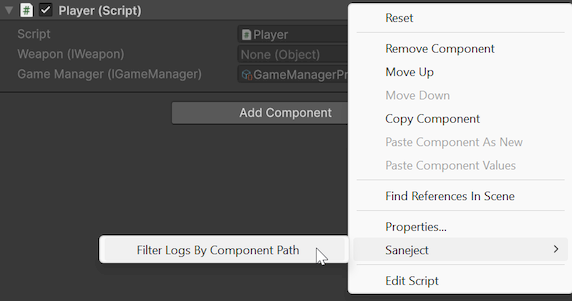
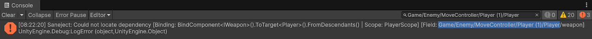

# MonoBehaviour inspector

The `MonoBehaviour` inspector is Saneject's default inspector for components.
It keeps Unity's normal layout, behavior and serialized editing workflow, and adds Saneject-specific features such as serialize interface support.

In practice, this system has two parts:

- `MonoBehaviourInspector`: the Unity custom `Editor` entry point for `MonoBehaviour`.
- `SanejectInspector`: the shared static drawing and validation API that does the real work.

The [SanejectInspector](xref:Plugins.Saneject.Editor.Inspectors.SanejectInspector) API is model-driven and uses [ComponentModel](xref:Plugins.Saneject.Editor.Inspectors.Models.ComponentModel) and [PropertyModel](xref:Plugins.Saneject.Editor.Inspectors.Models.PropertyModel).

The default editor is multi-object aware with (`[CanEditMultipleObjects]`), so standard Unity multi-selection editing still applies.

## What this inspector is for

Use this inspector when you want consistent field rendering across normal Unity components and Saneject injection targets, especially when your components use:

- `[Inject]` fields or `[field: Inject]` auto-properties.
- `[SerializeInterface]` members.
- Nested `[Serializable]` classes that contain injected data.

## Why Saneject uses a custom inspector

`[SerializeInterface]` uses Roslyn source generation to add interface backing fields as `UnityEngine.Object` members in a generated partial class.

In Unity's default inspector order, fields declared in that generated partial class are rendered after fields from your authored class.
That causes interface-backed fields to always appear last in the inspector instead of where the interface members are declared among the rest of your fields.

Saneject uses a custom inspector to restore logical declaration order, so interface-backed members are rendered where the corresponding interface members belong, along with other UX improvements.

## Drawing behavior

For each inspected component, Saneject draws:

- A disabled `Script` field at the top, matching Unity's standard inspector header behavior.
- Serializable fields collected from base type to derived type.
- Public fields, `[SerializeField]` fields, and `[SerializeInterface]` fields.
- Excludes members that Unity should not draw in this workflow, such as `[NonSerialized]` and `[HideInInspector]`.
- Nested serialized classes and their fields recursively.

Default inspector attributes such as `[Tooltip]` continue to work for both normal fields and interface-backed fields.

## Attribute-driven behavior

Saneject applies two inspector drawing rules based on attributes:

- Fields with `[Inject]` are read-only in the inspector.
- Fields with `[ReadOnly]` are also read-only, even when not injected.

You can hide injected members with:

- `Saneject/Settings/User Settings/Show Injected Fields & Properties`

This toggle affects both `[Inject]` fields and `[field: Inject]` auto-properties.

## Nested serialized class support

If a field is a nested serializable class, Saneject draws it as a foldout and recursively draws child members. The same rules and drawing behavior still apply inside nested classes.

Basic example:

```csharp
using System;
using UnityEngine;

[Serializable]
public class SpawnSettings
{
    [SerializeField] 
    private float delay = 1f;
    
    [SerializeField]
    private int count = 3;
}

public class EnemySpawner : MonoBehaviour
{
    [SerializeField] 
    private SpawnSettings settings;    
}
```

## Serialized interface validation

Roslyn-generated code already enforces the interface type for stored values, so inspector validation mainly exists to handle drag-and-drop assignment in serialized interface fields. 

`[Inject]` fields are read-only and managed by Saneject, so interface drag-and-drop and inspector validation is only applicable when using `[SerializeInterface]` without `[Inject]`.

Validation behavior:

- Single interface member: validates the assigned object against the expected interface type.
- Array or list interface member: validates each element.
- If a dropped value is a `GameObject`, Saneject tries `TryGetComponent(expectedType, out component)` and stores that component instead, matching Unity's behavior when drag-and-dropping `GameObject`s into component slots.
- If no matching component is found, or the assigned object still does not implement the expected interface type, Saneject logs an error and clears the reference to `null`.

## Models

The inspector uses a small model layer to keep drawing code predictable:

- `ComponentModel` captures the inspected target, its `SerializedObject`, and top-level drawable properties.
- `PropertyModel` captures display name, serialized property path, read-only state, interface metadata, collection metadata, and child properties.

See [ComponentModel](xref:Plugins.Saneject.Editor.Inspectors.Models.ComponentModel) and [PropertyModel](xref:Plugins.Saneject.Editor.Inspectors.Models.PropertyModel) for the full API reference.

## Using the Saneject inspector API in custom inspectors

`MonoBehaviourInspector` is intentionally thin and delegates to [SanejectInspector](xref:Plugins.Saneject.Editor.Inspectors.SanejectInspector).
If you create a custom inspector for a specific component type and still want Saneject behavior, call the API from your custom editor flow.

Basic example:

```csharp
using Plugins.Saneject.Editor.Inspectors;
using Plugins.Saneject.Editor.Inspectors.Models;
using UnityEditor;

[CustomEditor(typeof(MyComponent))]
public class MyComponentInspector : Editor
{
    private ComponentModel componentModel;

    private void OnEnable()
    {
        componentModel = new ComponentModel(target, serializedObject);
    }

    public override void OnInspectorGUI()
    {
        EditorGUILayout.HelpBox("Custom section above Saneject fields", MessageType.Info);
        SanejectInspector.OnInspectorGUI(componentModel);
    }
}
```

You can also use the API more granularly. See [SanejectInspector](xref:Plugins.Saneject.Editor.Inspectors.SanejectInspector) for details.

## Console filtering context menus

Saneject adds component context menu items to quickly filter logs.
 
- `Saneject/Filter Logs By Component Path`
    - Sets the Console search text to filter by the selected Scope's path.

Right click on component header and `Saneject/Filter Logs By Component Path`:



This adds the `Scope` type to the Console search text:



## Related pages

- [Field, property & method injection](../../core-concepts/field-property-and-method-injection.md)
- [Serialized interface](../../core-concepts/serialized-interface.md)
- [Scope inspector](scope-inspector.md)
- [Injection toolbar & context menus](../injection-toolbar-and-context-menus.md)
- [Settings](../settings.md)
- [Logging & validation](../logging-and-validation.md)
- [Glossary](../../reference/glossary.md)
