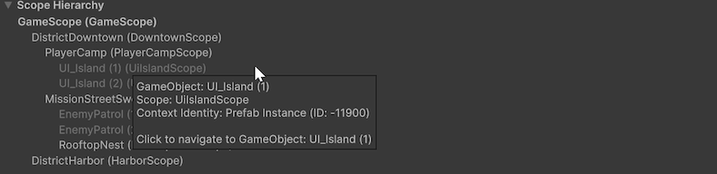
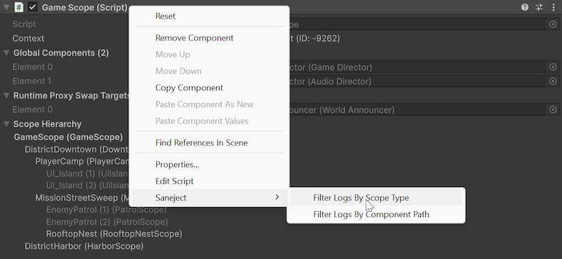
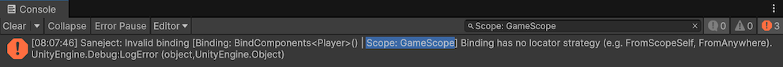

# Scope inspector

The `Scope` inspector is the main inspector surface for working with one scope at a time.
It combines context visibility, runtime preparation details, and scope navigation in one place.

For injection workflows, use the contextual main toolbar buttons, injection context menu, or batch injection.

## What this inspector is for

Use the `Scope` inspector when you want to:

- Verify which context the selected scope belongs to.
- See what the scope has prepared for runtime global registration.
- See which components are registered as runtime proxy swap targets.
- Navigate to related scopes in the same hierarchy.

For the underlying concepts, see [Scope](../../core-concepts/scope.md) and [Context](../../core-concepts/context.md).

## Inspector sections

When exactly one `Scope` is selected, the inspector draws the sections below.

### Context

The `Context` line shows the selected scope's context identity.

- With context isolation enabled, it shows the context type and context ID.
- With context isolation disabled, it shows `Context Isolation Off` instead of an ID.

This helps you verify whether scopes are in the same context before running injection.
For details, see [Context](../../core-concepts/context.md).

### Global Components

`Global Components` is a read-only foldout that lists the serialized components this scope will register in `GlobalScope` during `Scope.Awake()`.

For details, see [Global scope](../../core-concepts/global-scope.md).

### Runtime Proxy Swap Targets

`Runtime Proxy Swap Targets` is a read-only foldout listing components in this scope that have runtime proxy placeholders and will be asked to swap those proxies for resolved runtime instances during scope startup.

For full behavior, see [Runtime proxy](../../core-concepts/runtime-proxy.md).

### Scope Hierarchy

`Scope Hierarchy` shows a tree of scopes under the current hierarchy root.

- The currently inspected scope is shown in bold.
- Each scope node in the tree is clickable and navigates to that scope's `GameObject`.
- If context isolation is enabled, scopes in a different context than the inspected scope are grayed out.
- Hovering a scope node shows a tooltip with extra details, including `GameObject`, scope type, and context identity.

This is useful for understanding where local bindings are declared and how parent fallback will behave.
See [Scope](../../core-concepts/scope.md) and [Context](../../core-concepts/context.md) for details.

### Scope serialized fields

After the Saneject sections, the inspector draws serialized fields on your concrete scope component.
This keeps binding authoring fields and scope operations in one view.
 
## Console filtering context menus

Saneject adds component context menu items to quickly filter logs.

- `Saneject/Filter Logs By Scope Type`
    - Sets the Console search text to filter by `Scope: <ScopeTypeName>`. 

Right click on component header and `Saneject/Filter Logs By Scope Type`:

This adds the `Scope` type to the Console search text:

## Related pages

- [Scope](../../core-concepts/scope.md)
- [Binding](../../core-concepts/binding.md)
- [Context](../../core-concepts/context.md)
- [Global scope](../../core-concepts/global-scope.md)
- [Runtime proxy](../../core-concepts/runtime-proxy.md)
- [Injection toolbar & context menus](../injection-toolbar-and-context-menus.md)
- [Batch injection](../batch-injection.md)
- [Glossary](../../reference/glossary.md)

