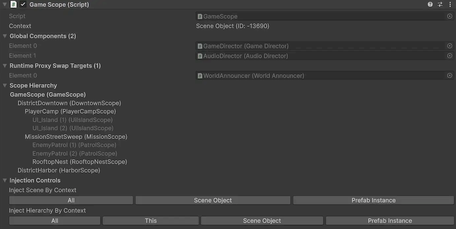

# Scope inspector

The `Scope` inspector is the main inspector surface for working with one scope at a time.
It combines context visibility, runtime preparation details, scope navigation, and injection actions in one place.

## Screenshot

## What this inspector is for

Use the `Scope` inspector when you want to:

- Verify which context the selected scope belongs to.
- See what the scope has prepared for runtime global registration.
- See which components are registered as runtime proxy swap targets.
- Navigate to related scopes in the same hierarchy.
- Run injection directly from the selected scope.

For the underlying concepts, see [Scope](../../core-concepts/scope.md) and [Context](../../core-concepts/context.md).

## Inspector sections

When exactly one `Scope` is selected, the inspector draws the sections below.

### Context

The `Context` line shows the selected scope's context identity.

- With context isolation enabled, it shows the context type and context ID.
- With context isolation disabled, it shows `Context Isolation Off` instead of an ID.

This helps you verify whether scopes are in the same context before running injection.
For details, see [Context](../../core-concepts/context.md).

### Global Components

`Global Components` is a read-only foldout that lists the serialized components this scope will register in `GlobalScope` during `Scope.Awake()`.

For details, see [Global scope](../../core-concepts/global-scope.md).

### Runtime Proxy Swap Targets

`Runtime Proxy Swap Targets` is a read-only foldout listing components in this scope that have runtime proxy placeholders and will be asked to swap those proxies for resolved runtime instances during scope startup.

For full behavior, see [Runtime proxy](../../core-concepts/runtime-proxy.md).

### Scope Hierarchy

`Scope Hierarchy` shows a tree of scopes under the current hierarchy root.

- The currently inspected scope is shown in bold.
- Each scope node in the tree is clickable and navigates to that scope's `GameObject`.
- If context isolation is enabled, scopes in a different context than the inspected scope are grayed out.
- Hovering a scope node shows a tooltip with extra details, including `GameObject`, scope type, and context identity.

This is useful for understanding where local bindings are declared and how parent fallback will behave.
See [Scope](../../core-concepts/scope.md) and [Context](../../core-concepts/context.md) for details.

### Injection Controls

`Injection Controls` provides one-click injection actions. Available groups depend on whether the inspected scope belongs to scene/prefab-instance context or prefab-asset context.

Scene object or prefab instance context:

- `Inject Scene By Context`
    - `All`: Injects the entire scene that this scope belongs to, including scene objects and prefab instances.
    - `Scene Object`: Injects all scene objects in the scene that this scope belongs to, excluding prefab instances.
    - `Prefab Instance`: Injects all prefab instances in the scene that this scope belongs to, excluding scene objects.
- `Inject Hierarchy By Context`
    - `All`: Injects this entire scene hierarchy, including both scene objects and prefab instances.
    - `This`: Injects all objects in this scene hierarchy that are the same context as this scope.
    - `Scene Object`: Injects all scene objects in this scene hierarchy, excluding prefab instances.
    - `Prefab Instance`: Injects all prefab instances in this scene hierarchy, excluding scene objects.

Prefab asset context:

- `Inject Prefab By Context`
    - `All`: Injects this entire prefab hierarchy, including both prefab asset objects and prefab instances.
    - `This`: Injects all objects in this prefab hierarchy that are the same context as this scope.
    - `Prefab Asset`: Injects all prefab asset objects in this prefab hierarchy, excluding prefab instances.
    - `Prefab Instance`: Injects all prefab instances in this prefab hierarchy, excluding prefab asset objects.

These options map to `ContextWalkFilter` values and use the same pipeline as the injection menus.
See [Injection menus](../injection-menus.md) and [Context](../../core-concepts/context.md).

### Scope serialized fields

After the Saneject sections, the inspector draws serialized fields on your concrete scope component.
This keeps binding authoring fields and scope operations in one view.

## Multi-selection behavior

When multiple scopes are selected:

- The detailed per-scope sections are hidden.
- The inspector shows a scope selection count.
- A help message explains that single-scope selection is required for detailed scope inspection.

For injecting many hierarchies at once, use the workflows in [Injection menus](../injection-menus.md) and [Batch injection](../batch-injection.md).

During injection, Saneject resolves and serializes global binding outputs on the declaring scope and tracks proxy swap targets for runtime startup.

## Log filtering context menus

Saneject adds component context menu items that support logging workflows. Right click on component header:

- `Saneject/Filter Logs By Scope Type`
    - Sets the Console search text to filter by `Scope: <ScopeTypeName>`.
- `Saneject/Filter Logs By Component Path`
    - Sets the Console search text to filter by the selected Scope's path.
 
## Related pages

- [Scope](../../core-concepts/scope.md)
- [Binding](../../core-concepts/binding.md)
- [Context](../../core-concepts/context.md)
- [Global scope](../../core-concepts/global-scope.md)
- [Runtime proxy](../../core-concepts/runtime-proxy.md)
- [Injection menus](../injection-menus.md)
- [Batch injection](../batch-injection.md)
- [Glossary](../../reference/glossary.md)

