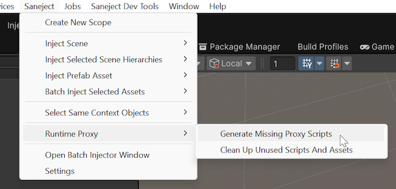

# Runtime proxy tools

Saneject has a few tools to help you manage runtime proxy assets and scripts.

## What do they do?

### Runtime proxy script generator

`RuntimeProxyScriptGenerator` generates missing runtime proxy script stubs for concrete component types required by `BindComponent<TInterface, TConcrete>().FromRuntimeProxy()`.

Those generated script stubs:

- Inherit `RuntimeProxy<TConcrete>`.
- Are marked with `[GenerateRuntimeProxy]`.
- Give Roslyn a concrete partial type to complete.

If the required script already exists, it does nothing.

### Runtime proxy cleaner

`RuntimeProxyCleaner` finds and deletes runtime proxy content that is no longer needed.

It cleans:

- Runtime proxy script files whose proxy types are no longer required by any runtime proxy binding manifest.
- Runtime proxy assets whose `.asset` files are not referenced by any non-proxy project asset.

## How do they work?

### Runtime proxy script generator

`RuntimeProxyScriptGenerator` reads the generated runtime proxy manifests on domain reload or when run from the menu.

It:

1. Enumerates manifest target types from `AssemblyProxyManifest.RequiredProxyTargets`.
2. Checks whether a generated proxy script type already exists for each target.
3. Creates a missing `.cs` stub file in `ProjectSettings.ProxyAssetGenerationFolder`.
4. Imports the new asset so Unity compiles it.

The generated class name is `{ConcreteTypeName}Proxy` plus a deterministic hash when the concrete type has a namespace, so different types with the same simple name do not collide.

### Runtime proxy cleaner

`RuntimeProxyCleaner` uses two scans.

For unused proxy script types, it:

1. Enumerates all non-abstract `RuntimeProxyBase` types in the domain.
2. Compares them against the manifest target types currently required by runtime proxy bindings.
3. Treats proxy types with no matching manifest target as unused.

For unused proxy assets, it:

1. Finds all concrete `RuntimeProxyBase` assets in the project.
2. Builds a dependency set from all non-proxy assets under `Assets/`.
3. Treats runtime proxy assets not present in that dependency set as unused.

On cleanup, it deletes unused proxy assets first, then deletes unused proxy scripts.

## When are they relevant?

### Runtime proxy script generator

`RuntimeProxyScriptGenerator` is relevant when one or more runtime proxy bindings require a proxy script that does not exist yet.

This matters most when:

- `Saneject/Settings/Project Settings/Generate Proxy Scripts On Domain Reload` is turned off.
- You added a new `FromRuntimeProxy()` binding and want to generate the missing scripts manually.
- You changed bindings or moved code in a way that introduced a new required concrete runtime proxy target.

If automatic generation is turned on, the tool is usually only relevant as a manual fallback.

### Runtime proxy cleaner

`RuntimeProxyCleaner` is relevant when runtime proxy scripts or runtime proxy assets are left behind after bindings change.

This happens most often when:

- A `FromRuntimeProxy()` binding was removed.
- A binding changed to a different concrete component type.
- Injection created proxy assets that are no longer referenced by any scene, prefab, or other project asset.

If `Saneject/Settings/User Settings/Log Unused Runtime Proxies On Domain Reload` is enabled, Saneject warns on domain reload when it finds unused runtime proxy types and/or assets.

## Where to find tools

Both tools are in the Unity main menu:

- `Saneject/Runtime Proxy/Generate Missing Proxy Scripts`
- `Saneject/Runtime Proxy/Clean Up Unused Scripts And Assets`

Related settings are in:

- `Saneject/Settings/Project Settings`
- `Saneject/Settings/User Settings`

## Related pages

- [Runtime proxy](../core-concepts/runtime-proxy.md)
- [Runtime proxy inspector](inspectors/runtime-proxy-inspector.md)
- [Settings](settings.md)
- [Logging & validation](logging-and-validation.md)
- [Glossary](../reference/glossary.md)
