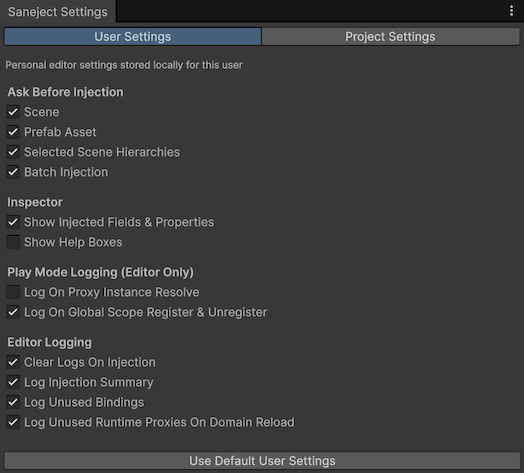
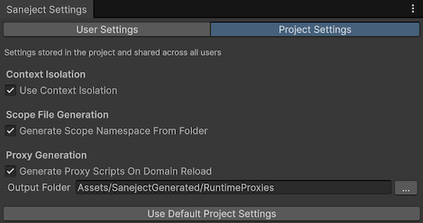

# Settings

Saneject settings control editor behavior for injection, inspector presentation, logging, and code generation.

The Settings window has two tabs:

- `User Settings`: personal settings stored on your machine.
- `Project Settings`: shared settings stored in the Unity project.

## Open the Settings window

Use the Unity main menu:

- `Saneject/Settings`

This opens the `Saneject Settings` editor window.

## User settings vs project settings

| Type               | [Scope](../reference/glossary.md#scope) | Storage                                            | Shared with team                       |
|--------------------|-----------------------------------------|----------------------------------------------------|----------------------------------------|
| `User Settings`    | Current Unity user on current machine   | `EditorPrefs` keys with prefix `SanejectSettings_` | No                                     |
| `Project Settings` | Entire Unity project                    | `ProjectSettings/Saneject/ProjectSettings.json`    | Yes, if the file is version controlled |

Important behavior:

- Settings are editable only in Edit Mode.
- Outside the Unity Editor, settings access falls back to default values.
- Reset actions show a confirmation dialog before applying changes.

## User settings

### Ask Before Injection

All of these default to `true`, which shows a confirmation dialog before [injection runs](../reference/glossary.md#injection-run).

| Setting                      | What it controls                                                                        |
|------------------------------|-----------------------------------------------------------------------------------------|
| `Scene`                      | Ask before injecting the current scene.                                                 |
| `Prefab Asset`               | Ask before injecting the current [prefab asset](../reference/glossary.md#prefab-asset). |
| `Selected Scene Hierarchies` | Ask before injecting selected scene hierarchies.                                        |
| `Batch Injection`            | Ask before [batch injection](../reference/glossary.md#batch-injection) runs.            |

These toggles affect injection commands and batch commands described in [Injection menus](injection-menus.md) and [Batch injection](batch-injection.md).

### Inspector

All of these default to `true`.

| Setting                             | What it controls                                                          |
|-------------------------------------|---------------------------------------------------------------------------|
| `Show Injected Fields & Properties` | Shows members marked with `[Inject]` and `[field: Inject]` in inspectors. |
| `Show Help Boxes`                   | Shows explanatory Saneject help boxes in inspectors.                      |

### Play Mode Logging (Editor Only)

All of these default to `true`.

| Setting                                     | What it controls                                                                                            |
|---------------------------------------------|-------------------------------------------------------------------------------------------------------------|
| `Log On Proxy Instance Resolve`             | Logs when a [runtime proxy](../reference/glossary.md#runtime-proxy) resolves its runtime instance.          |
| `Log On Global Scope Register & Unregister` | Logs [global registration](../reference/glossary.md#global-registration) lifecycle events in `GlobalScope`. |

### Editor Logging

All of these default to `true`.

| Setting                                       | What it controls                                                                                                                                                                                                                             |
|-----------------------------------------------|----------------------------------------------------------------------------------------------------------------------------------------------------------------------------------------------------------------------------------------------|
| `Clear Logs On Injection`                     | Clears the Unity Console before an [injection run](../reference/glossary.md#injection-run) starts.                                                                                                                                           |
| `Log Injection Summary`                       | Writes end-of-run summary logs.                                                                                                                                                                                                              |
| `Log Unused Bindings`                         | Warns when [bindings](../reference/glossary.md#binding) were declared but not used in a run.                                                                                                                                                 |
| `Log Unused Runtime Proxies On Domain Reload` | On domain reload, scans for [runtime proxy](../reference/glossary.md#runtime-proxy) assets and scripts that are not referenced by any [scope](../reference/glossary.md#scope) [binding](../reference/glossary.md#binding) and logs findings. |

For logging semantics and output shape, see [Logging & validation](logging-and-validation.md).

## Project settings

### Context Isolation

| Setting                 | Default | What it controls                                                                                                                                                                                                                                                                                            |
|-------------------------|---------|-------------------------------------------------------------------------------------------------------------------------------------------------------------------------------------------------------------------------------------------------------------------------------------------------------------|
| `Use Context Isolation` | `false` | Enables strict [context](../reference/glossary.md#context) boundaries during resolution. When enabled, scene and prefab-instance dependencies resolve only inside the same [context](../reference/glossary.md#context). [Prefab assets](../reference/glossary.md#prefab-asset) are always context-isolated. |

For details on [context](../reference/glossary.md#context) behavior, see [Context](../core-concepts/context.md).

### Scope File Generation

| Setting                                | Default | What it controls                                                                                                                                                                                    |
|----------------------------------------|---------|-----------------------------------------------------------------------------------------------------------------------------------------------------------------------------------------------------|
| `Generate Scope Namespace From Folder` | `true`  | When creating a new [scope](../reference/glossary.md#scope) from `Assets/Saneject/Create New Scope`, generates a namespace based on the [scope](../reference/glossary.md#scope) file's folder path. |

### Proxy Generation

| Setting                                   | Default                                   | What it controls                                                                                                        |
|-------------------------------------------|-------------------------------------------|-------------------------------------------------------------------------------------------------------------------------|
| `Generate Proxy Scripts On Domain Reload` | `true`                                    | Automatically generates missing [runtime proxy](../reference/glossary.md#runtime-proxy) scripts on Unity domain reload. |
| `Output Folder`                           | `Assets/SanejectGenerated/RuntimeProxies` | Target folder for auto-generated [runtime proxy](../reference/glossary.md#runtime-proxy) scripts and assets.            |

`Output Folder` notes:

- The folder picker accepts only folders under the current project's `Assets` directory.
- If the picker selects a folder outside `Assets`, Saneject logs a warning and keeps the current value.
- Typed values are sanitized to forward slashes and invalid path characters are removed.

For [runtime proxy](../reference/glossary.md#runtime-proxy) behavior, see [Runtime proxy](../core-concepts/runtime-proxy.md).

## Reset settings to defaults

The Settings window includes two reset actions:

- `Use Default User Settings`: clears Saneject user keys from `EditorPrefs`.
- `Use Default Project Settings`: rewrites Saneject [project settings](../reference/glossary.md#project-settings) to defaults in `ProjectSettings/Saneject/ProjectSettings.json`.

Use project reset carefully because it affects all contributors who use the [project settings](../reference/glossary.md#project-settings) file.

## Related pages

- [Injection menus](injection-menus.md)
- [Batch injection](batch-injection.md)
- [Logging & validation](logging-and-validation.md)
- [Context](../core-concepts/context.md)
- [Runtime proxy](../core-concepts/runtime-proxy.md)
- [Glossary](../reference/glossary.md)

