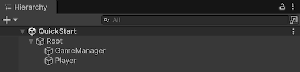
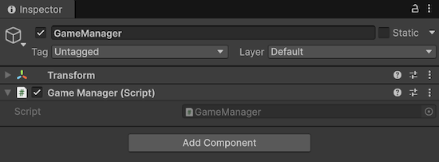
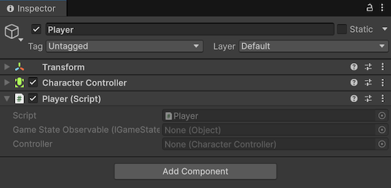
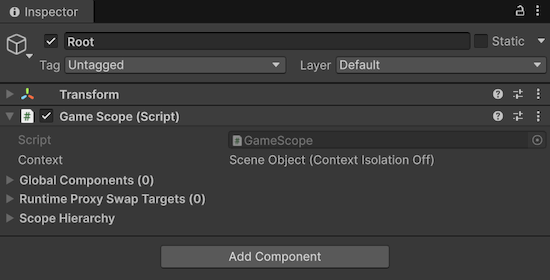
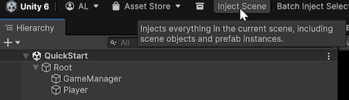
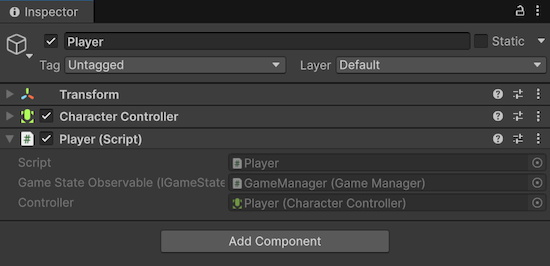

# Quick start

This page walks through a minimal Saneject setup in one scene and shows how to run your first injection. It should take around 5 minutes.

For prerequisites and installation methods, see [Installation & requirements](installation-and-requirements.md).

## 1. Create the scene hierarchy

1. Create a `GameObject` named `Root`.
2. Create a child `GameObject` named `GameManager` under `Root`
3. Create a child `GameObject` named `Player` under `Root`.
4. Add `CharacterController` to `Player`.



## 2. Create a component to inject

Create `GameManager.cs` and place it on `GameManager`.

```csharp
using UnityEngine;

public interface IGameStateObservable
{
}

public class GameManager : MonoBehaviour, IGameStateObservable
{
}
```



## 3. Create an injection target

Create `Player.cs` and attach it to `Player`.

```csharp
using Plugins.Saneject.Experimental.Runtime.Attributes;
using UnityEngine;

public partial class Player : MonoBehaviour
{
    [Inject, SerializeInterface]
    private IGameStateObservable gameStateObservable;

    [Inject, SerializeField]
    private CharacterController controller;
}
```



`Player` is `partial` because `[SerializeInterface]` uses generated code to serialize interface references.

## 4. Create a scope and declare bindings

Create `GameScope.cs`, attach it to `Root`, and declare [bindings](../reference/glossary.md#binding):

You can create a [scope](../reference/glossary.md#scope) manually or from:

- Main menu: `Saneject/Create New Scope`
- Project window context menu: `Assets/Saneject/Create New Scope`

```csharp
using Plugins.Saneject.Experimental.Runtime.Scopes;

public class GameScope : Scope
{
    protected override void DeclareBindings()
    {
        // Find first GameManager that implements IGameStateObservable anywhere in the scene
        BindComponent<IGameStateObservable, GameManager>()
            .FromAnywhere();

        // Find first CharacterController on the injection target (Player) Transform 
        BindComponent<CharacterController>()
            .FromTargetSelf();
    }
}
```



`Scope` is where [bindings](../reference/glossary.md#binding) are declared. During injection, Saneject resolves each `[Inject]` site from the nearest `Scope`, with fallback to parent [scopes](../reference/glossary.md#scope).

## 5. Run injection

Run dependency injection via the main toolbar button `Inject Scene`.



After injection, `Player` has serialized values for `gameStateObservable` and `controller`. Enter Play Mode and the scene runs without a runtime container.



## Inspector integration note

Saneject includes a custom `MonoBehaviour` inspector that keeps injected and [serialized interface](../reference/glossary.md#serialized-interface) fields ordered and preserves Saneject's intended inspector UX.
If the inspector looks wrong or incomplete, another custom inspector or plugin is likely overriding Saneject.
In that case, either disable the conflicting inspector or integrate Saneject's inspector API in your custom inspector to restore the Saneject inspector UX.

See [MonoBehaviour inspector](../editor-and-tooling/inspectors/monobehaviour-inspector.md) and [Saneject inspector API](xref:Plugins.Saneject.Experimental.Editor.Inspectors.SanejectInspector) for details.

## Related pages

- [Introduction](introduction.md)
- [Feature overview](feature-overview.md)
- [Sample game](sample-game.md)
- [Scope](../core-concepts/scope.md)
- [Binding](../core-concepts/binding.md)
- [Field, property & method injection](../core-concepts/field-property-and-method-injection.md)
- [Serialized interface](../core-concepts/serialized-interface.md)
- [Installation & requirements](installation-and-requirements.md)
- [Glossary](../reference/glossary.md)
