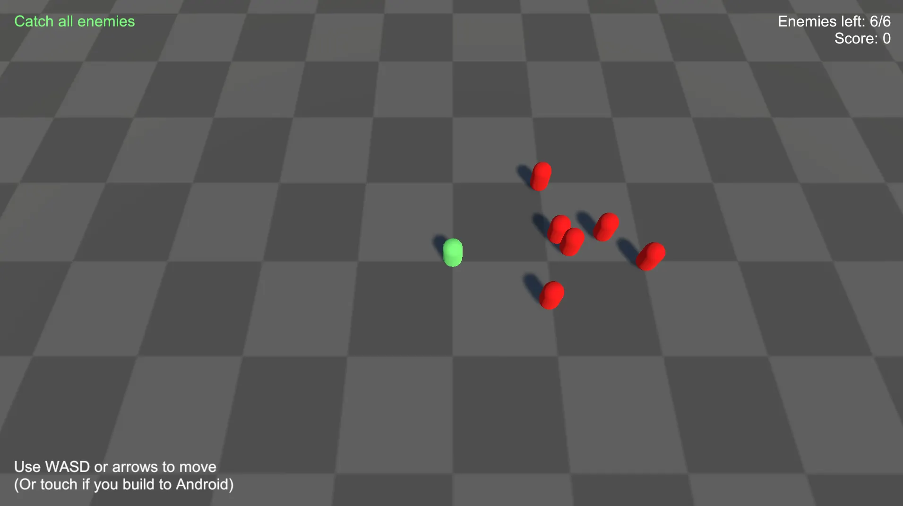

# Sample game

The sample game is a compact reference project that shows how Saneject is used in a real Unity setup.

You control a green player character. Red enemies move around the map and try to evade the player. Catch all enemies to end the round, then restart from the game over UI.



> Some older Unity versions (for example `2022.3.12f1`) can lose script references when importing samples from Package Manager.
> If that happens, right-click the imported `Samples` folder and choose **Reimport**.
> Reference discussion: https://discussions.unity.com/t/broken-script-references-on-updating-custom-package-through-package-manager-and-committing-it-to-git/910632/7

The sample intentionally keeps gameplay simple so you can focus on dependency structure:

- **Multiple [scope](../reference/glossary.md#scope) levels:** scene-wide, object-local, and prefab-local [bindings](../reference/glossary.md#binding).
- **Interface-first wiring:** most systems communicate through interfaces instead of hard references.
- **Cross-context dependencies:** scene and prefab systems connect through [runtime proxy bindings](../reference/glossary.md#runtime-proxy-binding).
- **Global runtime registration:** core gameplay services are registered through `BindGlobal<T>()` and consumed from other [contexts](../reference/glossary.md#context).
- **UI integration:** HUD and game-over flows subscribe to gameplay state through interfaces.

## Where to find it

| Install method                  | Location                                     |
|---------------------------------|----------------------------------------------|
| Package source layout           | `Assets/Plugins/Saneject/Samples~/DemoGame`  |
| Imported Package Manager sample | `Assets/Samples/Saneject/<version>/DemoGame` |

## How to run the sample

1. Add scenes to Build Settings in this order:
    - `StartScene`
    - `GameScene`
    - `UIScene`
2. Open `StartScene`.
3. Enter Play Mode.

## Scene flow

The sample uses additive scenes:

- `StartScene`: bootstrap scene that starts the game flow.
- `GameScene`: gameplay systems (player, enemies, score, game state, camera).
- `UIScene`: HUD and game-over UI.

At startup, the sample loads `GameScene` and `UIScene`, then unloads `StartScene`.

## Scope layout and responsibilities

The sample demonstrates [scope](../reference/glossary.md#scope) composition at multiple levels:

- `GameSceneScope`: declares scene-level gameplay [bindings](../reference/glossary.md#binding) and [global registrations](../reference/glossary.md#global-registration).
- `PlayerScope`: declares player-local [bindings](../reference/glossary.md#binding) such as movement dependencies.
- `EnemyScope`: declares per-enemy prefab [bindings](../reference/glossary.md#binding).
- `UISceneScope`: declares UI-side [bindings](../reference/glossary.md#binding), including [runtime proxy bindings](../reference/glossary.md#runtime-proxy-binding) to gameplay systems.

This layout shows the core Saneject rule in practice: each `Scope` owns [bindings](../reference/glossary.md#binding) for its local part of the hierarchy, while parent [scopes](../reference/glossary.md#scope) provide fallback when local [bindings](../reference/glossary.md#binding) do not match.

See [Scope](../core-concepts/scope.md) and [Binding](../core-concepts/binding.md).

## Binding patterns shown by the sample

### 1. Scene-level composition and globals

`GameSceneScope` declares both normal [bindings](../reference/glossary.md#binding) and global [bindings](../reference/glossary.md#binding).

```csharp
using Plugins.Saneject.Runtime.Scopes;
using UnityEngine;

public class GameSceneScope : Scope
{
    protected override void DeclareBindings()
    {
        BindGlobal<Player>()
            .FromScopeDescendants(includeSelf: true);

        BindGlobal<EnemyManager>()
            .FromScopeDescendants(includeSelf: true);

        BindGlobal<ScoreManager>()
            .FromScopeDescendants(includeSelf: true);

        BindGlobal<GameStateManager>()
            .FromScopeDescendants(includeSelf: true);

        BindComponent<ICameraFollowTarget, Player>()
            .FromScopeDescendants(includeSelf: true);

        BindComponent<IScoreUpdater, ScoreManager>()
            .FromScopeDescendants(includeSelf: true);

        BindComponent<IEnemyObservable, EnemyManager>()
            .FromScopeDescendants(includeSelf: true);

        BindAsset<GameObject>()
            .ToTarget<EnemyManager>()
            .ToMember("enemyPrefab")
            .FromAssetLoad("Assets/Plugins/Saneject/Samples~/DemoGame/Prefabs/Enemy.prefab");
    }
}
```

Why this matters:

- Gameplay systems in the scene can resolve dependencies directly with component and [asset bindings](../reference/glossary.md#asset-binding).
- UI and prefab [contexts](../reference/glossary.md#context) can resolve scene-owned services at runtime through proxy [bindings](../reference/glossary.md#binding) that use `GlobalScope`.

See [Global scope](../core-concepts/global-scope.md).

### 2. Runtime proxy bridge for cross-context references

UI systems and enemy prefab systems consume gameplay interfaces through [runtime proxies](../reference/glossary.md#runtime-proxy):

```csharp
using Plugins.Saneject.Runtime.Scopes;
using UnityEngine.UI;

public class UISceneScope : Scope
{
    protected override void DeclareBindings()
    {
        BindComponent<Text>()
            .ToID("scoreText")
            .FromTargetDescendants();

        BindComponent<IGameStateObservable, GameStateManager>()
            .FromRuntimeProxy()
            .FromGlobalScope();

        BindComponent<IScoreObservable, ScoreManager>()
            .FromRuntimeProxy()
            .FromGlobalScope();

        BindComponent<IEnemyObservable, EnemyManager>()
            .FromRuntimeProxy()
            .FromGlobalScope();
    }
}
```

This keeps scene and prefab boundaries valid in serialized data, while still allowing runtime access to real instances.

See [Runtime proxy](../core-concepts/runtime-proxy.md) and [Context](../core-concepts/context.md).

### 3. Interface injection in gameplay and UI

Most sample systems depend on interfaces, not concrete classes. That is why interface fields use `[SerializeInterface]`.

```csharp
using Plugins.Saneject.Runtime.Attributes;
using UnityEngine;

public partial class HUDController : MonoBehaviour
{
    [Inject, SerializeInterface]
    private IGameStateObservable gameStateObservable;

    [Inject, SerializeInterface]
    private IScoreObservable scoreObservable;

    [Inject, SerializeInterface]
    private IEnemyObservable enemyObservable;
}
```

This gives you:

- Decoupled systems that are easier to replace and test.
- [Serialized interface](../reference/glossary.md#serialized-interface) references that persist in scenes and prefabs.
- Automatic proxy swap support for single interface members when [runtime proxy bindings](../reference/glossary.md#runtime-proxy-binding) are used.

See [Field, property & method injection](../core-concepts/field-property-and-method-injection.md) and [Serialized interface](../core-concepts/serialized-interface.md).

## Game loop wiring shown by the sample

The game loop is connected through interface events and injected collaborators:

1. `EnemyManager` spawns and tracks enemies.
2. Enemies notify when caught.
3. `ScoreManager` updates points.
4. `GameStateManager` monitors remaining enemies and emits game-over when the count reaches zero.
5. UI controllers subscribe to score, enemy count, and game-over events.
6. Restart uses an injected scene-management interface.

The important part is not the gameplay logic itself. The important part is that each step is wired through scoped [bindings](../reference/glossary.md#binding) and interface contracts instead of direct [scene object](../reference/glossary.md#scene-object) references.

## What to study first in the sample

If you are new to Saneject, inspect these in order:

1. Scene [scopes](../reference/glossary.md#scope): `GameSceneScope`, `UISceneScope`, `PlayerScope`, `EnemyScope`.
2. Interface contracts: `IEnemyObservable`, `IScoreObservable`, `IGameStateObservable`, `ISceneManager`.
3. UI controllers: `HUDController`, `GameOverController`.
4. Gameplay managers: `EnemyManager`, `ScoreManager`, `GameStateManager`.

This path gives you the fastest overview of how [bindings](../reference/glossary.md#binding), [scopes](../reference/glossary.md#scope), and [runtime proxy](../reference/glossary.md#runtime-proxy) features fit together.

## Related pages

- [Quick start](quick-start.md)
- [Scope](../core-concepts/scope.md)
- [Binding](../core-concepts/binding.md)
- [Context](../core-concepts/context.md)
- [Field, property & method injection](../core-concepts/field-property-and-method-injection.md)
- [Serialized interface](../core-concepts/serialized-interface.md)
- [Runtime proxy](../core-concepts/runtime-proxy.md)
- [Global scope](../core-concepts/global-scope.md)
- [Glossary](../reference/glossary.md)
