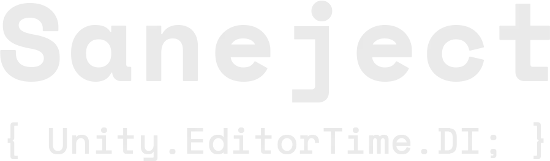

<p>
    <picture>
      <source media="(prefers-color-scheme: dark)" srcset="Docs/images/logo-light.webp">
      <source media="(prefers-color-scheme: light)" srcset="Docs/images/logo-dark.webp">
      
    </picture>
</p>


[](https://github.com/alexanderlarsen/Saneject/actions/workflows/tests.yml)
[](https://github.com/alexanderlarsen/Saneject/releases)
[](LICENSE)

Dependency injection the Unity way.

Resolve dependencies in the Unity Editor, not Play Mode, and write them directly into serialized fields so everything stays visible in the Inspector, including interfaces.

No runtime container, no startup cost, no hidden wiring. Just simple, deterministic DI that works with Unity instead of around it.

## Main features

| Feature                              | Description                                                                                                                       |
|--------------------------------------|-----------------------------------------------------------------------------------------------------------------------------------|
| Editor-time injection                | Resolve dependencies before Play Mode and store them as normal serialized references.                                             |
| Inspector-visible wiring             | Keep dependencies, including interfaces, visible and editable in the Inspector instead of hiding them behind a runtime container. |
| Fluent binding API                   | Declare bindings in `Scope` components with familiar DI-style syntax.                                                             |
| Serialized interfaces                | Use `[SerializeInterface]` for interface fields, arrays, and lists without wrapper classes.                                       |
| Scene, prefab, and context awareness | Control what gets injected where and how cross-context resolution behaves.                                                        |
| Runtime proxy bridging               | Handle references Unity cannot serialize directly across scene and prefab boundaries.                                             |
| Low runtime overhead                 | No runtime container, no reflection-based startup pass, and no extra lifecycle layer.                                             |
| Built-in tooling                     | Use injection menus, batch injection, logging, validation, settings, analyzers, and more directly in the Unity Editor.            |

For more features, see [Feature overview](https://alexanderlarsen.github.io/Saneject/docs/getting-started/feature-overview).

## Mental model

1. Mark fields, properties, or methods with `[Inject]` in your code.
2. Declare bindings in `Scope` components.
3. Run injection in the Unity Editor.
4. Saneject writes resolved dependencies into serialized members.
5. Enter Play Mode and use Unity's normal lifecycle.

## Try Saneject now

Add this URL to Unity Package Manager (Unity 2022.3.12 or newer):

```text
https://github.com/alexanderlarsen/Saneject.git?path=UnityProject/Saneject/Assets/Plugins/Saneject
```

Or download the [latest release](https://github.com/alexanderlarsen/Saneject/releases) and import the `Saneject` folder into your Unity project.

Then jump to [Quick start](https://alexanderlarsen.github.io/Saneject/docs/getting-started/quick-start).

## Feedback appreciated

If you try Saneject and something works well, feels unclear, or seems broken, I would love to hear about it.

- If you find a bug, please open an [Issue](https://github.com/alexanderlarsen/Saneject/issues).
- If you want to share feedback, ideas, or first impressions, drop a note in [Discussions](https://github.com/alexanderlarsen/Saneject/discussions).

## Links

- [Docs](https://alexanderlarsen.github.io/Saneject/docs/getting-started/introduction.html)
- [API](https://alexanderlarsen.github.io/Saneject/api/Plugins.Saneject.Editor.Inspectors.SanejectInspector.html)
- [Releases](https://github.com/alexanderlarsen/Saneject/releases)
- [MIT license](https://github.com/alexanderlarsen/Saneject/blob/main/LICENSE)
