<p>
    <picture>
      <source media="(prefers-color-scheme: dark)" srcset="Docs/logo-light.webp">
      <source media="(prefers-color-scheme: light)" srcset="Docs/logo-dark.webp">
      
    </picture>
</p>


[](https://github.com/alexanderlarsen/Saneject/actions/workflows/tests.yml)
[](https://github.com/alexanderlarsen/Saneject/releases)
[](LICENSE)

Dependency injection the Unity way.

Resolve everything in the Editor with familiar DI syntax while keeping dependencies visible in the inspector, including serialized interfaces and cross-scene/prefab references.

No runtime container, no startup cost, no extra lifecycles. Just clean, easy-to-use, deterministic DI that feels native to Unity.

> ⚠️ **Beta notice**  
> Saneject is currently in beta. The framework is functionally stable, but the API may still change during the beta phase. Expect some breaking changes until 1.0.0.

> 👋 **Tried it? Let me know**
>
> I'm looking for testers to help catch edge cases, bugs and polish the tooling. If you've cloned or tested Saneject, even briefly, I'd love your thoughts.
>
> - Did anything work well?
> - Was anything confusing or unclear?
> - Did you hit any bugs or unexpected behavior?
> - Is there something you expected that's missing?
>
> Open an [Issue](https://github.com/alexanderlarsen/Saneject/issues) or drop a quick comment in [Discussions](https://github.com/alexanderlarsen/Saneject/discussions). No need to be formal!

## Table of contents

- [What is this?](#what-is-this)
- [Why another DI tool?](#why-another-di-tool)
- [Features](#features)
    - [Injection & binding](#injection--binding)
    - [Serialization & interfaces](#serialization--interfaces)
    - [Performance & runtime](#performance--runtime)
    - [Editor UX & tooling](#editor-ux--tooling)
- [Quick start](#quick-start)
    - [Requirements](#requirements)
    - [Installation](#installation)
    - [Hello Saneject (basic example)](#hello-saneject-basic-example)
- [Sample game](#sample-game)
    - [Location by install method](#location-by-install-method)
    - [To run it](#to-run-it)
- [Binding API](#binding-api)
    - [Component bindings](#component-bindings)
    - [Asset bindings](#asset-bindings)
    - [Global singleton bindings](#global-singleton-bindings)
    - [Component locators](#component-locators)
        - [Scope-relative component locators](#scope-relative-component-locators)
        - [Root-relative component locators](#root-relative-component-locators)
        - [Injection target-relative component locators](#injection-target-relative-component-locators)
        - [Arbitrary transform target component locators](#arbitrary-transform-target-component-locators)
        - [Other component locators & special methods](#other-component-locators--special-methods)
    - [Asset locators](#asset-locators)
    - [Component filters](#component-filters)
    - [Asset filters](#asset-filters)
- [Deep dive](#deep-dive)
    - [What is dependency injection?](#what-is-dependency-injection)
    - [How runtime DI typically works](#how-runtime-di-typically-works)
    - [How Saneject DI works](#how-saneject-di-works)
    - [Runtime DI vs Saneject](#runtime-di-vs-saneject)
    - [Scopes & resolution order](#scopes--resolution-order)
    - [Binding uniqueness](#binding-uniqueness)
    - [Context isolation](#context-isolation)
        - [How it works](#how-it-works)
        - [Turning it off](#turning-it-off)
    - [SerializeInterface](#serializeinterface)
        - [Why Unity can't "serialize an interface"](#why-unity-cant-serialize-an-interface)
        - [What the Saneject Roslyn generator adds](#what-the-saneject-roslyn-generator-adds)
    - [ProxyObject](#proxyobject)
        - [Auto-generation](#auto-generation)
        - [Manual generation](#manual-generation)
        - [Example](#example)
        - [Resolve strategies](#resolve-strategies)
        - [Performance note](#performance-note)
    - [MonoBehaviour fallback inspector](#monobehaviour-fallback-inspector)
    - [Saneject inspector API](#saneject-inspector-api)
    - [GlobalScope](#globalscope)
        - [Global binding API](#global-binding-api)
        - [GlobalScope API](#globalscope-api)
    - [Roslyn tools](#roslyn-tools)
    - [User settings](#user-settings)
- [Tested Unity versions](#tested-unity-versions)
- [Limitations](#limitations)
- [Possible additions](#possible-additions)
- [Future explorations](#future-explorations)
- [Credits](#credits)
- [Contribution](#contribution)
- [License](#license)

## What is this?

Saneject is a middle-ground between hand-wiring references and a full runtime DI container. It resolves dependencies in the Unity Editor using familiar DI syntax and workflows, writes them straight into serialized fields (including interfaces), and keeps your classes free of `GetComponent`, static singletons, manual look-ups, etc. At runtime it's just regular, serialized Unity objects. No reflection, no container, no startup hit.

## Why another DI tool?

| Pain point                                                                                         | How Saneject helps                                                                                                                                                                              |
|----------------------------------------------------------------------------------------------------|-------------------------------------------------------------------------------------------------------------------------------------------------------------------------------------------------|
| "We want structured dependency management but don't want to commit to a full runtime DI workflow." | Saneject offers DI-style binding syntax and organisation without a runtime container. You keep editor-time determinism, default Unity lifecycle and Inspector visibility.                       |
| "We want to see what's wired where in the Inspector."                                              | All references are regular serialized fields. Nothing is hidden behind a runtime graph.                                                                                                         |
| "Interfaces can't be dragged into the Inspector."                                                  | Saneject's Roslyn generator adds safe interface-backing fields with Inspector support. `[SerializeInterface] IMyInterface myInterface` shows up as a proper serialized field.                   |
| "Runtime DI lifecycles can feel opaque or fight Unity's own Awake/Start order."                    | Everything is set and serialized in the editor. Unity's normal lifecycle stays untouched.                                                                                                       |
| "Large reflection-heavy containers add startup cost."                                              | Saneject resolves once in the editor. Zero runtime reflection or allocation at runtime.                                                                                                         |
| "Can't serialize references between scenes or from a scene into prefabs."                          | `ProxyObject`, a Roslyn generated `ScriptableObject`, can be referenced anywhere like any asset. At runtime, it resolves and forwards all calls to a real scene instance with minimal overhead. |
| "Non-dev team members struggle with code-only installers and like visible dependencies."           | Bindings live in `Scope` scripts as simple, declarative C#. Fields are regular serialized fields marked with `[Inject]`, and field visibility can be toggled from settings.                     |

Saneject isn't meant to replace full runtime frameworks like Zenject or VContainer. It's an alternative workflow for projects that value determinism, Inspector visibility, and minimal runtime overhead.

## Features

### Injection & binding

- **Editor-time, deterministic injection:** Bindings are resolved in the editor, stored directly in serialized fields, including nested serialized classes.
- **Fluent, scope-aware binding API:** Search hierarchy or project, filter by tag/layer/name, bind by type or ID.
- **Collection binding support:** Inject arrays or lists with full support for filters, scoping, and binding IDs.
- **Flexible filtering:** Query scene or asset bindings with filters for name, tag, layer, hierarchy, and custom predicates for advanced resolution logic.
- **Non-blocking validation:** Reports all missing, conflicting, or invalid bindings in a single pass without halting injection flow, enabling faster iteration and debugging.
- **Unified Scope component:** One `Scope` type handles both scenes and prefabs, with automatic context detection.

### Serialization & interfaces

- **Interface serialization with Roslyn:** `[SerializeInterface] IMyInterface` fields show up in the Inspector.
- **Serialized collections of interfaces:** Interface arrays and lists, e.g., `[SerializeInterface] IMyInterface[]`, are fully supported, injectable and visible in the Inspector too.
- **No more interface class wrappers:** Write plain `[SerializeInterface] IMyInterface foo` instead of wrapping in `Interface<TInterface> foo` and unwrapping with `foo.Value`.
- **Cross-scene / prefab references:** `ProxyObject` `ScriptableObjects` allow serialized references to objects Unity normally can't link.
- **Global Scope:** Scene dependencies can be promoted to global singletons at editor-time and resolved statically by proxies at runtime.

### Performance & runtime

- **No runtime reflection:** Everything is injected and serialized in the editor. At runtime, it's just data Unity already serialized.
- **Proxy resolution:** Proxies resolve their targets once, then cache them. Minimal overhead (dictionary lookup or simple search).

### Editor UX & tooling

- **Native UI/UX:** Designed to feel like it belongs in Unity with polished inspectors, minimal ceremony, and contextual behavior that matches Unity workflows.
- **User-friendly tooling:** One-click scene or prefab resolve, automatic proxy generation, correct inspector interface ordering, automatic Scope context handling.
- **Inspector polish:** `[Inject]` fields grayed out (or hidden), interface proxies show implemented types, help boxes on components.
- **User Settings panel:** Toggle injected field visibility, logging, and more.

## Quick start

### Requirements

| Requirement       | Description                                                                                                       |
|-------------------|-------------------------------------------------------------------------------------------------------------------|
| Unity version     | Unity 2022.3.12f1 LTS or newer. Saneject's Roslyn source generators and analyzers do not work in earlier versions |
| Scripting backend | Mono or IL2CPP                                                                                                    |
| Platforms         | Editor-only tooling; runtime code is plain C#, so it runs on any platform Unity supports                          |

> ⚠️ **Platform notice**  
> Saneject's runtime is just plain C# (no reflection, no dynamic code).  
> It's tested on Windows + Android (Mono & IL2CPP) builds without issues, but other targets (IL2CPP iOS, WebGL, consoles) are not yet verified.
>
> The only non-standard Unity moving parts are:
>
> - The Roslyn-generated partial classes compiled into your assemblies.
> - `ISerializationCallbackReceiver` setting interface fields after deserialization.
>
> Both *should* work everywhere Unity does, but if you run into something, please open an issue.

### Installation

| Install method         | Instruction                                                                                                                                                                                                                          |
|------------------------|--------------------------------------------------------------------------------------------------------------------------------------------------------------------------------------------------------------------------------------|
| Unity package          | 1. Grab the latest `unitypackage` from the [Releases page](https://github.com/alexanderlarsen/Saneject/releases)<br>2. Double-click → import.                                                                                        |
| UPM (latest version)   | 1. Open Unity Package Manager.<br>2. Click the + button and "Add package from git URL".<br>3. Copy-paste:<br>`https://github.com/alexanderlarsen/Saneject.git?path=UnityProject/Saneject/Assets/Plugins/Saneject`<br>4. Press Enter. |
| UPM (specific version) | Same steps as above, but include version after `#` to lock to that version.<br>Example:<br>`https://github.com/alexanderlarsen/Saneject.git?path=UnityProject/Saneject/Assets/Plugins/Saneject#0.8.2`                                |

### Hello Saneject (basic example)

1. Create a `GameObject` named `Root` in the scene.
2. Add a `GameObject` named `Player` under the `Root` and attach `Player.cs` and a `CharacterController` to it:

```csharp
// Classes with [SerializeInterface] must be declared 'partial'. The Roslyn generator injects hidden interface serialization code into a matching partial class behind the scenes.
public partial class Player : MonoBehaviour
{
    // Interface field, marked for injection, shows up in the Inspector
    [Inject, SerializeInterface]
    private IGameStateObservable gameStateObservable;

    // Concrete component field, marked for injection, living on the same GameObject
    [Inject, SerializeField]
    private CharacterController controller;
}
```

3. Add `GameManager.cs` somewhere in the scene:

```csharp
// Will satisfy the IGameStateObservable binding
public class GameManager : MonoBehaviour, IGameStateObservable
{ }

public interface IGameStateObservable 
{ }
```

4. Add `GameScope.cs` to the `Root` `GameObject`:

```csharp
// One place to declare where things come from
public class GameScope : Scope
{
    public override void Configure()
    {
        // Look anywhere in the loaded scene for a GameManager and bind by interface.
        // Resolves via FindObjectsByType<GameManager>(FindObjectsInactive.Include, FindObjectsSortMode.None)) under the hood.
        BindComponent<IGameStateObservable, GameManager>().FromAnywhereInScene();

        // Grab CharacterController on the injection target (Player) transform.
        // Resolves via player.transform.GetComponent<CharacterController>() under the hood.
        BindComponent<CharacterController>().FromTargetSelf();
    }
}
```

> 💡 Scope boilerplate classes can be created via `Saneject/Create New Scope`
> or `Assets/Create/Saneject/Create New Scope`.
>
> Namespace generation can be toggled in `User Settings/Generate Scope Namespace From Folder`.

5. Run dependency injection using either method:

- **Scope inspector:** `Inject Scene Dependencies` button
- **Hierarchy context menu:** Right-click hierarchy panel → `Inject Scene Dependencies`
- **Unity main menu bar:** `Saneject/Inject Scene Dependencies`

Saneject fills in the serialized fields. Press Play, no runtime container required.

> ⚠️️ **Potential inspector conflicts**  
> Saneject includes a `MonoBehaviourFallbackInspector` that ensures injected fields, `[SerializeInterface]` fields, and nested types are drawn with the intended UI/UX by default.
>
> If your inspector looks wrong or incomplete, it's likely another custom inspector or plugin overriding Saneject's inspector. In that case, you can restore the full Saneject layout inside your own inspector by calling:
> ```csharp
> SanejectInspector.DrawDefault(serializedObject, targets, target);
> ```
> For partial integration, you can call individual `SanejectInspector` methods to draw only what you need.
> See [MonoBehaviour fallback inspector](#monobehaviour-fallback-inspector) and [Saneject inspector API](#saneject-inspector-api) for details.

## Sample game

> ⚠️ **Missing sample refs in older Unity versions**
>
> Some older Unity versions, such as 2022.3.12f1, have a bug that can break script references in sample prefabs or scenes when importing samples via the Package Manager. If this happens, right-click the **Samples** folder and then **Reimport** to refresh all references.  
> More details: https://discussions.unity.com/t/broken-script-references-on-updating-custom-package-through-package-manager-and-committing-it-to-git/910632/7

The sample is provided as a reference project and can be studied to see how bindings, scopes, and proxies work together in practice.

It contains a small three-scene game where the player (green bean) chases enemies (red beans) while they try to evade. When all enemies are caught, the game is over and restart UI appears. It's intentionally kept minimal so you can study the setup and learn Saneject's core concepts without distractions.


It shows how to use Saneject in a real (but simple) game setup:

- **Multiple levels of binding**: Shows how you can declare bindings at different granularities (scene-wide, prefab-local, or object-local) so each piece only knows about what it needs.
- **Cross-scene and prefab references**: Demonstrates how to connect systems that live in different scenes or inside prefabs using `SerializeInterface` and proxies, without breaking Unity's prefab isolation.
- **Global scope usage**: Core systems like the game manager or score tracker are promoted to globals, making them easily accessible across the whole project without resorting to singletons.
- **UI integration**: The sample UI is wired entirely through interfaces in an MVC-like pattern, so buttons and text elements update automatically from gameplay state, cleanly separated from game logic.
- **Game loop orchestration**: Player, enemies, and UI are stitched together through DI so that chasing, scoring, and restarting the game all happen through clear, testable contracts instead of hard references.

### Location by install method

| Install method | Location                                                                                                       |
|----------------|----------------------------------------------------------------------------------------------------------------|
| Unity package  | `Assets/Plugins/Saneject/Samples/DemoGame`                                                                     |
| UPM / Git URL  | First import from the Package Manager Samples tab, then locate at `Assets/Samples/Saneject/<version>/DemoGame` |

### To run it

1. Add the following scenes to Build Settings (in this order):

- `StartScene` (bootstrap)
- `GameScene`
- `UIScene`

2. Open `StartScene`
3. Press Play.

## Binding API

To start binding dependencies, create a custom `Scope` and use one of the following `Bind` methods to start a fluent builder.

A few rules:

- **Field types must match bindings**: Interface bindings won't resolve concrete fields, and vice versa.
- **Single vs. collections bindings must match**: Single-value bindings won't resolve collection (list/array) fields, and collection bindings won't resolve single fields. The system validates everything automatically and reports missing/invalid bindings during injection.

You can bind dependencies in three ways, depending on how you want injection to work:

- **Bind by interface**: Matches any object that implements the interface.
- **Bind by concrete type**: Matches only objects of that exact type.
- **Bind an interface to a specific concrete type**: Ensures that only objects of a specific type are used to fulfill an interface.

### Component bindings

Bind `Component` from scene/prefab hierarchy. Methods return a `ComponentBindingBuilder` to define a locate strategy.

| Method                                                                                          | Description                                                      |
|-------------------------------------------------------------------------------------------------|------------------------------------------------------------------|
| `BindComponent<T>()`                                                                            | `T` (interface/concrete) fields resolve to a `T` component.      |
| `BindComponent<TInterface, TConcrete>()`                                                        | `TInterface` fields resolve to a `TConcrete` component.          |
| `BindComponents<T>()`<br/>`BindMultipleComponents<T>()`                                         | `T` (interface/concrete) lists/arrays resolve to `T` components. |
| `BindComponents<TInterface, TConcrete>()`<br/>`BindMultipleComponents<TInterface, TConcrete>()` | `TInterface` lists/arrays resolve to `TConcrete` components.     |

### Asset bindings

Bind project folder assets, e.g., prefabs, `ScriptableObject`. Methods return an `AssetBindingBuilder<TAsset>` to define a locate strategy.

Single-generic asset bindings are concrete-only. Use the two-generic form to bind by interface.

| Method                                                                                  | Description                                                                   |
|-----------------------------------------------------------------------------------------|-------------------------------------------------------------------------------|
| `BindAsset<TConcrete>()`                                                                | `TConcrete` fields resolve to a `TConcrete` `UnityEngine.Object` asset.       |
| `BindAsset<TInterface, TConcrete>()`                                                    | `TInterface` fields resolve to a `TConcrete` `UnityEngine.Object` asset.      |
| `BindAssets<TConcrete>()`<br/>`BindMultipleAssets<TConcrete>()`                         | `TConcrete` list/arrays resolve to `TConcrete` `UnityEngine.Object` assets.   |
| `BindAssets<TInterface, TConcrete>()`<br/>`BindMultipleAssets<TInterface, TConcrete>()` | `TInterface` lists/arrays resolve to `TConcrete` `UnityEngine.Object` assets. |

### Global singleton bindings

Bind cross-scene singletons from scene instances. Methods return a `ComponentBindingBuilder<TComponent>` to define a locate strategy.

| Method                     | Description                                                                                                                                            |
|----------------------------|--------------------------------------------------------------------------------------------------------------------------------------------------------|
| `BindGlobal<TComponent>()` | Promote a scene `Component` into `SceneGlobalContainer`.<br/>Registered in the global scope at startup for global resolution (e.g., via `ProxyObject`. |

### Component locators

Methods in `ComponentBindingBuilder<TComponent> where TComponent : UnityEngine.Component`. All methods return a `ComponentFilterBuilder<TComponent>` to filter found `Component`s.

#### Scope-relative component locators

Looks for the `Component` from the `Scope` `Transform` and its hierarchy.

| Method                                                                                         | Description                                                   |
|------------------------------------------------------------------------------------------------|---------------------------------------------------------------|
| `FromScopeSelf()`<br/>`FromSelf()`                                                             | Component on the Scope's own `Transform`.                     |
| `FromScopeParent()`<br/>`FromParent()`                                                         | Component on the Scope's direct parent.                       |
| `FromScopeAncestors(bool includeSelf = true)`<br/>`FromAncestors(bool includeSelf = true)`     | First match on any ancestor of the Scope (recursive upward).  |
| `FromScopeFirstChild()`<br/>`FromFirstChild()`                                                 | Component on the Scope's first direct child.                  |
| `FromScopeLastChild()`<br/>`FromLastChild()`                                                   | Component on the Scope's last direct child.                   |
| `FromScopeChildWithIndex(int index)`<br/>`FromChildWithIndex(int index)`                       | Component on the child at the given index.                    |
| `FromScopeDescendants(bool includeSelf = true)`<br/>`FromDescendants(bool includeSelf = true)` | Any descendant of the Scope.                                  |
| `FromScopeSiblings()`<br/>`FromSiblings()`                                                     | Any sibling of the Scope (other children of the same parent). |

#### Root-relative component locators

Looks for the `Component` from the `Scope.transform.root` `Transform` and its hierarchy.

| Method                                         | Description                                       |
|------------------------------------------------|---------------------------------------------------|
| `FromRootSelf()`                               | Component on the scene root object itself.        |
| `FromRootFirstChild()`                         | Component on the root's first direct child.       |
| `FromRootLastChild()`                          | Component on the root's last direct child.        |
| `FromRootChildWithIndex(int index)`            | Component on the root's child at the given index. |
| `FromRootDescendants(bool includeSelf = true)` | Any descendant of the root object.                |

#### Injection target-relative component locators

Looks for the `Component` from the injection target `Transform` and its hierarchy. Injection target is the `Component` of a field/property marked with `[Inject]`, i.e., the `Component` requesting injection.

| Method                                           | Description                                |
|--------------------------------------------------|--------------------------------------------|
| `FromTargetSelf()`                               | Component on the target's own `Transform`. |
| `FromTargetParent()`                             | Component on the target's parent.          |
| `FromTargetAncestors(bool includeSelf = true)`   | First match on any ancestor of the target. |
| `FromTargetFirstChild()`                         | Component on the target's first child.     |
| `FromTargetLastChild()`                          | Component on the target's last child.      |
| `FromTargetChildWithIndex(int index)`            | Component on the target's child at index.  |
| `FromTargetDescendants(bool includeSelf = true)` | Any descendant of the target.              |
| `FromTargetSiblings()`                           | Any sibling of the target.                 |

#### Arbitrary transform target component locators

Looks for the `Component` from the specified `Transform` and its hierarchy.

| Method                                                         | Description                                |
|----------------------------------------------------------------|--------------------------------------------|
| `From(Transform target)`                                       | Component on a specific `Transform`.       |
| `FromParentOf(Transform target)`                               | Component on the target's parent.          |
| `FromAncestorsOf(Transform target, bool includeSelf = true)`   | First match on any ancestor of the target. |
| `FromFirstChildOf(Transform target)`                           | Component on the target's first child.     |
| `FromLastChildOf(Transform target)`                            | Component on the target's last child.      |
| `FromChildWithIndexOf(Transform target, int index)`            | Component on the target's child at index.  |
| `FromDescendantsOf(Transform target, bool includeSelf = true)` | Any descendant of the target.              |
| `FromSiblingsOf(Transform target)`                             | Any sibling of the target.                 |

#### Other component locators & special methods

| Method                                             | Description                                                                                                                                                                                               |
|----------------------------------------------------|-----------------------------------------------------------------------------------------------------------------------------------------------------------------------------------------------------------|
| `FromAnywhereInScene()`                            | Finds the first matching component anywhere in the loaded scene.                                                                                                                                          |
| `FromInstance(TComponent instance)`                | Binds to an explicit instance.                                                                                                                                                                            |
| `FromMethod(Func<TComponent> method)`              | Uses a custom predicate to supply a single instance.                                                                                                                                                      |
| `FromMethod(Func<IEnumerable<TComponent>> method)` | Uses a custom factory method to supply a collection of instances.                                                                                                                                         |
| `FromProxy()`                                      | Automatically creates or locates a `ProxyObject` for `TConcrete`, a weak reference that resolves to a concrete `Component` at runtime, enabling cross-boundary references (e.g. between scenes, prefabs). |
| `WithId(string id)`                                | Assign a custom binding ID to match `[Inject("YourIdHere")]` fields.                                                                                                                                      |

### Asset locators

Methods in `AssetBindingBuilder<TAsset> where TAsset : UnityEngine.Object`. All methods return a `AssetFilterBuilder<TAsset>` to filter found `Object` instances.

| Method                                         | Description                                                                                                                                                          |
|------------------------------------------------|----------------------------------------------------------------------------------------------------------------------------------------------------------------------|
| `FromResources(string path)`                   | Load a single asset of type `TAsset` from a `Resources/` path via `Resources.Load`.                                                                                  |
| `FromResourcesAll(string path)`                | Load all assets of type `TAsset` at that path via `Resources.LoadAll`.                                                                                               |
| `FromAssetLoad(string assetPath)`              | Load an asset of type `TAsset` at the given path via `AssetDatabase.LoadAssetAtPath<T>()`.                                                                           |
| `FromAssetLoadAll(string assetPath)`           | Load all sub-assets of type `TAsset` inside a single asset file via `AssetDatabase.LoadAllAssetsAtPath<T>()` (e.g. Sprites in a texture, Meshes or Clips in an FBX). |
| `FromFolder(string folderPath)`                | Load all assets of type `TAsset` from the specified project folder and its subfolders via `AssetDatabase.FindAssets`.                                                |
| `FromInstance(TAsset instance)`                | Bind to an explicit `Object` instance.                                                                                                                               |
| `FromMethod(Func<TAsset> method)`              | Uses a custom predicate to supply a single instance.                                                                                                                 |
| `FromMethod(Func<IEnumerable<TAsset>> method)` | Uses a custom factory method to supply a collection of instances.                                                                                                    |
| `WithId(string id)`                            | Assign a custom binding ID to match `[Inject("YourIdHere")]` fields.                                                                                                 |

### Component filters

Methods in `ComponentFilterBuilder<TComponent>` allow querying and filtering the hierarchy for precise and complex search strategies. All methods return the builder itself to enable method chaining.

| Method                                   | Description                                                                                     |
|------------------------------------------|-------------------------------------------------------------------------------------------------|
| `WhereIsEnabled()`                       | Filters `Behaviour` components where `Behaviour.enabled` is true.                               |
| `WhereIsActiveAndEnabled()`              | Filters `Behaviour` components where `Behaviour.isActiveAndEnabled` is true.                    |
| `WhereComponentIndexIs(int index)`       | Filters components at a specific component index on their `GameObject` (excluding `Transform`). |
| `WhereIsFirstComponentSibling()`         | Filters components that are the first component on their `GameObject` (excluding `Transform`).  |
| `WhereIsLastComponentSibling()`          | Filters components that are the last component on their `GameObject` (excluding `Transform`).   |
| `WhereNameIs(string name)`               | Filters components whose `GameObject.name` exactly matches `name`.                              |
| `WhereNameContains(string substring)`    | Filters components whose `GameObject.name` includes the specified `substring`.                  |
| `WhereTagIs(string tag)`                 | Filters components whose `GameObject.tag` equals `tag`.                                         |
| `WhereLayerIs(int layer)`                | Filters components on a specific `layer`.                                                       |
| `WhereActiveInHierarchy()`               | Filters components whose `GameObject` is active in hierarchy.                                   |
| `WhereInactiveInHierarchy()`             | Filters components whose `GameObject` is inactive in hierarchy.                                 |
| `WhereActiveSelf()`                      | Filters components whose `GameObject` is locally active.                                        |
| `WhereInactiveSelf()`                    | Filters components whose `GameObject` is locally inactive.                                      |
| `WhereSiblingIndexIs(int index)`         | Filters components with the specified sibling index in their parent's hierarchy.                |
| `WhereIsFirstSibling()`                  | Filters components that are the first sibling in their parent's hierarchy.                      |
| `WhereIsLastSibling()`                   | Filters components that are the last sibling in their parent's hierarchy.                       |
| `Where(Func<TComponent,bool> predicate)` | Filters components using a custom predicate.                                                    |
| `WhereTargetIs<TTarget>()`               | Applies binding only if the injection target matches type `TTarget`.                            |
| `WhereMemberNameIs(params string[])`     | Applies binding only if the injected field or property has one of the specified member names.   |

### Asset filters

Methods in `AssetFilterBuilder<TAsset>` allow querying and filtering assets in the project folder for precise and complex asset search strategies. All methods return the builder itself to enable method chaining.

| Method                                | Description                                                                                   |
|---------------------------------------|-----------------------------------------------------------------------------------------------|
| `WhereGameObjectTagIs(string tag)`    | Filters `GameObject` assets whose `tag` matches `tag`.                                        |
| `WhereGameObjectLayerIs(int layer)`   | Filters `GameObject` assets whose `layer` matches `layer`.                                    |
| `WhereNameContains(string substring)` | Filters assets whose `name` contains the specified `substring`.                               |
| `WhereNameIs(string name)`            | Filters assets whose `name` exactly matches `name`.                                           |
| `Where(Func<TAsset,bool> predicate)`  | Filters assets using a custom predicate.                                                      |
| `WhereTargetIs<TTarget>()`            | Applies binding only if the injection target matches type `TTarget`.                          |
| `WhereMemberNameIs(params string[])`  | Applies binding only if the injected field or property has one of the specified member names. |

## Deep dive

### What is dependency injection?

Dependency injection (DI) is a design pattern where objects receive their dependencies from an external source, rather than creating or locating them themselves. Instead of calling `new()`, or searching the scene themselves (`GetComponent`, `FindFirstObjectOfType`, etc.), an external system supplies the needed objects.

### How runtime DI typically works

In most DI frameworks like Zenject or VContainer, you declare bindings in code or installers. At runtime, a container resolves and injects all dependencies before or during startup. This provides flexibility, supports unit testing, and allows highly dynamic setups. However, it introduces complexity, runtime overhead (reflection, allocations, container resolving), a second lifecycle on top of Unity's (`Awake`, `Start`, `OnEnable`, etc.) and the wiring can feel less transparent to non-programmers,
since it's not always visible in the Inspector.

### How Saneject DI works

Saneject flips the model: you still declare bindings in code (via a `Scope`), but all bindings are resolved in the Unity Editor. The results are written directly to serialized fields. There's no container or injection step at runtime. At startup, Unity loads the scene with references already assigned. This has both benefits and trade-offs compared to runtime DI, outlined below.

### Runtime DI vs Saneject

| Approach             | Runtime DI (Zenject, etc.)                               | Saneject                                                                                         |
|----------------------|----------------------------------------------------------|--------------------------------------------------------------------------------------------------|
| Injection timing     | Runtime (container initialization)                       | Editor-time (stored as serialized fields)                                                        |
| Lifecycle            | More complex - adds a second lifecycle on top of Unity's | Regular Unity lifecycle (Awake, Start, etc.)                                                     |
| Performance          | Some startup cost (reflection, allocations)              | Zero reflection or container at runtime (small runtime lookup if using global dependencies)      |
| Inspector visibility | Limited - container handles wiring                       | All dependencies are visible in the Inspector                                                    |
| Flexibility          | High - bindings can change at runtime                    | Lower - wiring is fixed after injection                                                          |
| Testing / mocking    | Strong - easy to substitute in unit tests                | Less ergonomic - requires setting serialized data                                                |
| Visual debuggability | Can be opaque - dynamic graph                            | Fully deterministic - just look at the fields for missing dependencies                           |
| Plain C# classes     | Full support - constructor injection, POCO creation      | No constructor injection and POCO creation. Does support injection into serialized nested POCOs. |

### Scopes & resolution order

| **Concept**               | **What it means in Saneject**                                                                                                                                                                                                                                                                                                |
|---------------------------|------------------------------------------------------------------------------------------------------------------------------------------------------------------------------------------------------------------------------------------------------------------------------------------------------------------------------|
| **Scope component**       | A `MonoBehaviour` that declares bindings for how to resolve dependencies in `Components` **below** its `Transform`.                                                                                                                                                                                                          |
| **Root-scope scan**       | No matter which `Scope` you start the injection on, Saneject walks up to the top-most Scope first, then injects downward once.                                                                                                                                                                                               |
| **Resolution fallback**   | When a binding isn't found in the current `Scope`, the injector climbs upward through parent `Scopes` until it finds one (or fails).                                                                                                                                                                                         |
| **Scene Scope**           | Lives on a (non-prefab) scene `GameObject`. Can bind to any `Component` or `Object` in the scene or project folder, including prefabs.                                                                                                                                                                                       |
| **Prefab Scope**          | Lives on a prefab. Can bind to any `Component` or `Object` in the prefab itself or project folder. Prefab Scopes present in the scene are skipped during scene injection, to keep the prefab self-contained.<br><br>Need a scene reference inside a prefab? Use an `ProxyObject` `ScriptableObject` and inject that instead. |
| **Scene vs prefab Scope** | Same `Component` but the DI system treats them as different contexts.                                                                                                                                                                                                                                                        |

An example of how scoped resolution works (code below):

```mermaid
flowchart TD
  subgraph Editor
    PrefabDI["Prefab injection pass"]
    DI["Scene injection pass"]
  end

  subgraph Scene
    PrefabDI -->|Inject| UIScope["UIScope (Prefab)"]
    DI -->|Skip injection| UIScope
    DI -->|Inject| EnemyAudioService["Enemy.audioService (IAudioService)"]
    DI -->|Inject| EnemyAIController["Enemy.aiController (AIController)"]
    EnemyAudioService -->|"Try resolve IAudioService → Binding not found"| EnemyScope
    EnemyAIController -->|"Try resolve AIController → Binding found"| EnemyScope
    EnemyScope -->|"Try resolve IAudioService → Binding found"| RootScope
  end
```



> ⚠️ Last time I checked, Mermaid diagrams don't render in the GitHub mobile app. Use a browser to view them properly.

`DependencyInjector` (injection passes) first queries `EnemyScope` for `IAudioService` but a binding isn't defined there, so the request bubbles up to `RootScope` which has the binding and provides the `Object`.

`AIController` is resolved directly from `EnemyScope`, so no fallback is needed.

Any scopes that live on prefabs (like `UIScope` above) are skipped during a scene-wide injection pass - they get their own dependencies when the prefab is injected in isolation, or you can inject scene objects into a prefab via an `ProxyObject`.

```csharp
public class RootScope : Scope
{
    public override void Configure()
    {
        BindAsset<IAudioService>().FromResources("Audio/Service");
    }
}
```

```csharp
public class EnemyScope : Scope
{
    public override void Configure()
    {
        // Enemy-local AIController only; no IAudioService here.
        BindComponent<AIController>().FromScopeSelf();
    }
}
```

After injection:

```csharp
public class Enemy : MonoBehaviour
{
    [Inject, SerializeInterface] 
    IAudioService audioService; // Resolved from RootScope
    
    [Inject]
    AIController aiController; // Resolved from EnemyScope        
}
```

> ℹ️ `Scope` uses `HideFlags.DontSaveInBuild` to strip it from builds, to prevent accidental usage at runtime.

### Binding uniqueness

Each binding you declare in a `Scope` must be unique. If two bindings in the same `Scope` conflict, Saneject will log an error and ignore the duplicate.

A binding is considered unique within a scope based on the following:

- **Bound type**: If an interface type is provided, uniqueness is based only on the interface type (ignoring concrete). If no interface type is provided, uniqueness is based on the concrete type.
- **Binding ID**: If set via `.WithId()` and matched with `[Inject("YourIdHere")]`.
- **Single vs collection**: Whether it's a single-value binding or a collection (`List<T>` or `T[]`).
- **Global flag**: Whether the binding is marked as global.
- **Target filters**: If the binding uses the target type filter `WhereTargetIs<T>()`.
- **Member name filters**: If the binding uses the member filter `WhereMemberNameIs(...)`.

**Overlap rule (important):**

When determining duplicates, target and member-name filters are compared by overlap, not by full-set equality.

- **Target filters:** two bindings overlap if any target types are the same or assignable (base/derived).
- **Member-name filters:** two bindings overlap if they share at least one member name.
- **Empty target/member filter**: is treated as a generic binding and does not overlap a filtered binding for uniqueness (so a general binding can coexist with a targeted one).

For example, the following two bindings are considered duplicates and will conflict:

```csharp
BindComponent<IMyService>();
BindComponent<IMyService, MyServiceConcrete>();
```

or:

```csharp
BindComponent<MyServiceConcrete>();
BindComponent<MyServiceConcrete>();
```

But the following combinations are allowed:

```csharp
// Interface and direct concrete binding
BindComponent<IMyService>();
BindComponent<MyServiceConcrete>();

// Same interface, but with a unique ID
BindComponent<IMyService>();
BindComponent<IMyService, MyServiceConcrete>().WithId("Secondary");

// Same interface, one single and one collection binding
BindComponent<IMyService>();
BindComponents<IMyService, MyServiceConcrete>();

// Same interface but different target filters
BindComponent<IMyService>().WhereTargetIs<Player>();
BindComponent<IMyService>().WhereTargetIs<Enemy>();

// Same interface but different member name filters
BindComponent<IMyService>().WhereMemberNameIs("serviceA");
BindComponent<IMyService>().WhereMemberNameIs("serviceB");
```

This uniqueness model ensures deterministic resolution and early conflict detection. Duplicate bindings are logged and skipped automatically.

### Context isolation

By default, Saneject enforces *context isolation* when resolving dependencies, meaning preventing references across contexts Unity can't serialize, such as scene ↔ prefab or prefab ↔ prefab, which will break when the prefab isn't present in the scene.

When context isolation is enabled (recommended):

- Scene objects only resolve to other objects in the same scene.
- Prefab instances only resolve to other components within the same prefab instance.
- Prefab assets only resolve within their own asset root.
- Cross-context candidates (scene ↔ prefab, prefab ↔ prefab, prefab asset ↔ prefab instance, etc.) are filtered out with a clear log message.

#### How it works

For each `[Inject]` field, Saneject determines the *context key* of both sides:

- **Injection target (field owner):** the object declaring the `[Inject]` field.
- **Candidate dependency:** each object that could satisfy the binding.

Both are compared:

- If the target is a scene object, only candidates from the same scene are allowed.
- If the target is a prefab instance, only candidates from that exact prefab instance root are allowed.
- If the target is a prefab asset, only candidates from that prefab asset root are allowed.
- ScriptableObjects and other project assets are not restricted.

Any mismatches are discarded before assignment, and the rejection is logged with the binding signature for transparency.

#### Turning it off

This behavior can be controlled in **User Settings** with the toggle **Filter By Same Context**:

- **On (default)**: Cross-context links are blocked. Use `ProxyObjects` if you need to connect a scene to a prefab or bridge between prefabs.
- **Off**: Cross-context links are allowed. This is generally unsafe, but can be useful in rare advanced workflows.

For most cases, leave this enabled and rely on `ProxyObjects` for legitimate cross-context references.

### SerializeInterface

#### Why Unity can't "serialize an interface"

Unity's serializer only supports a restricted set of types:

- Primitive value types (`int`, `float`, `bool`, etc.)
- Enums and strings
- Arrays and `List<T>` where `T` is serializable
- Structs marked `[Serializable]`
- References to `UnityEngine.Object` subclasses (`Component`, `ScriptableObject`, etc.)

Interfaces don't fit into any of these categories. They're just contracts, not concrete data or Unity objects, so Unity has nothing it can actually write. As a result, fields typed as an interface are skipped entirely by the serializer.

#### What the Saneject Roslyn generator adds

For every `[SerializeInterface]` field, the generator emits a hidden, serializable `UnityEngine.Object` backing field in a partial class that implements `ISerializationCallbackReceiver`.

At serialization time (Editor only), the interface reference is synced into this backing field so it shows up in the Inspector and persists in the scene/prefab.

At deserialization time, the backing field is copied back into the real interface field so the component can use it normally in code.

```csharp
// User written class. 
// Needs to be partial for source generator to extend it with another partial.
public partial class Requester : MonoBehaviour
{
    [Inject, SerializeInterface]
    private IService service;

    [Inject, SerializeInterface]
    private IService[] servicesArray;
}
```

```csharp
// Auto-generated partial.
public partial class Requester : ISerializationCallbackReceiver
{
    [SerializeField, InterfaceBackingField(interfaceType: typeof(IService), isInjected: true, injectId: null)]
    private Object __service; // Real serialized field
    
    [SerializeField, InterfaceBackingField(interfaceType: typeof(IService), isInjected: true, injectId: null)]
    private Object[] __servicesArray; // Real serialized field

    public void OnBeforeSerialize()
    {
        // Sync interface fields into their Object-backed fields so they serialize and show up in the Inspector.
        #if UNITY_EDITOR
        __service = service as Object;
        __servicesArray = servicesArray?.Cast<UnityEngine.Object>().ToArray();
        #endif
    }
    
    public void OnAfterDeserialize()
    {
        // When Unity deserialization occurs, the Object is assigned to the actual interface field.
        service = __service as IService;
        
        servicesArray = (__servicesArray ?? Array.Empty<UnityEngine.Object>())
                    .Select(x => x as IService)
                    .ToArray();
    }
}
```

The generated backing fields make interface members appear in the Inspector like any other serialized reference.

With `[Inject, SerializeInterface]`, fields are grayed out and auto-managed by Saneject.

Without `[Inject]`, they behave as regular `Object` fields you can assign manually. If you assign an object that doesn't implement the required interface, the field is cleared to `null`.


### ProxyObject

`ProxyObject<T>` is a special Roslyn-generated `ScriptableObject` that:

- Implements every interface on `T` at compile-time.
- Generates forwarding code for all method calls, property gets/sets, and event subscriptions at compile-time.
- The actual `T` instance is resolved at runtime – cheaply if using `BindGlobal<TComponent>` to register it to the `GlobalScope`.

Why? Unity can't serialize direct references to scene objects across scenes or into prefabs. The proxy asset is serializable, so you assign it in the Inspector or inject it. At runtime, it finds and links to the actual instance the first time it's used. This makes it ideal for cross-context injections.

#### Auto-generation

Think of it as a serializable weak reference that resolves quickly at runtime. Whenever you need to inject a `Component` from outside the current serialization context, just bind like this:

`BindComponent<IInterface, Concrete>().FromProxy()`

At injection time, this will:

- Generate a proxy script implementing all interfaces of `Concrete` (if one doesn't already exist).
- Trigger a standard Unity script recompilation if a new proxy script has to be generated, stopping the current injection pass. In this case, click Inject again to continue.
- Create a `ScriptableObject` proxy asset at `Assets/Generated` (if one doesn't already exist).
- Reuse the first found proxy asset if it already exists somewhere in the project.

#### Manual generation

`FromProxy()` always reuses a single proxy asset per type project-wide. For advanced cases (like different resolution strategies per object), you can add more manually:

Right-click any `MonoScript` that implements one or more interfaces and select **Generate Proxy Object**.

This creates:

- A proxy script for the class.
- A proxy `ScriptableObject` asset in `Assets/Generated` (path is configurable in settings).

Or write the stub manually and create the proxy `ScriptableObject` with right-click project folders → `Create/Saneject/Proxy`.

#### Example


> ⚠️ Last time I checked, Mermaid diagrams don't render in the GitHub mobile app. Use a browser to view them properly.

Example interface:

```csharp
public interface IGameManager
{
    bool IsGameOver { get; }
    void RestartGame();
}
```

Concrete class:

```csharp
public class GameManager : MonoBehaviour, IGameManager
{
    public bool IsGameOver { get; private set; }
    public void RestartGame() { }
}
```

Generated stub (once per class):

```csharp
[GenerateProxyObject]
public partial class GameManagerProxy : ProxyObject<GameManager> { }
```

Roslyn-generated proxy forwarding:

```csharp
public partial class GameManagerProxy : IGameManager
{
    public bool IsGameOver
    {
        get
        {
            if (!instance) instance = ResolveInstance();
            return instance.IsGameOver;
        }
    }

    public void RestartGame()
    {
        if (!instance) instance = ResolveInstance();
        instance.RestartGame();
    }
}
```

Now you can drag the `GameManagerProxy` asset into any `[SerializeInterface] IGameManager` field, whether it's in a scene, a prefab, or resolved through injection.

#### Resolve strategies

| Resolve method                    | What it does                                                                                                               |
|-----------------------------------|----------------------------------------------------------------------------------------------------------------------------|
| `FromGlobalScope`                 | Pulls the instance from `GlobalScope`. Register it via `BindGlobal` in a `Scope`. No reflection, just a dictionary lookup. |
| `FindInLoadedScenes`              | Uses `FindFirstObjectByType<T>(FindObjectsInactive.Include)` across all loaded scenes.                                     |
| `FromComponentOnPrefab`           | Instantiates the given prefab and returns the component.                                                                   |
| `FromNewComponentOnNewGameObject` | Creates a new `GameObject` and adds the component.                                                                         |
| `ManualRegistration`              | You call `proxy.RegisterInstance(instance)` at runtime before the proxy is used.                                           |

#### Performance note

The proxy resolves its target the first time it's accessed and then caches it. If the cached instance goes null (for example, after a scene reload), the proxy will resolve it again automatically.

Forwarded calls include a null-check, which makes them about 8x slower than a direct call. In practice that means nanoseconds of overhead, which is negligible outside of extremely tight loops.

In a stress test, one million proxy calls in a single frame to a trivial method took ~5 ms on an Intel i7-9700K CPU. If you ever need to squeeze out that last bit of performance in a hot path, grab the concrete instance once with `proxy.GetInstanceAs<TConcrete>()` and call it directly.

### MonoBehaviour fallback inspector

Unity's default inspector draws fields in declaration order, but Roslyn-generated interface backing fields live in a partial class, which normally causes them to appear at the bottom of the Inspector. This breaks expected grouping and makes injected interfaces harder to interpret.

`MonoBehaviourFallbackInspector` is a global fallback custom `Editor` for all `MonoBehaviour`s.  
It is only used when no more specific inspector exists for the target type, ensuring Saneject's intended UI/UX is always applied by default.

It replaces Unity's default drawing logic with a call to `SanejectInspector.DrawDefault`, which:

- Draws the script field and all serializable fields and interfaces in correct declaration order, including base types.
- Applies custom UI for `[SerializeInterface]` fields, with type labels, collection support, and validation.
- Shows `[Inject]` and `[ReadOnly]` fields as read-only (single values and collections).
- Recursively renders nested `[Serializable]` types.
- Validates assigned interface types and resolves from `GameObject`s when possible.
- Omits non-serialized, backing-only, or hidden fields by default.

If you create your own inspector for a specific type or a catch-all `Editor` for `MonoBehaviour`, Unity will use that instead of Saneject's `MonoBehaviourFallbackInspector`. In that case, Saneject's inspector features won't apply unless you explicitly call back into it.

You can completely restore Saneject's inspector behavior inside your custom editor by calling:

```csharp
SanejectInspector.DrawDefault(serializedObject, targets, target);
```

You can also restore the behavior more granularly by using individual static methods from `SanejectInspector` (explained below).

### Saneject inspector API

`SanejectInspector` contains the full inspector rendering system used by Saneject.  
It draws injected fields as read-only, interface fields, collections, and nested objects with correct ordering and visibility.

You can use the full system:

```csharp
SanejectInspector.DrawDefault(serializedObject, targets, target);
```

Or call specific parts of it:

| Method                         | Description                                                                                                                      |
|--------------------------------|----------------------------------------------------------------------------------------------------------------------------------|
| `DrawMonoBehaviourScriptField` | Draws the default non-editable script field at the top of a MonoBehaviour inspector.                                             |
| `DrawAllSerializedFields`      | Draws all serializable fields on the given target using Saneject's ordering, visibility, and injection-aware logic.              |
| `DrawSerializedField`          | Draws a single serialized field with support for interface backing, read-only handling, and nested types.                        |
| `TryGetInterfaceBackingInfo`   | Attempts to find the interface backing field and resolve its concrete element type for a `[SerializeInterface]` field.           |
| `IsReadOnly`                   | Returns true if a field should be drawn as read-only due to `[Inject]` or `[ReadOnly]`.                                          |
| `HasInject`                    | Returns true if a field is marked with `[Inject]`.                                                                               |
| `HasReadOnly`                  | Returns true if a field is marked with `[ReadOnly]`.                                                                             |
| `IsCollection`                 | Returns true if a serialized property is a collection (array or list).                                                           |
| `IsSerializeInterfaceField`    | Returns true if a field is marked with `[SerializeInterface]`.                                                                   |
| `DrawReadOnlyCollection`       | Draws a collection in a read-only format, used for injected or `[ReadOnly]` arrays/lists.                                        |
| `DrawInterfaceObjectField`     | Draws an object field for an interface reference, resolving components from assigned `GameObject`s when possible.                |
| `GetFormattedInterfaceLabel`   | Formats a field name and interface type into a human-friendly label.                                                             |
| `GetOrderedFields`             | Returns all instance fields of a type and its base types (excluding MonoBehaviour), in declaration order.                        |
| `ShouldDrawField`              | Returns true if a field is valid for drawing in the inspector based on serialization and visibility rules.                       |
| `GetElementType`               | Returns the element type of a collection type (array or `List<>`).                                                               |
| `IsNestedSerializable`         | Returns true if a type is a non-Unity serializable reference type suitable for nested drawing.                                   |
| `DrawNestedSerializable`       | Recursively draws the contents of a nested serializable object using the same field rules.                                       |
| `ValidateInterfaceCollection`  | Validates that objects in a collection implement a required interface type, resolving components from `GameObject`s if possible. |

These utilities are useful for building custom inspectors, advanced tooling, or partial field drawing while preserving Saneject's behavior and layout.

### GlobalScope

The `GlobalScope` is a static service locator that `ProxyObject` can fetch from at near-zero cost (dictionary lookup).
Use it to register scene objects or assets as cross-scene singletons. The `GlobalScope` can only hold one instance per unique type.

Bindings are added via `BindGlobal<TComponent>()` inside a `Scope`. This stores the binding into a `SceneGlobalContainer` component.

At runtime, on `Awake()` (with `[DefaultExecutionOrder(-10000)]`), the `SceneGlobalContainer` adds all its references to the `GlobalScope`.

Only one `SceneGlobalContainer` is allowed per scene - it's created automatically during scene injection and manual creation is not allowed. If another instance of the same type is registered, the registration fails and an error is logged. The original instance remains.

#### Global binding API

Register global singletons in the `Scope` using the following methods.

| Method                     | Description                                                              |
|----------------------------|--------------------------------------------------------------------------|
| `BindGlobal<TComponent>()` | Adds a scene `Component` to the global scope via `SceneGlobalContainer`. |

#### GlobalScope API

| Method                          | Description                                                       |
|---------------------------------|-------------------------------------------------------------------|
| `GlobalScope.Register<T>(T)`    | Registers an instance globally. Only one per type.                |
| `GlobalScope.Get<T>()`          | Returns the registered instance (or `null`).                      |
| `GlobalScope.Unregister<T>()`   | Removes a registered instance of type `T`.                        |
| `GlobalScope.IsRegistered<T>()` | Returns `true` if an instance of type `T` is in the global scope. |
| `GlobalScope.Clear()`           | Clears all global registrations (Play Mode only).                 |

If you're using `ProxyObject`, global registration is one of the ways to resolve its target instance.

💡 You can toggle logging for global registration under `Saneject/User Settings/Editor Logging`.

### Roslyn tools

Roslyn tools enhance your compile-time experience using C#'s powerful compiler APIs.

- A **Roslyn analyzer** inspects code and reports diagnostics (like errors or suggestions).
- A **Roslyn code fix** provides a quick-fix action for an analyzer error.
- A **Roslyn source generator** adds new C# code to your project during compilation.

Saneject ships with three Roslyn tool DLLs (in `Saneject/RoslynLibs`):

| DLL                                 | Type                | Purpose                                                                                                                                                                                            |
|-------------------------------------|---------------------|----------------------------------------------------------------------------------------------------------------------------------------------------------------------------------------------------|
| **SerializeInterfaceGenerator.dll** | Source generator    | Generates hidden backing fields and serialization hooks for `[SerializeInterface]` members.                                                                                                        |
| **ProxyObjectGenerator.dll**        | Source generator    | Emits proxy classes for types marked with `[GenerateProxyObject]`. Each proxy is a `ScriptableObject` that implements the same interfaces and forwards all calls to the resolved runtime instance. |
| **AttributesAnalyzer.dll**          | Analyzer + code fix | Validates field decoration rules for `[Inject]`, `[SerializeField]`, and `[SerializeInterface]`. Includes context-aware quick fixes in supported IDEs (like Rider).                                |

Unity's official Roslyn analyzer documentation (including setup instructions):  
<https://docs.unity3d.com/Manual/roslyn-analyzers.html>

Use that guide if you want to plug in custom Roslyn tooling or integrate Saneject's tools in other project structures.

Roslyn source code is in the [RoslynTools](RoslynTools) folder.

### User settings

Found under `Saneject/User Settings`, these let you customize editor and logging behavior in the Unity Editor.

| Setting                                     | Description                                                                                                                                                                                                                                   |
|---------------------------------------------|-----------------------------------------------------------------------------------------------------------------------------------------------------------------------------------------------------------------------------------------------|
| `Ask Before Scene Injection`                | Show a confirmation dialog before injecting dependencies into the scene.                                                                                                                                                                      |
| `Ask Before Prefab Injection`               | Show a confirmation dialog before injecting prefab dependencies.                                                                                                                                                                              |
| `Filter By Same Context`                    | Enforce context isolation during injection. Scene objects only resolve with other scene objects, and prefab objects only resolve within their own prefab. Cross-context references are filtered out unless this is disabled in User Settings. |
| `Show Injected Fields`                      | Show `[Inject]` fields in the Inspector.                                                                                                                                                                                                      |
| `Show Help Boxes`                           | Show help boxes in the Inspector on Saneject components.                                                                                                                                                                                      |
| `Log On Proxy Instance Resolve`             | Log when a proxy resolves its target during Play Mode.                                                                                                                                                                                        |
| `Log Global Scope Register/Unregister`      | Log when objects are registered or unregistered in the global scope during Play Mode.                                                                                                                                                         |
| `Log Injection Stats`                       | Log a summary after injection: scopes processed, fields injected, globals added, unused/missing bindings.                                                                                                                                     |
| `Log Prefab Skipped During Scene Injection` | Log when a prefab is skipped during a scene injection pass.                                                                                                                                                                                   |
| `Log Unused Bindings`                       | Log when bindings are declared but never used in the current scene or prefab.                                                                                                                                                                 |
| `Clear Logs On Injection`                   | Clear console logs before injection starts. Useful for seeing missing/invalid bindings etc. for the current injection pass only.                                                                                                              |
| `Generated Proxy Asset Folder`              | Folder to save proxy assets auto-generated by the system.                                                                                                                                                                                     |
| `Generate Scope Namespace From Folder`      | If enabled, new Scopes created via the editor menu get a namespace matching their folder path (relative to `Assets/`). When disabled, Scopes are generated without a namespace.                                                               |

Ask ChatGPT

## Tested Unity versions

Saneject is automatically tested in [CI](https://github.com/alexanderlarsen/Saneject/actions/workflows/tests.yml) against the following Unity editor versions:

| Unity Version | Release Type | Notes                                                         |
|---------------|--------------|---------------------------------------------------------------|
| 2022.3.12f1   | LTS          | Minimum supported version for Roslyn generators and analyzers |
| 2022.3.62f1   | LTS          | Latest 2022 LTS                                               |
| 6000.0.23f1   | LTS          | Earliest Unity 6.0 LTS                                        |
| 6000.0.55f1   | LTS          | Latest Unity 6.0 LTS                                          |
| 6000.1.16f1   | Supported    | Latest Unity 6.1 (non-LTS) at the time of writing             |
| 6000.2.0f1    | Supported    | Latest Unity 6.2 (non-LTS) at the time of writing             |

In-between versions will likely work, but only the above are verified in automated tests.  
Unity 2023 releases are skipped since they are tech stream builds (not long-term supported), and Unity does not recommend them for production.

## Limitations

- Injecting plain C# objects (POCOs) directly into other objects is not supported due to Unity's serialization limits. Injection *into* serializable POCOs nested inside `MonoBehaviour` is supported.
- Verified on Windows (Mono + IL2CPP) and Android (IL2CPP). Other platforms remain untested.

For trade-offs compared to runtime DI frameworks, see [Runtime DI vs Saneject](#runtime-di-vs-saneject).

## Possible additions

These are features that could be added if there's interest.

- Asset binding by interface only, `BindAsset<IMyInterface>()`. Useful for injecting collections of different `ScriptableObject` that implement the same interface.

## Future explorations

These are research ideas and experiments that may or may not make it into Saneject.

- Editor-time POCO injection via `[SerializeReference]`.
- Project-wide "one click" injection: process all scenes and prefabs in one go. Difficult to get right but could be a power feature.
- Circular dependency detection: Currently not possible because injection runs one scene or prefab at a time. A project-wide injection pass would enable it, and it could be configurable (ignore, warn, block).
- Interface-aware object picker. Unity's built-in picker can't filter by interface, so this would require a fully custom object picker. A bit niche now that `[Inject]` fields are grayed out and not pickable, but it would make `[SerializeInterface]` feel more native if people want to use it without `[Inject]`.

## Credits

Inspired by:

- [Zenject](https://github.com/modesttree/Zenject)
- [VContainer](https://github.com/hadashiA/VContainer)
- [Serialize Interface Generator](https://github.com/SimonNordon4/serialize-interface-generator)

## Contribution

There's no formal roadmap or contribution pipeline in place at the moment, but suggestions and issue reports are always appreciated.

Feel free to open an [Issue](https://github.com/alexanderlarsen/Saneject/issues) or drop a quick comment in [Discussions](https://github.com/alexanderlarsen/Saneject/discussions).

## License

MIT License

Copyright (c) 2025 Alexander Larsen

Permission is hereby granted, free of charge, to any person obtaining a copy
of this software and associated documentation files (the "Software"), to deal
in the Software without restriction, including without limitation the rights
to use, copy, modify, merge, publish, distribute, sublicense, and/or sell
copies of the Software, and to permit persons to whom the Software is
furnished to do so, subject to the following conditions:

The above copyright notice and this permission notice shall be included in all
copies or substantial portions of the Software.

THE SOFTWARE IS PROVIDED "AS IS", WITHOUT WARRANTY OF ANY KIND, EXPRESS OR
IMPLIED, INCLUDING BUT NOT LIMITED TO THE WARRANTIES OF MERCHANTABILITY,
FITNESS FOR A PARTICULAR PURPOSE AND NONINFRINGEMENT. IN NO EVENT SHALL THE
AUTHORS OR COPYRIGHT HOLDERS BE LIABLE FOR ANY CLAIM, DAMAGES OR OTHER
LIABILITY, WHETHER IN AN ACTION OF CONTRACT, TORT OR OTHERWISE, ARISING FROM,
OUT OF OR IN CONNECTION WITH THE SOFTWARE OR THE USE OR OTHER DEALINGS IN THE
SOFTWARE.
