# Saneject (0.7.0 beta)

Editor-time resolved serialized field dependency injection for Unity. Keep your references visible, classes clean, ditch the runtime container.

> ⚠️ **Beta Notice**  
> Saneject is currently in beta. The framework is functionally stable, but the API is still evolving during the beta phase. Expect some breaking changes until 1.0.0.

> 👋 **Tried it? Let me know!**
>
> I’m looking for testers to help catch edge cases, bugs and polish the tooling. If you’ve cloned or tested Saneject, even briefly, I’d love your thoughts.
>
> - Did anything work well?
> - Was anything confusing or unclear?
> - Did you hit any bugs or unexpected behavior?
> - Is there something you expected that’s missing?
>
> Open an [Issue](https://github.com/alexanderlarsen/Saneject/issues) or drop a quick comment in [Discussions](https://github.com/alexanderlarsen/Saneject/discussions). No need to be formal!

## Table of Contents

- [What Is This?](#what-is-this)
- [Why Another DI Tool?](#why-another-di-tool)
- [Features](#features)
- [Quick Start](#quick-start)
    - [Requirements](#requirements)
    - [Installation](#installation)
    - [Hello Saneject (Basic Example)](#hello-saneject-basic-example)
- [Demo Game](#demo-game)
- [Deep Dive](#deep-dive)
    - [What Is Dependency Injection?](#what-is-dependency-injection)
    - [How Runtime DI Typically Works](#how-runtime-di-typically-works)
    - [How Saneject DI Works](#how-saneject-di-works)
    - [Runtime DI vs Saneject Comparison](#runtime-di-vs-saneject-comparison)
    - [Scopes & Resolution Order](#scopes--resolution-order)
    - [Binding API](#binding-api)
    - [Binding Uniqueness](#binding-uniqueness)
    - [SerializeInterface](#serializeinterface)
    - [MonoBehaviourInspector](#monobehaviourinspector)
    - [SanejectInspector API](#sanejectinspector-api)
    - [Interface Proxy Object](#interface-proxy-object)
    - [Global Scope](#global-scope)
    - [Roslyn Tools in Saneject](#roslyn-tools-in-saneject)
    - [UX](#ux)
    - [User Settings](#user-settings)
- [Limitations / Known Issues](#limitations--known-issues)
- [Credits / Contribution](#credits--contribution)
- [License](#license)

## What Is This?

Saneject is a middle-ground between hand-wiring references and a full runtime DI container. It resolves dependencies in the Unity Editor using familiar DI syntax and workflows, writes them straight into serialized fields (including interfaces), and keeps your classes free of `GetComponent`, singletons, manual look-ups, etc. At runtime it’s just regular, serialized Unity objects - no reflection, no container, no startup hit.

## Why Another DI Tool?

| Pain Point                                                                                       | How Saneject Helps                                                                                                                                                                             |
|--------------------------------------------------------------------------------------------------|------------------------------------------------------------------------------------------------------------------------------------------------------------------------------------------------|
| We want structured dependency management but don’t want to commit to a full runtime DI workflow. | Saneject offers DI-style binding syntax and organisation without a runtime container - you keep editor-time determinism, default Unity lifecycle and Inspector visibility.                     |
| “We want to see what’s wired where in the Inspector.”                                            | All references are regular serialized fields. Nothing is hidden behind a runtime graph.                                                                                                        |
| Interfaces can’t be dragged into the Inspector.                                                  | Saneject’s Roslyn generator adds safe interface-backing fields with Inspector support. `[SerializeInterface] IMyInterface myInterface` shows up as a proper serialized field.                  |
| Runtime DI lifecycles can feel opaque or fight Unity’s own Awake/Start order.                    | Everything is set and serialized in the editor. Unity’s normal lifecycle stays untouched.                                                                                                      |
| Large reflection-heavy containers add startup cost.                                              | Saneject resolves once in the editor - zero reflection or allocation at runtime.                                                                                                               |
| Can’t serialize references between scenes or from a scene into prefabs.                          | `InterfaceProxyObject`, a Roslyn generated `ScriptableObject`, can be referenced anywhere like any asset. At runtime, it resolves and forwards to a real scene instance with minimal overhead. |
| Mixed teams (artists/designers) struggle with code-only installers.                              | Bindings live in Scope scripts as simple, declarative C#. Fields are regular serialized fields marked with `[Inject]`, and field visibility can be toggled from settings.                      |

Saneject isn’t meant to replace full runtime frameworks like Zenject or VContainer. It’s an alternative workflow for projects that value determinism, Inspector visibility, and minimal runtime overhead.

## Features

### Injection & Binding

- **Editor-time, deterministic injection:** Bindings are resolved in the editor, stored directly in serialized fields, including nested serialized classes.
- **Fluent, scope-aware binding API:** Search hierarchy or project, filter by tag/layer/name, bind by type or ID.
- **Collection binding support:** Inject arrays or lists with full support for filters, scoping, and binding IDs.
- **Flexible filtering:** Query scene or asset bindings with filters for name, tag, layer, hierarchy, and custom predicates for advanced resolution logic.
- **Non-blocking validation:** Reports all missing, conflicting, or invalid bindings in a single pass without halting injection flow, enabling faster iteration and debugging.
- **Unified Scope component:** One Scope type handles both scenes and prefabs, with automatic context detection.

### Serialization & Interfaces

- **Interface serialization with Roslyn:** `[SerializeInterface] IMyInterface` fields show up in the Inspector.
- **Serialized collections of interfaces:** Interface arrays and lists using `[SerializeInterface] IMyInterface[]` are fully supported, injectable and visible in the Inspector.
- **Cross-scene / prefab references:** `InterfaceProxyObject` `ScriptableObjects` allow serialized references to objects Unity normally can’t link.
- **Global Scope container:** Scene dependencies can be promoted to global singletons and resolved statically by proxies.

### Performance & Runtime

- **No runtime reflection:** Everything is injected and serialized in the editor. At runtime, it's just data Unity already serialized.
- **Proxy resolution:** Proxies resolve their targets once, then cache them. Minimal overhead (dictionary lookup or simple search).

### Editor UX & Tooling

- **Native UI/UX:** Designed to feel like it belongs in Unity - polished inspectors, minimal ceremony, and contextual behavior that matches Unity workflows.
- **User-friendly tooling:** One-click scene resolve, right-click proxy generation, correct inspector interface ordering, automatic Scope context handling.
- **Inspector polish:** `[Inject]` fields grayed out (or hidden), interface proxies show implemented types, help boxes on components.
- **User Settings panel:** Toggle injected field visibility, logging, and more.

## Quick Start

### Requirements

| Requirement       | Description                                                                                                                  |
|-------------------|------------------------------------------------------------------------------------------------------------------------------|
| Unity Version     | Unity 6000.0.23f1 LTS or newer. Relies on C# Roslyn source generators. Earlier versions may work but are currently untested. |
| Scripting Backend | Mono or IL2CPP                                                                                                               |
| Platforms         | Editor-only tooling; runtime code is plain C#, so it runs on any platform Unity 6 supports                                   |

> ⚠️ **Platform notice**  
> Saneject’s runtime is just plain C# (no reflection, no dynamic code).  
> It's tested on Windows + Android (Mono & IL2CPP) builds without issues, but other IL2CPP targets (iOS, WebGL, consoles) are not yet verified.
>
> The only non-standard Unity moving parts are:
>
> - The Roslyn-generated partial classes compiled into your assemblies.
> - `ISerializationCallbackReceiver` setting interface fields after deserialization.
>
> Both *should* work everywhere Unity does, but if you run into stripping/AOT quirks, please open an issue.

### Installation

| Install Method              | Instruction                                                                                                                                                                                                                                                                            |
|-----------------------------|----------------------------------------------------------------------------------------------------------------------------------------------------------------------------------------------------------------------------------------------------------------------------------------|
| Unity Package               | Grab the latest `unitypackage` from the [Releases page](https://github.com/alexanderlarsen/Saneject/releases) → double-click → import.                                                                                                                                                 |
| Clone + Copy                | 1. Clone the repo somewhere outside your project<br> `git clone https://github.com/alexanderlarsen/Saneject.git`<br><br> 2. Copy Saneject plugin folder into your own project<br> `cp -r Saneject/UnityProject/Saneject/Assets/Plugins/Saneject <YourUnityProjectRoot>/Assets/Plugins` |
| Unity Package Manager (UPM) | Currently unsupported but I'll get it up and running later.                                                                                                                                                                                                                            |

### Hello Saneject (Basic Example)

1. Create a `GameObject` named `Root` in the scene.
2. Add a `GameObject` named `Player` under the `Root` and attach `Player.cs` and a `CharacterController` to it:

```csharp
public class Player : MonoBehaviour
{
    // Interface field, marked for injection, shows up in the Inspector
    [Inject, SerializeInterface]
    private IGameStateObservable gameStateObservable;

    // Concrete component field, marked for injection, living on the same GameObject
    [Inject, SerializeField]
    private CharacterController controller;
}
```

3. Add `GameManager.cs` somewhere in the scene:

```csharp
// Will satisfy the IGameStateObservable binding
public class GameManager : MonoBehaviour, IGameStateObservable
{ }

public interface IGameStateObservable 
{ }
```

4. Add `GameScope.cs` to the `Root` `GameObject`:

```csharp
// One place to declare where things come from
public class GameScope : Scope
{
    public override void Configure()
    {
        // Look anywhere in the loaded scene for a GameManager and bind by interface.
        // Resolves via FindObjectsByType<GameManager>(FindObjectsInactive.Include, FindObjectsSortMode.None)) under the hood.
        BindComponent<IGameStateObservable, GameManager>().FromAnywhereInScene();

        // Grab CharacterController on the injection target (Player) transform.
        // Resolves via player.transform.GetComponent<CharacterController>() under the hood.
        BindComponent<CharacterController>().FromTargetSelf();
    }
}
```

5. Run dependency injection using either method:

- **Scope Inspector:** Inject Scene Dependencies button
- **Hierarchy Context Menu:** Right-click hierarchy panel → Inject Scene Dependencies
- **Unity Main Menu Bar:** Saneject → Inject Scene Dependencies

Saneject fills in the serialized fields. Press Play - no runtime container required.

> ⚠️ **Global MonoBehaviour Inspector Override**  
> A `MonoBehaviourInspector.cs` file overrides all `MonoBehaviour` inspectors to enforce intended UX (read-only injected fields, correct interface order and more).
>
> If you need to use your own custom inspector or it causes issues with other plugins, you can safely delete this file and call `SanejectInspector.DrawAllSerializedFields(serializedObject, target)` from your own inspector. You can also use lower-level helpers from `SanejectInspector` for full control.
>
> Saneject will still work if you delete it, but inspector UX will degrade. Use `SanejectInspector` methods directly in your own inspector for full control and to restore UX.

## Demo Game

A small three-scene demo game lives in `Assets/Plugins/Saneject/Demo`. It shows how to use Saneject in a real (but simple) game setup:

- Cross-scene and prefab references using `SerializeInterface` and interface proxies
- Scene and prefab `Scopes` with different bindings
- Global scope usage
- Basic UI and game loop

Gameplay: chase enemies as they evade you. Catch them all to win and restart.

**To run it:**

1. Add the following scenes to Build Settings (in this order):

- `StartScene` (bootstrap)
- `GameScene`
- `UIScene`

2. Open `StartScene`
3. Press Play.

Requires **TextMesh Pro essentials** for the UI to work.

The demo should be fairly self-explanatory and can be used as a code/setup study to understand how to structure bindings, scopes, and proxies.

## Deep Dive

### What Is Dependency Injection?

Dependency Injection (DI) is a design pattern where objects receive their dependencies from an external source, rather than creating or locating them themselves. Instead of calling `new` or searching the scene themselves, an external system supplies the needed objects.

### How Runtime DI Typically Works

In most DI frameworks like Zenject or VContainer, you declare bindings in code or installers. At runtime, a container resolves and injects all dependencies before or during startup. This provides flexibility, supports unit testing, and allows dynamic setups. However, it introduces complexity and runtime overhead (reflection, allocations), and the wiring can feel less transparent to non-programmers, since it's not always visible in the Inspector.

### How Saneject DI Works

Saneject flips the model: you still declare bindings in code (via a `Scope`), but all bindings are resolved in the Unity Editor. The results are written directly to serialized fields. There's no container or injection step at runtime - Unity loads the scene with references already assigned. This has both benefits and trade-offs compared to runtime DI, outlined below.

### Runtime DI vs Saneject Comparison

| Approach             | Runtime DI (Zenject, etc.)                               | Saneject                                                                                         |
|----------------------|----------------------------------------------------------|--------------------------------------------------------------------------------------------------|
| Injection timing     | Runtime (container init)                                 | Editor-time (stored as serialized fields)                                                        |
| Lifecycle            | More complex - adds a second lifecycle on top of Unity's | Regular Unity lifecycle (Awake, Start, etc.)                                                     |
| Performance          | Some startup cost (reflection, allocations)              | Zero reflection or container at runtime (small runtime lookup if using global dependencies)      |
| Inspector visibility | Limited - container handles wiring                       | All dependencies are visible in the Inspector                                                    |
| Flexibility          | High - bindings can change at runtime                    | Lower - wiring is fixed after injection                                                          |
| Testing / mocking    | Strong - easy to substitute in unit tests                | Less ergonomic - requires setting serialized data                                                |
| Visual Debuggability | Can be opaque - dynamic graph                            | Fully deterministic - just look at the fields for missing dependencies                           |
| Plain C# Classes     | Full support - constructor injection, POCO creation      | No constructor injection and POCO creation. Does support injection into serialized nested POCOs. |

### Scopes & Resolution Order

| **Concept**               | **What it Means in Saneject**                                                                                                                                                                                                                                                                                                         |
|---------------------------|---------------------------------------------------------------------------------------------------------------------------------------------------------------------------------------------------------------------------------------------------------------------------------------------------------------------------------------|
| **Scope component**       | A `MonoBehaviour` that declares bindings for how to resolve dependencies in `Components` **below** its `Transform`.                                                                                                                                                                                                                   |
| **Root-scope scan**       | No matter which `Scope` you start the injection on, Saneject walks up to the top-most Scope first, then injects downward once.                                                                                                                                                                                                        |
| **Resolution fallback**   | When a binding isn’t found in the current `Scope`, the injector climbs upward through parent `Scopes` until it finds one (or fails).                                                                                                                                                                                                  |
| **Scene Scope**           | Lives on a (non-prefab) scene `GameObject`. Can bind to any `Component` or `Object` in the scene or project folder, including prefabs.                                                                                                                                                                                                |
| **Prefab Scope**          | Lives on a prefab. Can bind to any `Component` or `Object` in the prefab itself or project folder. Prefab Scopes present in the scene are skipped during scene injection, to keep the prefab self-contained.<br><br>Need a scene reference inside a prefab? Use an `InterfaceProxyObject` `ScriptableObject` and inject that instead. |
| **Scene vs Prefab Scope** | Same `Component` but the DI system treats them as different contexts.                                                                                                                                                                                                                                                                 |

An example of how scoped resolution works (code below):

```mermaid
flowchart TD
  subgraph Editor
    PrefabDI["Prefab injection pass"]
    DI["Scene injection pass"]
  end

  subgraph Scene
    PrefabDI -->|Inject| UIScope["UIScope (Prefab)"]
    DI -->|Skip injection| UIScope
    DI -->|Inject| EnemyAudioService["Enemy.audioService (IAudioService)"]
    DI -->|Inject| EnemyAIController["Enemy.aiController (AIController)"]
    EnemyAudioService -->|"Try resolve IAudioService → Binding not found"| EnemyScope
    EnemyAIController -->|"Try resolve AIController → Binding found"| EnemyScope
    EnemyScope -->|"Try resolve IAudioService → Binding found"| RootScope
  end
```



> ⚠️ Last time I checked, Mermaid diagrams don’t render in the GitHub mobile app. Use a browser to view them properly.

`DependencyInjector` (injection passes) first queries `EnemyScope` for `IAudioService` but a binding isn't defined there, so the request bubbles up to `RootScope` which has the binding and provides the `Object`.

`AIController` is resolved directly from `EnemyScope`, so no fallback is needed.

Any scopes that live on prefabs (like `UIScope` above) are skipped during a scene-wide injection pass - they get their own dependencies when the prefab is injected in isolation, or you can inject scene objects into a prefab via an `InterfaceProxyObject`.

```csharp
public class RootScope : Scope
{
    public override void Configure()
    {
        BindAsset<IAudioService>().FromResources("Audio/Service");
    }
}
```

```csharp
public class EnemyScope : Scope
{
    public override void Configure()
    {
        // Enemy-local AIController only; no IAudioService here.
        BindComponent<AIController>().FromScopeSelf();
    }
}
```

After injection:

```csharp
public class Enemy : MonoBehaviour
{
    [Inject, SerializeInterface] 
    IAudioService audioService; // Resolved from RootScope
    
    [Inject]
    AIController aiController; // Resolved from EnemyScope        
}
```

> ℹ️ `Scope` uses `HideFlags.DontSaveInBuild` to strip it from builds, to prevent accidental usage at runtime.

### Binding API

To start binding dependencies, create a custom `Scope` and use one of the following `Bind` methods to start a fluent builder.

A few rules:

- **Field types must match bindings**: Interface bindings won't resolve concrete fields, and vice versa.
- **Single vs. collections bindings must match**: Single-value bindings won’t resolve collection (list/array) fields, and collection bindings won’t resolve single fields. The system validates these mismatches automatically and reports them during injection.

You can bind dependencies in three ways, depending on how you want injection to work:

- **Bind by interface**: Matches any component that implements the interface.
- **Bind by concrete type**: Matches only components of that exact class.
- **Bind an interface to a specific concrete type**: Ensures that only components of a specific type are used to fulfill an interface.

#### Component Bindings

Bind Components from scene/prefab hierarchy. Methods return a `ComponentBindingBuilder<TComponent>` to define a locate strategy.

| Method                                                                                          | Description                                                                             |
|-------------------------------------------------------------------------------------------------|-----------------------------------------------------------------------------------------|
| `BindComponent<TComponent>()`                                                                   | Bind a `Component` and resolve by interface or concrete.                                |
| `BindComponent<TInterface, TConcrete>()`                                                        | Bind a `Component` by `TInterface`and resolve with `TConcrete`.                         |
| `BindComponents<TComponent>()`<br/>`BindMultipleComponents<TComponent>()`                       | Bind a `Component` collection (list/array) and resolve by interface or concrete.        |
| `BindComponents<TInterface, TConcrete>()`<br/>`BindMultipleComponents<TInterface, TConcrete>()` | Bind a `Component` collection (list/array) by `TInterface`and resolve with `TConcrete`. |
| `BindComponents<TInterface, TConcrete>()`<br/>`BindMultipleComponents<TInterface, TConcrete>()` | Bind a `Component` collection (list/array) by `TInterface`and resolve with `TConcrete`. |

#### Asset Bindings

Bind Project folder assets, e.g., prefabs, `ScriptableObjects`. Methods return an `AssetBindingBuilder<TAsset>` to define a locate strategy.

| Method                                                                                  | Description                                                                                            |
|-----------------------------------------------------------------------------------------|--------------------------------------------------------------------------------------------------------|
| `BindAsset<TConcrete>()`                                                                | Bind a `UnityEngine.Object` asset and resolve by `TConcrete`.                                          |
| `BindAsset<TInterface, TConcrete>()`                                                    | Bind a `UnityEngine.Object` asset by `TInterface`and resolve with `TConcrete`.                         |
| `BindAssets<TConcrete>()`<br/>`BindMultipleAssets<TConcrete>()`                         | Bind a `UnityEngine.Object` asset collection (list/array) and resolve by `TConcrete`.                  |
| `BindAssets<TInterface, TConcrete>()`<br/>`BindMultipleAssets<TInterface, TConcrete>()` | Bind a `UnityEngine.Object` asset collection (list/array) by `TInterface`and resolve with `TConcrete`. |

#### Global Singleton Bindings

Bind cross-scene singletons from scene instances. Methods return a `ComponentBindingBuilder<TComponent>` to define a locate strategy.

| Method                     | Description                                                                                                                                                     |
|----------------------------|-----------------------------------------------------------------------------------------------------------------------------------------------------------------|
| `BindGlobal<TComponent>()` | Promote a scene `Component` into `SceneGlobalContainer`.<br/>Registered in the global scope at startup for global resolution (e.g., via `InterfaceProxyObject`. |

#### Component Locators

Methods in `ComponentBindingBuilder<TComponent> where TComponent : UnityEngine.Component`. All methods return a `ComponentFilterBuilder<TComponent>` to filter found `Component`s.

Scope-Relative Component Locators:

Looks for the `Component` from the `Scope` `Transform` and its hierarchy.

| Method                                                                                         | Description                                                   |
|------------------------------------------------------------------------------------------------|---------------------------------------------------------------|
| `FromScopeSelf()`<br/>`FromSelf()`                                                             | Component on the Scope’s own `Transform`.                     |
| `FromScopeParent()`<br/>`FromParent()`                                                         | Component on the Scope’s direct parent.                       |
| `FromScopeAncestors(bool includeSelf = true)`<br/>`FromAncestors(bool includeSelf = true)`     | First match on any ancestor of the Scope (recursive upward).  |
| `FromScopeFirstChild()`<br/>`FromFirstChild()`                                                 | Component on the Scope’s first direct child.                  |
| `FromScopeLastChild()`<br/>`FromLastChild()`                                                   | Component on the Scope’s last direct child.                   |
| `FromScopeChildWithIndex(int index)`<br/>`FromChildWithIndex(int index)`                       | Component on the child at the given index.                    |
| `FromScopeDescendants(bool includeSelf = true)`<br/>`FromDescendants(bool includeSelf = true)` | Any descendant of the Scope.                                  |
| `FromScopeSiblings()`<br/>`FromSiblings()`                                                     | Any sibling of the Scope (other children of the same parent). |

Root-Relative Component Locators:

Looks for the `Component` from the `Scope.transform.root` `Transform` and its hierarchy.

| Method                                         | Description                                       |
|------------------------------------------------|---------------------------------------------------|
| `FromRootSelf()`                               | Component on the scene root object itself.        |
| `FromRootFirstChild()`                         | Component on the root’s first direct child.       |
| `FromRootLastChild()`                          | Component on the root’s last direct child.        |
| `FromRootChildWithIndex(int index)`            | Component on the root’s child at the given index. |
| `FromRootDescendants(bool includeSelf = true)` | Any descendant of the root object.                |

Injection-Target-Relative Component Locators:

Looks for the `Component` from the injection target `Transform` and its hierarchy. Injection target is the `Component` of a field/property marked with `[Inject]`, i.e., the `Component` requesting injection.

| Method                                           | Description                                |
|--------------------------------------------------|--------------------------------------------|
| `FromTargetSelf()`                               | Component on the target’s own `Transform`. |
| `FromTargetParent()`                             | Component on the target’s parent.          |
| `FromTargetAncestors(bool includeSelf = true)`   | First match on any ancestor of the target. |
| `FromTargetFirstChild()`                         | Component on the target’s first child.     |
| `FromTargetLastChild()`                          | Component on the target’s last child.      |
| `FromTargetChildWithIndex(int index)`            | Component on the target’s child at index.  |
| `FromTargetDescendants(bool includeSelf = true)` | Any descendant of the target.              |
| `FromTargetSiblings()`                           | Any sibling of the target.                 |

Arbitrary Transform Target Component Locators:

Looks for the `Component` from the specified `Transform` and its hierarchy.

| Method                                                         | Description                                |
|----------------------------------------------------------------|--------------------------------------------|
| `From(Transform target)`                                       | Component on a specific `Transform`.       |
| `FromParentOf(Transform target)`                               | Component on the target’s parent.          |
| `FromAncestorsOf(Transform target, bool includeSelf = true)`   | First match on any ancestor of the target. |
| `FromFirstChildOf(Transform target)`                           | Component on the target’s first child.     |
| `FromLastChildOf(Transform target)`                            | Component on the target’s last child.      |
| `FromChildWithIndexOf(Transform target, int index)`            | Component on the target’s child at index.  |
| `FromDescendantsOf(Transform target, bool includeSelf = true)` | Any descendant of the target.              |
| `FromSiblingsOf(Transform target)`                             | Any sibling of the target.                 |

Other Component Locators:

| Method                                             | Description                                                               |
|----------------------------------------------------|---------------------------------------------------------------------------|
| `FromAnywhereInScene()`                            | Finds the first matching component anywhere in the loaded scene.          |
| `FromInstance(TComponent instance)`                | Binds to an explicit instance.                                            |
| `FromMethod(Func<TComponent> method)`              | Uses a custom predicate to supply a single instance.                      |
| `FromMethod(Func<IEnumerable<TComponent>> method)` | Uses a custom factory method to supply a collection of instances.         |
| `WithId(string id)`                                | Assign a custom binding ID to match `[Inject(Id = "YourIdHere")]` fields. |

#### Asset Locators

Methods in `AssetBindingBuilder<TAsset> where TAsset : UnityEngine.Object`. All methods return a `AssetFilterBuilder<TAsset>` to filter found `Object`s.

| Method                                         | Description                                                                                           |
|------------------------------------------------|-------------------------------------------------------------------------------------------------------|
| `FromResources(string path)`                   | Load a single asset of type `TAsset` from a `Resources/` path via `Resources.Load`.                   |
| `FromResourcesAll(string path)`                | Load all assets of type `TAsset` at that path via `Resources.LoadAll`.                                |
| `FromAssetLoad(string assetPath)`              | Load an asset of type `TAsset` at the given path via `AssetDatabase.LoadAssetAtPath<T>()`.            |
| `FromAssetLoadAll(string assetPath)`           | Load multiple assets of type `TAsset` at the given path via `AssetDatabase.LoadAllAssetsAtPath<T>()`. |
| `FromInstance(TAsset instance)`                | Bind to an explicit `Object` instance.                                                                |
| `FromMethod(Func<TAsset> method)`              | Uses a custom predicate to supply a single instance.                                                  |
| `FromMethod(Func<IEnumerable<TAsset>> method)` | Uses a custom factory method to supply a collection of instances.                                     |
| `WithId(string id)`                            | Assign a custom binding ID to match `[Inject(Id = "YourIdHere")]` fields.                             |

#### Component Filters

Methods in `ComponentFilterBuilder<TComponent>` allow querying and filtering the hierarchy for precise and complex search strategies. All methods return the builder to enable method chaining.

| Method                                   | Description                                                                                     |
|------------------------------------------|-------------------------------------------------------------------------------------------------|
| `WhereIsEnabled()`                       | Filters `Behaviour` components where `Behaviour.enabled` is true.                               |
| `WhereIsActiveAndEnabled()`              | Filters `Behaviour` components where `Behaviour.isActiveAndEnabled` is true.                    |
| `WhereComponentIndexIs(int index)`       | Filters components at a specific component index on their `GameObject` (excluding `Transform`). |
| `WhereIsFirstComponentSibling()`         | Filters components that are the first component on their `GameObject` (excluding `Transform`).  |
| `WhereIsLastComponentSibling()`          | Filters components that are the last component on their `GameObject` (excluding `Transform`).   |
| `WhereNameIs(string name)`               | Filters components whose `GameObject.name` exactly matches `name`.                              |
| `WhereNameContains(string substring)`    | Filters components whose `GameObject.name` includes the specified `substring`.                  |
| `WhereTagIs(string tag)`                 | Filters components whose `GameObject.tag` equals `tag`.                                         |
| `WhereLayerIs(int layer)`                | Filters components on a specific `layer`.                                                       |
| `WhereActiveInHierarchy()`               | Filters components whose `GameObject` is active in hierarchy.                                   |
| `WhereInactiveInHierarchy()`             | Filters components whose `GameObject` is inactive in hierarchy.                                 |
| `WhereActiveSelf()`                      | Filters components whose `GameObject` is locally active.                                        |
| `WhereInactiveSelf()`                    | Filters components whose `GameObject` is locally inactive.                                      |
| `WhereSiblingIndexIs(int index)`         | Filters components with the specified sibling index in their parent's hierarchy.                |
| `WhereIsFirstSibling()`                  | Filters components that are the first sibling in their parent's hierarchy.                      |
| `WhereIsLastSibling()`                   | Filters components that are the last sibling in their parent's hierarchy.                       |
| `Where(Func<TComponent,bool> predicate)` | Filters components using a custom predicate function.                                           |
| `WhereTargetIs<TTarget>()`               | Applies binding only if the injection target matches type `TTarget`.                            |

#### Asset Filters

Methods in `AssetFilterBuilder<TAsset>` allow querying and filtering assets in the project folder for precise and complex asset search strategies. All methods return the builder to enable method chaining.

| Method                                | Description                                                          |
|---------------------------------------|----------------------------------------------------------------------|
| `WhereGameObjectTagIs(string tag)`    | Filters `GameObject` assets whose `tag` matches `tag`.               |
| `WhereGameObjectLayerIs(int layer)`   | Filters `GameObject` assets whose `layer` matches `layer`.           |
| `WhereNameContains(string substring)` | Filters assets whose `name` contains the specified `substring`.      |
| `WhereNameIs(string name)`            | Filters assets whose `name` exactly matches `name`.                  |
| `Where(Func<TAsset,bool> predicate)`  | Filters assets using a custom predicate function.                    |
| `WhereTargetIs<TTarget>()`            | Applies binding only if the injection target matches type `TTarget`. |

### Binding Uniqueness

Each binding you declare in a `Scope` must be unique. If two bindings in the same `Scope` conflict, meaning they target the same injection key, Saneject will log an error and ignore the duplicate.

A binding is considered unique within a scope based on the following:

- **Bound type**: Either the interface type (if provided) or the concrete type (if binding directly).
- **Binding ID**: If set via `.WithId()` and matched with `[Inject(Id = "YourIdHere")]`.
- **Single vs collection**: Whether it's a single-value binding or a collection (`List<T>` or `T[]`).
- **Global flag**: Whether the binding is marked as global.
- **Target filters**: If the binding uses the target type filter `WhereTargetIs<T>()`.

For example, the following two bindings are considered duplicates and will conflict:

```csharp
BindComponent<IMyService>();
BindComponent<IMyService, MyServiceImpl>();
```

But the following combinations are allowed:

```csharp
// Interface and direct concrete binding
BindComponent<IMyService>();
BindComponent<MyServiceImpl>();

// Same interface, but with a unique ID
BindComponent<IMyService>();
BindComponent<IMyService, MyServiceImpl>().WithId("Secondary");

// Same interface, one single and one collection binding
BindComponent<IMyService>();
BindComponents<IMyService, MyServiceImpl>();

// Same interface and ID, but different target filters
BindComponent<IMyService>().WhereTargetIs<Player>();
BindComponent<IMyService>().WhereTargetIs<Enemy>();
```

This uniqueness model ensures deterministic resolution and early conflict detection. Duplicate bindings are logged and skipped automatically.

### SerializeInterface

#### Why Unity can’t “serialize an interface”

Serializing an interface in the literal sense doesn't make much sense, because an interface is just a type contract, not a tangible object. Unity’s serializer only stores concrete `UnityEngine.Object` references, so a field typed as an interface has nothing for the serializer to write and gets skipped completely.

#### What the Saneject Roslyn generator adds

For every `[SerializeInterface]` field the generator emits a hidden, serializable backing `Object` in a partial class that implements `ISerializationCallbackReceiver`. The partial class copies the reference into the real interface field after deserialization. It also syncs the interface to the backing field before serialization - in the Editor only - to reflect the current value of the interface in the Inspector.

```csharp
// User written class. 
// Needs to be partial for source generator to extend it with another partial.
public partial class Requester : MonoBehaviour
{
    [Inject, SerializeInterface]
    private IService service;

    [Inject, SerializeInterface]
    private IService[] servicesArray;
}
```

```csharp
// Auto-generated partial.
public partial class Requester : ISerializationCallbackReceiver
{
    [SerializeField, InterfaceBackingField(interfaceType: typeof(IService), isInjected: true, injectId: null)]
    private Object __service; // Real serialized field
    
    [SerializeField, InterfaceBackingField(interfaceType: typeof(IService), isInjected: true, injectId: null)]
    private Object[] __servicesArray; // Real serialized field

    public void OnBeforeSerialize()
    {
        // Sync interface fields into their Object-backed fields so they serialize and show up in the Inspector.
        #if UNITY_EDITOR
        __service = service as Object;
        __servicesArray = servicesArray?.Cast<UnityEngine.Object>().ToArray();
        #endif
    }
    
    public void OnAfterDeserialize()
    {
        // When Unity deserialization occurs, the Object is assigned to the actual interface field.
        service = __service as IService;
        
        servicesArray = (__servicesArray ?? Array.Empty<UnityEngine.Object>())
                    .Select(x => x as IService)
                    .ToArray();
    }
}
```

The generated backing fields make the interface fields show up in the Inspector as visible, serializable `Object` references, labeled with the interface type. In `[Inject, SerializeInterface]` cases, the field is grayed out and managed automatically by the DI system. If you remove `[Inject]`, it becomes a standard `Object` picker, and stays manually assignable. If a non-matching object is assigned, the field is cleared and set to `null`.


### MonoBehaviourInspector

Unity's default inspector draws fields in declaration order, but Roslyn-generated interface backing fields live in a partial class, which normally causes them to appear at the bottom of the Inspector. This breaks expected grouping and makes injected interfaces harder to interpret.

`MonoBehaviourInspector` is a global custom `Editor` for all `MonoBehaviour`s. It replaces Unity's default drawing logic with a call to `SanejectInspector.DrawAllSerializedFields`, which:

- Draws interface fields and their backing objects in declaration order.
- Shows `[Inject]` fields as read-only (single values and collections).
- Recursively renders nested `[Serializable]` types.
- Validates assigned interface types and resolves from `GameObject`s when possible.
- Omits non-serialized, backing-only, or hidden fields by default.

> ⚠️ **Custom Inspector Compatibility**  
> `MonoBehaviourInspector` overrides all `MonoBehaviour` inspectors to enforce Saneject's intended UX, including read-only injected fields, correct interface ordering, and nested object rendering.
>
> If you're using your own `Editor`, or if this override conflicts with another plugin, you can safely delete `MonoBehaviourInspector.cs`. Saneject will still work, injection and serialization are unaffected, but Inspector UX will degrade unless you manually restore the rendering logic.
>
> To fully restore Saneject’s injection-aware Inspector behavior, call:  
> `SanejectInspector.DrawAllSerializedFields(serializedObject, target)` from your custom inspector.
>
> You can also cherry-pick specific methods from `SanejectInspector` if you only need partial functionality.

### SanejectInspector API

`SanejectInspector` contains the full inspector rendering system used by Saneject. It draws interface fields, injection-aware collections, and nested objects with correct ordering and visibility.

You can use the full system:

```csharp
SanejectInspector.DrawAllSerializedFields(serializedObject, target);
```

Or call specific parts of it:

| Method                     | Description                                                                    |
|----------------------------|--------------------------------------------------------------------------------|
| `DrawSerializedField`      | Draws a single field with support for `[Inject]`, `[SerializeInterface]`, etc. |
| `DrawInterfaceObjectField` | Draws an interface field with runtime type validation and GameObject lookup    |
| `DrawReadOnlyCollection`   | Renders injected arrays/lists in a disabled UI                                 |
| `DrawNestedSerializable`   | Recursively draws `[Serializable]` nested classes                              |
| `ShouldDrawField`          | Filters hidden, internal, or backing-only fields                               |
| `GetOrderedFields`         | Returns all serializable fields in declaration order (including base types)    |

These utilities are useful for building custom inspectors, advanced tooling, or partial field drawing while preserving Saneject’s behavior and layout.

### Interface Proxy Object

`InterfaceProxyObject<T>` is a Roslyn-generated `ScriptableObject` that:

- Implements every interface on `T` at compile-time.
- Forwards calls, property gets/sets, and event subscriptions to a concrete `T` instance resolved at runtime.

Why? Unity can’t serialize a scene object reference between scenes (or from a scene into a prefab). The proxy asset is serializable, so you assign it in the Editor and at runtime it locates the real instance the first time it’s used.


> ⚠️ Last time I checked, Mermaid diagrams don’t render in the GitHub mobile app. Use a browser to view them properly.

#### Creating a proxy

1. Right-click any `MonoScript` that implements one or more interfaces (or code the stub manually as shown below).
2. Choose **Generate Interface Proxy**.
3. Click **Yes** on both dialogs (creates the partial class and an asset instance).

Example:

```csharp
public interface IGameManager 
{
    bool IsGameOver { get; }
    void RestartGame();
}
```

```csharp
public class GameManager : MonoBehaviour, IGameManager
{
    public bool IsGameOver { get; private set; }
    public void RestartGame() { }
}
```

Generated stub (generated once by editor script):

```csharp
[GenerateInterfaceProxy]
public partial class GameManagerProxy : InterfaceProxyObject<GameManager> { }
```

Roslyn-generated proxy forwarding:

```csharp
public partial class GameManagerProxy : IGameManager
{
    public bool IsGameOver
    {
        get
        {
            if (!instance) instance = ResolveInstance();
            return instance.IsGameOver;
        }
    }
    
    public void RestartGame()
    {
        if (!instance) instance = ResolveInstance();
        instance.RestartGame();
    }
}
```

Now drag the `GameManagerProxy` asset into any `[SerializeInterface] IGameManager` field, in any scene or prefab or inject it.

#### Resolve strategies

| Resolve method                    | What it does                                                                                                               |
|-----------------------------------|----------------------------------------------------------------------------------------------------------------------------|
| `FromGlobalScope`                 | Pulls the instance from `GlobalScope`. Register it via `BindGlobal` in a `Scope`. No reflection, just a dictionary lookup. |
| `FindInLoadedScenes`              | Uses `FindFirstObjectByType<T>(FindObjectsInactive.Include)` across all loaded scenes.                                     |
| `FromComponentOnPrefab`           | Instantiates the given prefab and returns the component.                                                                   |
| `FromNewComponentOnNewGameObject` | Creates a new `GameObject` and adds the component.                                                                         |
| `ManualRegistration`              | You call `proxy.RegisterInstance(instance)` at runtime before the proxy is used.                                           |

#### Performance note

The proxy resolves on first access and caches the instance. If the instance becomes null on scene load or otherwise, the proxy will try resolving it again on next access.

Each forwarded call includes a null-check, making it roughly 8x slower than a direct call - but we’re talking nanoseconds per call.

In testing, one million proxy calls in one frame to a trivial method cost ~5 ms on a desktop PC.  
If you’re in a **very** tight loop, extract the real instance via `proxy.GetInstanceAs<TConcrete>()` and call it directly.

### Global Scope

The `GlobalScope` is a static service locator that `InterfaceProxyObject` can fetch from at near-zero cost (dictionary lookup).
Use it to register scene objects or assets as cross-scene singletons. The `GlobalScope` can only hold one instance per unique type.

Bindings are added via `BindGlobal<TComponent>()` inside a `Scope`. This stores the binding into a `SceneGlobalContainer` component.

At runtime, on `Awake()` (with `[DefaultExecutionOrder(-10000)]`), the `SceneGlobalContainer` adds all its references to the `GlobalScope`.

Only one `SceneGlobalContainer` is allowed per scene - it's created automatically during scene injection and manual creation is not allowed.

#### Global Binding API

Register global singletons in the `Scope` using the following methods.

| Method                     | Description                                                              |
|----------------------------|--------------------------------------------------------------------------|
| `BindGlobal<TComponent>()` | Adds a scene `Component` to the global scope via `SceneGlobalContainer`. |

#### GlobalScope API

| Method                          | Description                                                       |
|---------------------------------|-------------------------------------------------------------------|
| `GlobalScope.Register<T>(T)`    | Registers an instance globally. Only one per type.                |
| `GlobalScope.Get<T>()`          | Returns the registered instance (or `null`).                      |
| `GlobalScope.Unregister<T>()`   | Removes a registered instance of type `T`.                        |
| `GlobalScope.IsRegistered<T>()` | Returns `true` if an instance of type `T` is in the global scope. |
| `GlobalScope.Clear()`           | Clears all global registrations (Play Mode only).                 |

If you're using `InterfaceProxyObject`, global registration is one of the ways to resolve its target instance.

💡 You can toggle logging for global registration under **Saneject → User Settings → Logging**.

### Roslyn Tools in Saneject

Roslyn tools enhance your compile-time experience using C#'s powerful compiler APIs.

- A **Roslyn analyzer** inspects code and reports diagnostics (like errors or suggestions).
- A **Roslyn code fix** provides a quick-fix action for an analyzer error.
- A **Roslyn source generator** adds new C# code to your project during compilation.

Saneject ships with three Roslyn tool DLLs (in `Saneject/RoslynLibs`):

| DLL                                 | Type               | Purpose                                                                                                                                                             |
|-------------------------------------|--------------------|---------------------------------------------------------------------------------------------------------------------------------------------------------------------|
| **SerializeInterfaceGenerator.dll** | Source Generator   | Generates hidden backing fields and serialization hooks for `[SerializeInterface]` members.                                                                         |
| **InterfaceProxyGenerator.dll**     | Source Generator   | Emits proxy classes that forward interface calls to backing fields (via `InterfaceProxyObject<T>`).                                                                 |
| **AttributesAnalyzer.dll**          | Analyzer + CodeFix | Validates field decoration rules for `[Inject]`, `[SerializeField]`, and `[SerializeInterface]`. Includes context-aware quick fixes in supported IDEs (like Rider). |

Unity’s official Roslyn analyzer documentation (including setup instructions):  
<https://docs.unity3d.com/Manual/roslyn-analyzers.html>

Use that guide if you want to plug in custom Roslyn tooling or integrate Saneject’s tools in other project structures.

Roslyn source code is in the [RoslynTools](RoslynTools) folder.

### UX

A few helpful touches built into the inspector experience:

- Injected fields are grayed out to show they’re auto-filled at runtime.
- A single `Scope` component handles both scene and prefab injection. Context is detected automatically.
- The `Scope` type (Scene, Prefab) is shown in its inspector for clarity.
- Interface proxies list which interfaces they implement.
- Help boxes on all Saneject components explain what they do.
- Right-click any `MonoScript` to generate an `InterfaceProxyObject`.
- `Scope` uses `HideFlags.DontSaveInBuild` so it won’t end up in builds by mistake.
- Internal `Scope` methods are hidden from IntelliSense using `[EditorBrowsable(EditorBrowsableState.Never)]`.
- Provides a `[ReadOnly]` attribute (unrelated to DI) you can use to gray out non-DI fields in the Inspector.

### User Settings

Found under **Saneject → User Settings**, these let you customize editor and logging behavior in the Unity Editor.

| Setting                                     | Description                                                                                               |
|---------------------------------------------|-----------------------------------------------------------------------------------------------------------|
| `Ask Before Scene Injection`                | Show a confirmation dialog before injecting dependencies into the scene.                                  |
| `Ask Before Prefab Injection`               | Show a confirmation dialog before injecting prefab dependencies.                                          |
| `Show Injected Fields`                      | Show `[Inject]` fields in the Inspector.                                                                  |
| `Show Help Boxes`                           | Show help boxes in the Inspector on Saneject components.                                                  |
| `Log On Proxy Instance Resolve`             | Log when a proxy resolves its target during Play Mode.                                                    |
| `Log Global Scope Register/Unregister`      | Log when objects are registered or unregistered in the global scope during Play Mode.                     |
| `Log Injection Stats`                       | Log a summary after injection: scopes processed, fields injected, globals added, unused/missing bindings. |
| `Log Prefab Skipped During Scene Injection` | Log when a prefab is skipped during a scene injection pass.                                               |
| `Log Unused Bindings`                       | Log when bindings are declared but never used in the current scene or prefab.                             |

## Limitations / Known Issues

- Unity version support: Confirmed working on Unity 6000.0.23f1 LTS and newer. Older versions aren’t currently supported.
    - Uses newer APIs like `FindObjectsByType<T>(FindObjectsInactive, FindObjectsSortMode)`, which don’t exist in older versions.
    - Roslyn source generators didn’t run properly in 2022.2 when tested, despite Unity 2021.1+ claiming support. No deeper investigation has been done yet.
    - Preprocessor fallback paths haven’t been added yet.
- Platform coverage: so far tested on Windows (Mono + IL2CPP) and Android IL2CPP builds only.
- Proxy-creation menu can be flaky. It relies on `SessionState` keys to survive a domain reload, and occasionally Unity clears them before the follow-up dialog appears. If that happens, the `.cs` proxy file is generated but no `.asset` is created, just run **Generate Interface Proxy** again on the script to finish the flow.
- Circular dependency detection is not yet implemented.
- Unity's object picker cannot filter by interface types in the Inspector.
- Unity Package Manager (UPM) support is not yet available. Use `.unitypackage` or clone + copy for now. Planned for post-beta once the API and structure stabilize.

## Credits

Inspired by:

- [Zenject](https://github.com/modesttree/Zenject)
- [VContainer](https://github.com/hadashiA/VContainer)
- [Serialize Interface Generator](https://github.com/SimonNordon4/serialize-interface-generator)

## Contribution

There's no formal roadmap or contribution pipeline in place at the moment, but suggestions and issue reports are always appreciated.

Feel free to open an [Issue](https://github.com/alexanderlarsen/Saneject/issues) or drop a quick comment in [Discussions](https://github.com/alexanderlarsen/Saneject/discussions).

## License

MIT License

Copyright (c) 2025 Alexander Larsen

Permission is hereby granted, free of charge, to any person obtaining a copy
of this software and associated documentation files (the "Software"), to deal
in the Software without restriction, including without limitation the rights
to use, copy, modify, merge, publish, distribute, sublicense, and/or sell
copies of the Software, and to permit persons to whom the Software is
furnished to do so, subject to the following conditions:

The above copyright notice and this permission notice shall be included in all
copies or substantial portions of the Software.

THE SOFTWARE IS PROVIDED "AS IS", WITHOUT WARRANTY OF ANY KIND, EXPRESS OR
IMPLIED, INCLUDING BUT NOT LIMITED TO THE WARRANTIES OF MERCHANTABILITY,
FITNESS FOR A PARTICULAR PURPOSE AND NONINFRINGEMENT. IN NO EVENT SHALL THE
AUTHORS OR COPYRIGHT HOLDERS BE LIABLE FOR ANY CLAIM, DAMAGES OR OTHER
LIABILITY, WHETHER IN AN ACTION OF CONTRACT, TORT OR OTHERWISE, ARISING FROM,
OUT OF OR IN CONNECTION WITH THE SOFTWARE OR THE USE OR OTHER DEALINGS IN THE
SOFTWARE.
